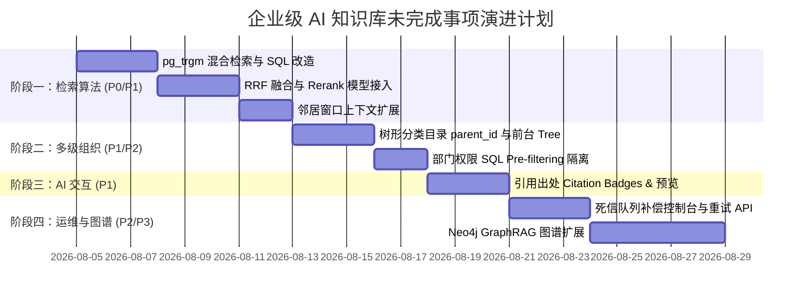

# 企业级 AI 知识库系统 (Enterprise Knowledge Hub) 待完成与演进任务清单

> **文档说明**：本文档基于当前代码库（后端 `enterprise-knowledge-base` 与前端 `enterprise-knowledge-base-ui`）的真实实现状态，对照 `KNOWLEDGE_BASE_EVOLUTION_PLAN.md` 规划书整理出所有**尚未完成**与**待优化完善**的技术事项及落地指导。

---

## 📌 一、 整体完成度概览 (Gap Executive Summary)

目前系统已具备标准的 RAG 异步解析 Pipeline（NestJS + RabbitMQ + Mongo + Postgres `pgvector` + R2）以及基础的 AI 问答 Drawer（Vercel AI SDK + LangChain Tool）。

但在**检索精确度、知识空间组织、AI 交互出处追溯与运维控制台**方面，仍存在以下待完成事项：

| 演进阶段 | 模块 / 功能点 | 目前代码状态 | 核心缺口与瓶颈 | 优先级 |
| :--- | :--- | :--- | :--- | :---: |
| **阶段 1：高级检索** | 1.1 混合检索 (Hybrid Search) | 仅实现了单路 `pgvector` 向量近似搜索 | 缺少 `pg_trgm` / `tsvector` 全文关键字检索路，无法精准匹配专有名词与型号 | **P0** |
| | 1.2 GraphRAG 知识图谱扩展 | 暂无 Neo4j 相关实现 | 缺少实体关系三元组抽取与 Cypher 关联图谱查询 | **P3** |
| | 1.3 RRF 融合与 Rerank 重排 | 仅取向量近邻前 4 个切片 | 缺少 RRF (Reciprocal Rank Fusion) 融合算法及通义/BGE Rerank 模型精细打分 | **P0** |
| | 1.4 邻居窗口扩展 (Context Expansion) | 仅返回命中切片本身的 content | 缺少前后 ±2 片邻居段落合并（~1500字大上下文），易造成断章取义 | **P1** |
| **阶段 2：多级组织与权限**| 2.1 无限极树形分类目录 | `CategoryEntity` 仅为扁平结构 | 缺少 `parent_id` 字段及前端 Antd Tree 树状侧边栏与拖拽归类组件 | **P2** |
| | 2.2 空间权限隔离 (Workspace ACL) | 数据表包含 `team_id` | 向量与全文检索 SQL 缺少部门权限 SQL Pre-filtering 预过滤条件 | **P1** |
| **阶段 3：AI 智能交互** | 3.3 可验证引用出处 (Citations) | 前端仅纯 Markdown 文本渲染 | 缺少 AI 回答中的引用角标 `[1]`，以及点击 Tooltip 预览源段落与相似度得分 | **P1** |
| **阶段 4：工程化运维** | 4.2 运维死信补偿控制台 | 后端仅有基础 DLX 报错标记 | 缺少死信队列 DLX 可视化控制台、手动一键重试与人工补算向量 API | **P2** |

---

## 🚀 二、 详细待完成任务与技术方案 (Detailed Tasks)

### 1. 高级检索算法增强 (Advanced RAG Pipeline)

#### 1.1 混合检索 (Hybrid Search: Vector + `pg_trgm`)
- **[后端] SQL 改进与索引创建**：
  - 在 PostgreSQL `kh_document_chunk` 表上创建 `pg_trgm` GIN 索引与 `tsvector` 倒排索引；
  - 改造 [knowledge-retriever.tool.ts](file:///d:/self/my-push/enterprise-knowledge-base/src/agent/tools/knowledge-retriever.tool.ts)，实现并发召回：
    - **语义路**：`pgvector` 密集向量相似度 Top 20；
    - **关键字路**：`pg_trgm` 与 `tsvector` 模糊匹配/全文检索 Top 20。

#### 1.2 RRF 排名融合与 Rerank 重排模型
- **[后端] RRF 融合算法**：
  - 实现 RRF 算法表达式：$RRF\_Score(d) = \sum \frac{1}{k + r(d)}$（通常 $k=60$），对双路召回结果进行名次归一化打分；
- **[后端] Rerank 模型集成**：
  - 封装 `RerankService`，对接通义 / BGE Rerank 模型 API；
  - 对 RRF 粗筛后的候选切片进行语义相关度二次精细打分，最终裁剪出 Top 4 最优质上下文。

#### 1.3 “小块匹配，大块作答”邻居窗口扩展 (Context Expansion)
- **[后端] 邻居段落提取**：
  - 向量切片维持 300~500 字，保证高召回率；
  - 命中切片（如 `chunk_index = 5`）后，自动查询同文档中 `chunk_index` 在 `[3, 4, 5, 6, 7]` 范围内的段落；
  - 将前后 ±2 片邻居段落拼合成约 1500 字的大文本块注入 Prompt。

#### 1.4 GraphRAG 知识图谱扩展 (Neo4j AuraDB)
- **[后端] 知识图谱构建**：
  - 在 Worker 解析文档阶段，调用 LLM 抽取 `(实体A)-[关系]->(实体B)` 三元组并写入 Neo4j；
- **[后端] 图谱检索 Tool**：
  - 封装 `graph_retriever` 工具，根据用户复杂多跳问题生成 Cypher 语句查询关系链。

---

### 2. 多级知识组织与空间权限隔离 (Hierarchy & ACL)

#### 2.1 无限极树形分类目录 (Category Tree)
- **[后端] 数据库实体扩展**：
  - 在 [category.entity.ts](file:///d:/self/my-push/enterprise-knowledge-base/src/dictionary/entities/category.entity.ts) 中增加 `parentId`（自关联外键）；
  - 提供 `GET /dictionary/categories/tree` 树状层级接口；
- **[前端] 树形导航与拖拽归类**：
  - 在前端 [DocumentList.tsx](file:///d:/self/my-push/enterprise-knowledge-base-ui/src/pages/DocumentList.tsx) 中集成 Ant Design `Tree` 侧边栏，支持节点展开与文档拖拽归类。

#### 2.2 部门与空间权限隔离 (Workspace ACL)
- **[后端] SQL Pre-filtering 过滤**：
  - 在向量/全文检索 SQL 的 `WHERE` 子句中强加入权限过滤逻辑（例如 `WHERE d.team_id IN (:...userTeamIds) OR d.is_public = true`）；
  - 先完成部门与公开权限的 SQL 预过滤，再计算向量距离。

---

### 3. AI 智能问答交互体验升级 (Vercel AI SDK + Citations)

#### 3.1 可验证引用出处 (Citations with Markdown Badges)
- **[后端] 引用元数据透传**：
  - 检索 Tool 返回结果时，为每个知识切片编号（如 `[1]`, `[2]`），并在 System Prompt 中要求 AI 在引用处标注 `[1]` 角标；
- **[前端] 交互式引用角标渲染**：
  - 在 [AIChatDrawer.tsx](file:///d:/self/my-push/enterprise-knowledge-base-ui/src/components/AIChatDrawer.tsx) 中扩展 `ReactMarkdown` 自定义 `a` / `span` 标签渲染；
  - 点击 `[1]` 角标弹出 Popover / Tooltip，展示引用的原始文档标题、切片内容与向量匹配度评分。

---

### 4. 工程化运维与死信补偿 (DevOps & Management)

#### 4.1 死信队列 (DLX) 可视化补偿控制台
- **[后端] 运维 API 接口**：
  - 提供查询 RabbitMQ 死信队列（`knowledge.document.dlx`）任务列表的 API；
  - 提供 `POST /document/retry-failed` 重新触发文档解析与向量化补偿计算的 API；
- **[前端] 可视化死信运维页面**：
  - 在前端管理后台增加“解析失败 / 补偿控制台”页面，支持一键重试与日志查看。

---

## 📅 三、 推荐实施路线图 (Implementation Timeline)

---

## 📄 关联文档
- 架构演进规划书：[KNOWLEDGE_BASE_EVOLUTION_PLAN.md](file:///d:/self/my-push/enterprise-knowledge-base/docs/KNOWLEDGE_BASE_EVOLUTION_PLAN.md)
- 后端检索引擎实现：[knowledge-retriever.tool.ts](file:///d:/self/my-push/enterprise-knowledge-base/src/agent/tools/knowledge-retriever.tool.ts)
- 前端对话抽屉组件：[AIChatDrawer.tsx](file:///d:/self/my-push/enterprise-knowledge-base-ui/src/components/AIChatDrawer.tsx)
