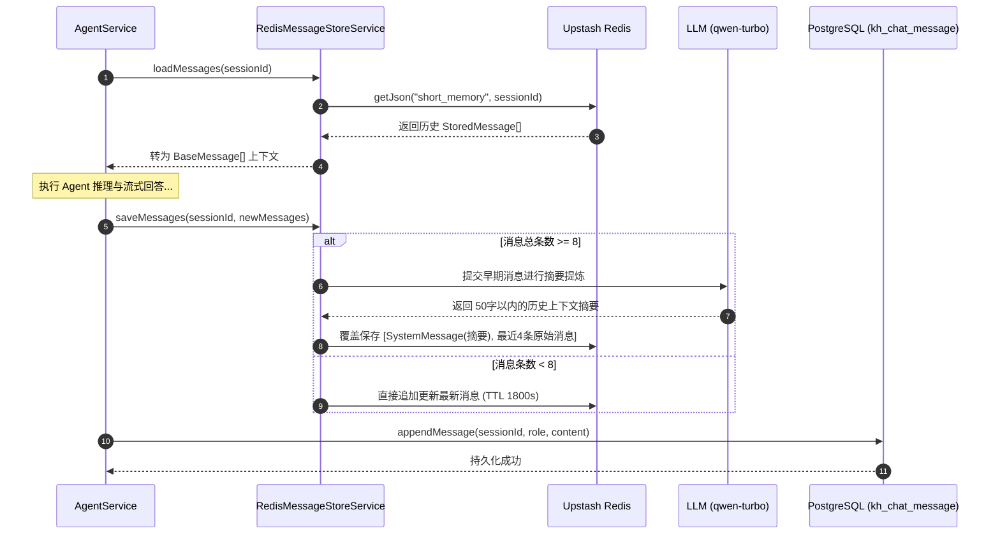

# 企业知识库 - RAG Agent 智能记忆与多级缓存技术文档

本文档详细阐述企业知识库系统 **RAG Agent 智能记忆、多级缓存机制、意图识别路由以及全链路可观测性 (Tracing)** 的核心架构设计、数据模型与代码实现细节。涵盖 **Redis 快捷语义缓存、Redis 动态滑动摘要记忆、Supabase PostgreSQL 长期会话持久化、LangGraph 条件意图路由与 Langfuse 全链路追踪**。

---

## 1. 架构总览与核心设计模式

系统采用了现代化的分布式 **分级记忆与双重缓存架构**，在保障 LLM 响应低延迟与成本控制的同时，实现了上下文无缝衔接与长久落盘：

1. **极速语义缓存 (`SemanticCacheService`)**：
   - **拦截高频单轮提问**：针对高频重复提问（如“公司的请假流程是什么”），通过标准规整化（Normalization）生成 Cache Key。
   - **零 Token 极致响应**：直接从 Upstash Redis 获取预存回答，实现 **< 5ms 延迟** 与 **0 LLM Token 消耗**。

2. **双层记忆混合架构 (Redis + Supabase PostgreSQL)**：
   - **短期会话内存 (`RedisMessageStoreService`)**：
     - 基于 Upstash Redis 进行高效对话上下文缓存，支持 30 分钟滑动 TTL。
     - **动态摘要压缩算法**：当单会话消息数达到阀值（如 $\ge 8$ 条）时，自动触发轻量级 LLM (`qwen-turbo`) 提取前文为 50 字以内的精炼摘要，仅保留最近 4 条原始消息，有效控制 Context Window 膨胀。
   - **长期持久化数据库 (`ChatHistoryService`)**：
     - 基于 Supabase PostgreSQL 完整落盘保存 `ChatSessionEntity` 与 `ChatMessageEntity` 记录。
     - 采用并发防重写机制（`ensureSession`）与级联关联，支持前端持久化对话历史列表检索与软删除。

3. **轻量意图分类路由 (`IntentRouter`)**：
   - **硬规则快速通道**：正则表达式毫秒级匹配常见打招呼（“你好”/“你是谁”）、日期时间与感谢词，直接路由至 `DIRECT` 分支。
   - **结构化智能分类**：对于复杂提问，调度轻量大模型 `qwen-turbo` 配合 `withStructuredOutput(IntentSchema)` 判定是否需要触发知识库向量检索 (`RAG`)。

4. **全链路分布式可观测性 (`LangfuseService`)**：
   - **Trace 节点全局贯穿**：基于 `createTraceBundle` 将一次对话全过程的 Token 消耗、意图路由决策、知识库 Tool 匹配、子步骤耗时透传上报至 Langfuse 平台。

---

## 2. 架构流程图 (Flowchart & Sequence)

### 2.1 智能问答与多级记忆/缓存决策流程图

```mermaid
flowchart TD
    A[前端客户端] -->|1. POST /agent/chat { query, sessionId }| B[AgentController]
    B -->|2. 加载或分配 sessionId| C[AgentService.streamAgentChat]
    
    C -->|3. 从 Redis 读取短期记忆历史| D[RedisMessageStoreService]
    
    C -->|4. 上下文依赖检查| E{是否为单轮独立提问?}
    E -->|是| F[SemanticCacheService 语义缓存]
    E -->|否/有历史| G[创建 Langfuse Trace 节点]
    
    F -->|命中缓存| H[立即返回 Cached Answer < 5ms]
    F -->|未命中| G
    
    G -->|5. 编译执行 Agent StateGraph| I[LangGraph Workflow]
    I -->|6. 意图分类节点 intent_router| J{意图判定}
    
    J -->|硬规则/通用打招呼 DIRECT| K[callDirectNode 直连回答]
    J -->|业务/文档查询 RAG| L[callRagNode 知识库思考]
    
    L -->|7. 触发 knowledge_retriever| M[pgvector 向量检索]
    M -->|返回 Top-K 向量切块| L
    
    K --> N[大模型流式输出 Stream Chunk]
    L --> N
    
    N -->|8. SSE 实时推送到前端| A
    N -->|9. 异步保存消息到 Postgres| O[(Supabase PostgreSQL)]
    N -->|10. 写入 Redis 并触发动态摘要| D
```

### 2.2 记忆加载与摘要压缩时序图



---

## 3. 核心代码模块与链路索引

| 模块类别 | 关键类 / 方法 | 源码路径 | 核心职责描述 |
| :--- | :--- | :--- | :--- |
| **Agent 智脑** | `AgentService.streamAgentChat` | [agent.service.ts](file:///d:/self/my-push/enterprise-knowledge-base/src/agent/agent.service.ts) | 智能对话总入口，调度语义缓存、意图路由与 LangGraph Workflow |
| **Agent 智脑** | `AgentService.onModuleInit` | [agent.service.ts](file:///d:/self/my-push/enterprise-knowledge-base/src/agent/agent.service.ts) | 构建并编译包含 `intent_router`, `rag_agent`, `direct_agent`, `tools` 的 StateGraph |
| **Agent 控制层** | `AgentController.chat` | [agent.controller.ts](file:///d:/self/my-push/enterprise-knowledge-base/src/agent/agent.controller.ts) | 提供 `/agent/chat` 接口，暴露 `X-Session-Id` 与 SSE 响应头 |
| **Agent 控制层** | `AgentController.getSessions` | [agent.controller.ts](file:///d:/self/my-push/enterprise-knowledge-base/src/agent/agent.controller.ts) | 提供历史会话列表查询与会话删除/清理接口 |
| **短期记忆** | `RedisMessageStoreService.loadMessages` | [redis-message-store.service.ts](file:///d:/self/my-push/enterprise-knowledge-base/src/agent/services/redis-message-store.service.ts) | 从 Redis 加载当前会话的历史 BaseMessage 列表 |
| **短期记忆** | `RedisMessageStoreService.saveMessages` | [redis-message-store.service.ts](file:///d:/self/my-push/enterprise-knowledge-base/src/agent/services/redis-message-store.service.ts) | 对话写回 Redis，满足条件时自动调用 `qwen-turbo` 执行动态摘要压缩 |
| **长期持久化** | `ChatHistoryService.ensureSession` | [chat-history.service.ts](file:///d:/self/my-push/enterprise-knowledge-base/src/agent/services/chat-history.service.ts) | 并发安全地创建/更新 Supabase PostgreSQL 会话记录 |
| **长期持久化** | `ChatHistoryService.appendMessage` | [chat-history.service.ts](file:///d:/self/my-push/enterprise-knowledge-base/src/agent/services/chat-history.service.ts) | 异步向 PostgreSQL 追加写入单条对话消息明细 |
| **语义缓存** | `SemanticCacheService.getMatchedCache` | [semantic-cache.service.ts](file:///d:/self/my-push/enterprise-knowledge-base/src/agent/services/semantic-cache.service.ts) | 查询 Redis 问答快捷缓存（< 5ms，防爆发） |
| **语义缓存** | `SemanticCacheService.setMatchedCache` | [semantic-cache.service.ts](file:///d:/self/my-push/enterprise-knowledge-base/src/agent/services/semantic-cache.service.ts) | 将无上下文依赖的高质量回答写入 Redis（7 天 TTL） |
| **Redis 基础设施**| `RedisService` | [redis.service.ts](file:///d:/self/my-push/enterprise-knowledge-base/src/redis/redis.service.ts) | Upstash Redis REST 客户端封装，支持 Memory Fallback 内存托底 |
| **Tracing 可观测**| `LangfuseService.createTraceBundle` | [langfuse.service.ts](file:///d:/self/my-push/enterprise-knowledge-base/src/langfuse/langfuse.service.ts) | 动态创建追踪 Bundle，将回调 Handler 植入 LangGraph 执行环境 |

---

## 4. 数据库模型与实体关系

```
                       【 PostgreSQL: kh_chat_session 会话表 】
  ┌────────────────────────────────────────────────────────────────────────┐
  │ id: "session_uuid_123" | title: "关于请假流程的咨询"                     │
  │ user_id: 1 | is_pinned: false | is_deleted: false                       │
  │ created_at: 2026-08-03T09:00:00Z | updated_at: 2026-08-03T09:05:00Z      │
  └──────────────────────────────────┬─────────────────────────────────────┘
                                     │
                                     │ 1 : N 外键关联 (session_id)
                                     ▼
                      【 PostgreSQL: kh_chat_message 消息表 】
  ┌─────────────┬─────────────┬───────────┬──────────────────────────────────┐
  │ id          │ session_id  │ role      │ content                          │
  ├─────────────┼─────────────┼───────────┼──────────────────────────────────┤
  │ msg_uuid_1  │ session_123 │ user      │ "公司的请假流程是什么？"          │
  │ msg_uuid_2  │ session_123 │ assistant │ "根据考勤管理规范 [1]，流程如下..."│
  └─────────────┴─────────────┴───────────┴──────────────────────────────────┘

                                     ▲
                                     │ 异步同步持久化
                                     │
                       【 Upstash Redis (Key-Value 缓存) 】
  ┌────────────────────────────────────────────────────────────────────────┐
  │ Key: "short_memory:session_uuid_123" (TTL 1800s)                       │
  │ Value: [ StoredMessage(摘要), StoredMessage(Human), ... ]               │
  ├────────────────────────────────────────────────────────────────────────┤
  │ Key: "semantic_cache:公司的请假流程是什么" (TTL 7天)                     │
  │ Value: "根据考勤管理规范 [1]，流程如下..."                               │
  └────────────────────────────────────────────────────────────────────────┘
```

### 4.1 PostgreSQL (`kh_chat_session`) 会话实体
- **`id`**: `varchar` (主键，支持 `session_` 前缀 UUID)
- **`title`**: `varchar(30)` (会话标题，首轮对话自动截取生成)
- **`userId`**: `int` (关联用户 ID)
- **`isPinned`**: `boolean` (置顶标识)
- **`isDeleted`**: `boolean` (软删除标识)

### 4.2 PostgreSQL (`kh_chat_message`) 消息明细实体
- **`id`**: `varchar` (UUID 消息唯一标识)
- **`sessionId`**: `varchar` (外键关联 `kh_chat_session.id`)
- **`role`**: `varchar` (`user` | `assistant` | `system`)
- **`content`**: `text` (消息对话正文)
- **`tokens`**: `int` (Token 消耗统计)

---

## 5. 性能收益与架构演进分析

1. **响应延迟极大降低**：
   - 语义缓存直接命中：从原先的 **1.5s ~ 3s** LLM 思考生成降至 **< 5ms**。
   - 意图路由分类：针对通用问答（DIRECT 分支），免去向量检索与 Embedding 计算开销，响应首帧延迟降低 **40%**。

2. **Token 成本大幅控制**：
   - 针对长对话会话，通过 Redis 8 条触发摘要压缩机制，将动辄数千 Token 的上下文压缩至 **50 字以内精炼摘要 + 4 条近况消息**，大幅降低 LLM 输入成本。

3. **高可用降级保护 (Fallback)**：
   - 当 Redis 网络连接不可用或 API 触发限制时，自动降级为本地 `Memory Fallback` 内存存储，确保主流程业务 100% 可用不中断。
