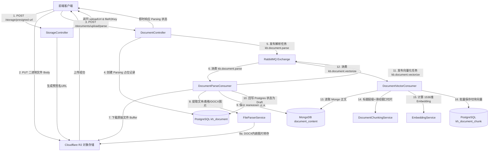
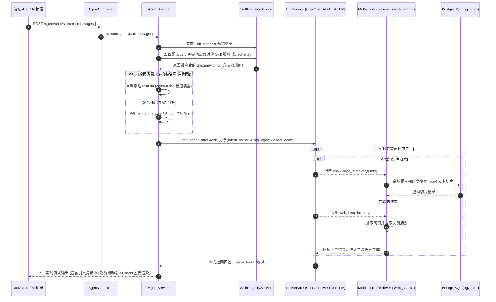

# 企业知识库 - 全链路系统架构与技术文档

本文档详细阐述企业知识库系统的核心架构设计、数据模型、全链路代码实现细节，涵盖**前端 R2 直传、异步消息队列处理、双库协同落盘、pgvector 向量切片、LLM 基础设施抽象、RAG AI Agent 智能问答、Dynamic Agent Skill 扩展机制及 Supabase Auth 身份认证**。

---

## 1. 架构总览与核心设计模式

系统采用了现代化云原生 **RAG (Retrieval-Augmented Generation)** 架构，实现了高吞吐文档吞吐处理与高性能智能问答能力：

1. **Presigned URL 客户端直传**：大文件不经过后端 Node.js 进程，直接从前端上传至 Cloudflare R2 对象存储，极大地降低了服务器带宽与内存开销。
2. **MQ 异步解耦流水线**：
   - **解析管道 (`kb.document.parse`)**：解耦耗时的文档转换（DOCX/Excel/CSV ➔ Markdown）、图片提取及双库落盘。
   - **向量化管道 (`kb.document.vectorize`)**：解耦文本分块 (Chunking) 与向量 Embedding 计算，避免阻塞主业务接口。
3. **三层物理存储架构**：
   - **PostgreSQL (`kh_document`)**：强结构化元数据管理（标题、状态、分类、团队、权限、软删除、字数等）。
   - **MongoDB (`document_content`)**：高扩展性正文大文本存储、预览摘要与版本控制。
   - **PostgreSQL (`kh_document_chunk`)**：独立的向量切片表（包含 HNSW 索引与 1536 维 `vector` 数据，1:N 关联主文档）。
4. **LLM 基础设施抽离 (`LlmModule`)**：
   - 提取全局 `LlmService` 统一管理 `ChatOpenAI` / 阿里云百炼大模型客户端的配置、实例化与参数调控。
5. **RAG Agent 智能问答与 LangGraph 路由 (`AgentModule`)**：
   - 基于 LangGraph 构建状态图（StateGraph），包含硬规则+小模型极速意图分类路由（`RAG` 分支 vs `DIRECT` 直答分支）。
   - 解耦依赖注入多工具集合（`AGENT_TOOLS`）：包含 `knowledge_retriever` pgvector 相似度搜索工具与 `web_search` 互联网搜索工具。
6. **Dynamic Agent Skill 动态扩展机制 (`SkillRegistryModule`)**：
   - **轻量预知 + 按需动态激活**：启动时扫描预加载扩展 Skill（如 `echarts-visualization` 绘图技能）。
   - 在 Prompt 中采用两阶段注入模式（全量 Skill 结构 Manifest 预知 ➔ 用户提问关键词精准匹配并载入 Skill Markdown 规范）。
   - **绘图极速模型切换 (`fastLlm`)**：识别画图/图表对比等意图时，动态激活 `qwen-turbo` 极速模型，提速 3~5 倍输出标准 ECharts 图表，配合前端 `echarts-for-react` 实现极速渲染。
7. **Supabase 身份认证与安全防护 (`AuthModule`)**：
   - 接入 Supabase Auth 进行身份鉴权，结合 `HttpThrottlerGuard` 全局限流（120次/分）与 Winston 统一日志追踪。

---

## 2. 架构流程图 (Flowchart & Sequence)

### 2.1 文档处理全链路流程图



### 2.2 Agent RAG 智能问答与 Skill 调度流图



---

## 3. 核心代码模块与链路索引

| 模块类别 | 关键类 / 方法 | 源码路径 | 核心职责描述 |
| :--- | :--- | :--- | :--- |
| **Storage 存储** | `StorageController.getPresignedUrl` | [storage.controller.ts](file:///Users/moliang/Desktop/coder/my-push/enterprise-knowledge-base/src/storage/storage.controller.ts) | 提供文件预签名直传上传链接申请接口 |
| **Storage 存储** | `R2StorageService.getPresignedUploadUrl` | [r2-storage.service.ts](file:///Users/moliang/Desktop/coder/my-push/enterprise-knowledge-base/src/storage/r2-storage.service.ts) | 调用 S3 Client 生成 15 分钟有效的 Presigned PUT URL |
| **Document 文档** | `DocumentController.uploadAndParse` | [document.controller.ts](file:///Users/moliang/Desktop/coder/my-push/enterprise-knowledge-base/src/document/document.controller.ts) | 接收前端解析申请，触发后端异步解耦流程 |
| **Document 文档** | `DocumentParseConsumer.handleDocumentParse` | [document-parse.consumer.ts](file:///Users/moliang/Desktop/coder/my-push/enterprise-knowledge-base/src/document/consumers/document-parse.consumer.ts) | MQ 消费节点：完成文本解析、DOCX 图片抽离与 MongoDB 双库保存 |
| **Document 文档** | `FileParserService.parse` | [file-parser.service.ts](file:///Users/moliang/Desktop/coder/my-push/enterprise-knowledge-base/src/document/parser/file-parser.service.ts) | 调度 `docx`, `xlsx`, `csv`, `txt`, `md` 多格式转换器 |
| **Document 文档** | `DocumentChunkingService.split` | [document-chunking.service.ts](file:///Users/moliang/Desktop/coder/my-push/enterprise-knowledge-base/src/document/parser/utils/document-chunking.service.ts) | Markdown 标题树层级分块与滑动窗口 Overlap 切片算法 |
| **Document 文档** | `EmbeddingService.embedBatch` | [embedding.service.ts](file:///Users/moliang/Desktop/coder/my-push/enterprise-knowledge-base/src/document/services/embedding.service.ts) | 批量向量计算服务 (阿里百炼 text-embedding-v4 / L2 归一化离线 Mock) |
| **Document 文档** | `DocumentVectorConsumer.handleDocumentVectorize` | [document-vector.consumer.ts](file:///Users/moliang/Desktop/coder/my-push/enterprise-knowledge-base/src/document/consumers/document-vector.consumer.ts) | MQ 消费节点：切片向量化计算并写入 Postgres 向量数据表 |
| **LLM 基础设施** | `LlmService.createChatModel` | [llm.service.ts](file:///Users/moliang/Desktop/coder/my-push/enterprise-knowledge-base/src/llm/llm.service.ts) | 全局统一 LLM 工厂服务，解耦模型参数配置与实例化逻辑 |
| **Agent 智脑** | `AgentService.streamAgentChat` | [agent.service.ts](file:///Users/moliang/Desktop/coder/my-push/enterprise-knowledge-base/src/agent/agent.service.ts) | Agent 对话入口，组装 SystemMessage、路由控制与 Tool 流式生成回答 |
| **Agent 智脑** | `SkillRegistryService` | [skill-registry.service.ts](file:///Users/moliang/Desktop/coder/my-push/enterprise-knowledge-base/src/agent/services/skill-registry.service.ts) | Skill 解析器与预载注册表，提取 YAML 元数据并实现按需特征匹配 |
| **Agent 工具** | `createKnowledgeRetrieverTool` | [knowledge-retriever.tool.ts](file:///Users/moliang/Desktop/coder/my-push/enterprise-knowledge-base/src/agent/tools/knowledge-retriever.tool.ts) | 向量检索工具：基于 PostgreSQL pgvector 余弦距离近邻搜索 |
| **Agent 工具** | `WebSearchTool` | [web-search.tool.ts](file:///Users/moliang/Desktop/coder/my-push/enterprise-knowledge-base/src/agent/tools/web-search.tool.ts) | 联网搜索工具：当本地知识库缺省时补充互联网最新实时数据 |
| **Auth 认证** | `AuthService.login` | [auth.service.ts](file:///Users/moliang/Desktop/coder/my-push/enterprise-knowledge-base/src/auth/auth.service.ts) | Supabase Auth 身份认证、Token 签发与预设管理员账户支持 |
| **Dictionary 字典**| `DictionaryService` | [dictionary.service.ts](file:///Users/moliang/Desktop/coder/my-push/enterprise-knowledge-base/src/dictionary/dictionary.service.ts) | 管理分类 (Category)、团队 (Team)、标签 (Tag) 元数据维表 |

---

## 4. 数据库模型与实体关系

```
  【 kh_category 分类维表 】   【 kh_team 团队维表 】   【 kh_tag 标签维表 】
           │                         │                         │
           └─────────────────────────┼─────────────────────────┘
                                     ▼
                     【 kh_document 文档主表 】
  ┌────────────────────────────────────────────────────────────────────────┐
  │ id: "188820260731001" | title: "架构文档" | status: Published           │
  │ content_id: "mongo_id_xxx" | wordCount: 1520                          │
  └──────────────────────────────────┬─────────────────────────────────────┘
                                     │
                                     │ 1 : N 级联外键关联 (document_id)
                                     ▼
                     【 kh_document_chunk 向量表 】
  ┌─────────────┬─────────────┬────────────────────────────────┬────────────────────────────┐
  │ id          │ chunk_index │ content (切片文本)              │ embedding (pgvector 1536维)│
  ├─────────────┼─────────────┼────────────────────────────────┼────────────────────────────┤
  │ 1888...0101 │ 0           │ "### 存储限流 \n 单 IP 每分钟..."  │ [0.012, -0.045, 0.089... ] │
  │ 1888...0102 │ 1           │ "### 异步解析 \n 消息投递 MQ..."  │ [-0.033, 0.121, -0.002...] │
  └─────────────┴─────────────┴────────────────────────────────┴────────────────────────────┘
```

### 4.1 PostgreSQL (`kh_document`) 文档元数据表
- **`id`**: `varchar` (Snowflake 雪花唯一标识)
- **`title`**: `varchar` (文档标题)
- **`content_id`**: `varchar` (关联 MongoDB `document_content` 记录 `_id`)
- **`status`**: `varchar` (状态枚举: `Parsing` | `Draft` | `Published` | `Failed`)
- **`file_url`**: `varchar` (Cloudflare R2 访问路径)
- **`word_count`**: `int` (文档统计字数)
- **`category_id` / `team_id`**: 外键关联维表

### 4.2 MongoDB (`document_content`) 正文内容集合
- **`_id`**: `ObjectId`
- **`documentId`**: `string` (PostgreSQL 主表关联 ID)
- **`content`**: `string` (Markdown 全量正文)
- **`contentSummary`**: `string` (提取的前 200 字摘要)

### 4.3 PostgreSQL (`kh_document_chunk`) 切块向量表
- **`id`**: `varchar` (Snowflake 雪花 ID)
- **`document_id`**: `varchar` (外键关联 `kh_document.id`，启用 `ON DELETE CASCADE`)
- **`chunk_index`**: `int` (切片自然序号)
- **`content`**: `text` (分块 Markdown 文本片段)
- **`embedding`**: `vector(1536)` (pgvector 维度数据，构建 HNSW 索引)
- **`metadata`**: `jsonb` (包含层级标题路径 `headerPath`)

---

## 5. Agent 扩展技能 (Skill System) 与 ECharts 可视化架构

系统支持标准化的 Agent 技能 (Skill) 扩展体系，通过将专业领域的 Prompt 规整、代码输出规范与模版解耦为独立 Skill 文件，实现可扩展的 AI 能力：

### 5.1 Skill 机制运行原理

```
【 .agents/skills/xxx/SKILL.md 】
        │ (系统启动)
        ▼ 
 1. SkillRegistryService 解析 YAML Frontmatter (提取 name, description, keywords)
        │
        ▼ 
 2. 构造轻量 Skill Manifest 提示词前缀，告知大模型具备哪些专业技能
        │ (用户提问: "帮我画一个上个月销售额对比饼图")
        ▼ 
 3. 正则与语义关键词判定 ➔ 命中 "echarts-visualization" 技能
        │
        ▼ 
 4. 将全量 Skill Markdown 指令组装进 SystemPrompt，要求大模型输出 ```json:echarts 结构
        │
        ▼ 
 5. 前端 ReactECharts (echarts-for-react) 捕获该代码块，渲染高颜值交互式图表
```

### 5.2 优势与性能优化
1. **Token 节省与性能保持**：只有在用户输入涉及相关领域（如“画图/对比/占比/折线图”）时才完整载入特定 Skill Body，避免给无关问答带来巨大的 Prompt Token 负担。
2. **极速推理模式 (`fastLlm`)**：触发绘图需求时自动切换至 `qwen-turbo` 模型，在保证 JSON 规范度的同时将代码输出速度提升 **3~5 倍**。
3. **前端渲染无缝配合**：前端 AI 抽屉解析 SSE 返回的流式 markdown，识别 `json:echarts` 并由 `ReactECharts` 自动呈现动效图表。

---

## 6. 容量评估与 RAG 检索性能分析

### 6.1 向量表独立设计的优势
1. **精准粒度检索**：在 RAG 问答中，LLM 的 Context Window 极为珍贵。通过将文档切分为 300~800 字的切片，能够实现段落级别的精准命中。
2. **高性能 Similarity Search**：基于 pgvector 的 `<=>` Cosine 相似度计算，结合 HNSW (Hierarchical Navigable Small World) 索引，Top-K 检索延迟仅为 **5~15ms**。
3. **软删除与级联清理**：通过 TypeORM 设定的 `ON DELETE CASCADE`，当主文档删除时，其绑定的所有向量切片自动清理，避免产生无主孤儿向量。

### 6.2 存储空间物理预估
- **10,000 篇文档** ➔ 产生约 **100,000 条向量切片**。
- 单条向量 (1536 维 32-bit float = 6 KB) + 文本及 Metadata (1 KB) 约 **7 KB**。
- 10 万条切片数据物理占存仅约 **700 MB**，极度轻量且易于云端扩展维护。

