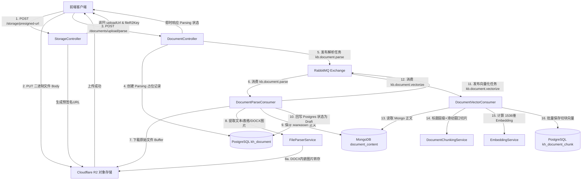
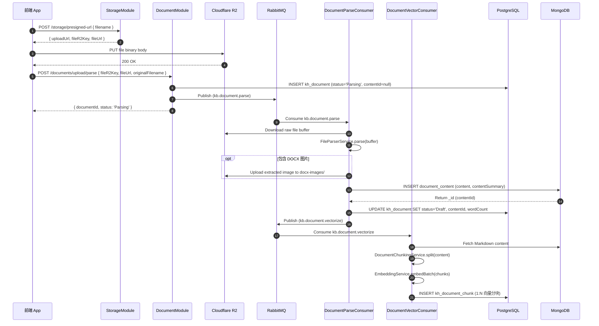

# 企业知识库 - 文档上传、解析与向量化全流程架构文档

本文档详细阐述企业知识库系统中文档上传直传、异步文本解析、双库存储以及**智能文本切块 (Chunking) 与向量化嵌入 (Embedding)** 的全链路架构设计、数据模型与代码实现细节。

---

## 1. 架构总览与设计模式

系统采用了 **“前端 R2 直传 + 异步消息队列 (RabbitMQ) + 双库联动 + pgvector 向量存储”** 的现代云原生 RAG 架构：

1. **Presigned URL 客户端直传**：大文件不经过后端 Node.js 进程，直接从前端上传至 Cloudflare R2 对象存储，降低服务器带宽与内存消耗。
2. **MQ 异步解耦流水线**：
   - 管道 1 (`kb.document.parse`)：解耦耗时的文档转换（DOCX/Excel/CSV ➔ Markdown）、图片提取及双库落盘。
   - 管道 2 (`kb.document.vectorize`)：解耦文本分块 (Chunking) 与向量 Embedding 计算，避免阻塞主业务接口。
3. **三层物理存储架构**：
   - **PostgreSQL (`kh_document`)**：强结构化元数据管理（标题、状态、分类、团队、权限、软删除、字数等）。
   - **MongoDB (`document_content`)**：高扩展性正文大文本、预览摘要与版本控制。
   - **PostgreSQL (`kh_document_chunk`)**：独立的向量切片表（包含 HNSW 索引与 1536 维 `vector` 数据，1:N 关联主文档）。
4. **安全与容错**：接口速率限制 (10次/分)、Mongo 写入退避重试、Nack 异常死信防护以及向量降级 Mock 机制。

---

## 2. 架构流程图 (Flowchart & Sequence)

### 2.1 业务流程图



### 2.2 交互时序图



---

## 3. 代码模块与链路索引

| 阶段 | 关键类 / 方法 | 源码路径 | 核心职责 |
| :--- | :--- | :--- | :--- |
| **直传预签名** | `StorageController.getPresignedUrl` | [storage.controller.ts](file:///d:/self/my-push/enterprise-knowledge-base/src/storage/storage.controller.ts#L25-L35) | 接收前端申请，校验文件名并调用存储服务 |
| **R2 签名生成** | `R2StorageService.getPresignedUploadUrl` | [r2-storage.service.ts](file:///d:/self/my-push/enterprise-knowledge-base/src/storage/r2-storage.service.ts#L54-L78) | 基于 S3 SDK 生成 15 分钟有效的 Presigned PUT URL |
| **提交解析申请** | `DocumentController.uploadAndParse` | [document.controller.ts](file:///d:/self/my-push/enterprise-knowledge-base/src/document/document.controller.ts#L32-L38) | 提供带 RateLimit (10次/分) 防护的解析申请接口 |
| **创建占位与发布** | `DocumentService.uploadAndCreateDocument` | [document.service.ts](file:///d:/self/my-push/enterprise-knowledge-base/src/document/document.service.ts#L82-L130) | 写入 Postgres 占位记录，发布消息至 RabbitMQ |
| **MQ 文本解析** | `DocumentParseConsumer.handleDocumentParse` | [document-parse.consumer.ts](file:///d:/self/my-push/enterprise-knowledge-base/src/document/consumers/document-parse.consumer.ts#L45-L121) | 下载 R2 文件、调用解析器、写入 Mongo、回写 Postgres 并发布向量化任务 |
| **格式解析调度** | `FileParserService.parse` | [file-parser.service.ts](file:///d:/self/my-push/enterprise-knowledge-base/src/document/parser/file-parser.service.ts#L52-L103) | 调度 `docx`, `xlsx`, `csv`, `txt`, `md` 具体解析器 |
| **Markdown 智能分块** | `DocumentChunkingService.split` | [document-chunking.service.ts](file:///d:/self/my-push/enterprise-knowledge-base/src/document/parser/utils/document-chunking.service.ts) | 依据 `# / ##` 标题层级路径与滑动窗口 (Sliding Window + Overlap) 分块 |
| **向量 Embedding** | `EmbeddingService.embedBatch` | [embedding.service.ts](file:///d:/self/my-push/enterprise-knowledge-base/src/document/services/embedding.service.ts) | 批量获取文本向量 (支持 OpenAI 规范 API 及离线 L2 模长归一化算法) |
| **MQ 向量化消费** | `DocumentVectorConsumer.handleDocumentVectorize` | [document-vector.consumer.ts](file:///d:/self/my-push/enterprise-knowledge-base/src/document/consumers/document-vector.consumer.ts) | 监听 `kb.document.vectorize`，分块计算向量并写入 Postgres 切片表 |

---

## 4. 数据模型与关系

```
  【 kh_document 文档主表 】 (1 份文档 = 1 条记录)
  ┌───────────────────────────────────────────────────────────┐
  │ id: "188820260731001" | title: "知识库架构设计" | status: Draft │
  └─────────────────────────────┬─────────────────────────────┘
                                │
                                │ 1 : N 关联 (document_id, 外键级联删除)
                                ▼
  【 kh_document_chunk 向量切片表 】 (1 份文档 = N 条切片向量)
  ┌─────────────┬─────────────┬────────────────────────────────┬────────────────────────────┐
  │ id          │ chunk_index │ content (切片文本)              │ embedding (pgvector 1536维)│
  ├─────────────┼─────────────┼────────────────────────────────┼────────────────────────────┤
  │ 1888...0101 │ 0           │ "### 存储限流 \n 单 IP 每分钟..."  │ [0.012, -0.045, 0.089... ] │
  │ 1888...0102 │ 1           │ "### 异步解析 \n 消息投递 MQ..."  │ [-0.033, 0.121, -0.002...] │
  └─────────────┴─────────────┴────────────────────────────────┴────────────────────────────┘
```

### 4.1 PostgreSQL (`kh_document`) 元数据模型
* **`id`**: 字符串 (Snowflake 雪花 ID)
* **`title`**: 文档标题
* **`content_id`**: MongoDB `document_content` 表的 `_id` 关联字段
* **`status`**: 枚举 (`Parsing` ➔ `Draft` / `Failed` / `Published`)
* **`wordCount`**: 中英混合字数（CJK 汉字 + 拉丁分词）

### 4.2 MongoDB (`document_content`) 正文模型
* **`_id`**: Mongo ObjectId
* **`documentId`**: 关联 PostgreSQL 侧的主键 ID
* **`content`**: 转换后的完整 Markdown 文本
* **`contentSummary`**: 截取的前 200 字纯文本预览

### 4.3 PostgreSQL (`kh_document_chunk`) 向量表模型
* **`id`**: 字符串 (Snowflake 雪花 ID)
* **`document_id`**: 外键关联 `kh_document(id)`，支持 `ON DELETE CASCADE`
* **`chunk_index`**: 切片序号 (0, 1, 2...)
* **`content`**: 分块 Markdown 文本
* **`embedding`**: 1536 维向量数据 (基于 `vectorTransformer` 处理类型转换)
* **`metadata`**: JSONB 包含标题路径 (`headerPath`) 与层级信息

---

## 5. 容量与性能技术评估

### 5.1 为什么向量表独立建表？
1. **1:N 关系**：1 篇文档需拆分为 N 个短切块，独立建表才能保持短段落级别的精确检索。
2. **检索粒度 (RAG Top-K)**：语义问答时直接在 `kh_document_chunk` 中搜索相似度最高的前 3~5 个段落，避免拉取整篇大文档。
3. **主表性能隔离**：隔离向量数据，防止 `kh_document` 表体积膨胀，保障后台列表查询与管理操作极速响应。

### 5.2 存储容量预估 (以典型企业知识库为例)
- **1 万篇文档** ➔ 约生成 **10 万条向量切片**。
- 单条切片包含向量 (6 KB) + 文本 (1 KB) 约 **7 KB**。
- **10 万条切片物理总存储仅约 700 MB**，即使达到 **10 万篇文档 (100 万条向量切片)** 也仅占约 **7 GB** 磁盘。
- 在 PostgreSQL + HNSW 索引下，检索延迟稳定保持在 **5~15 毫秒** 之间，极其轻量高效。
