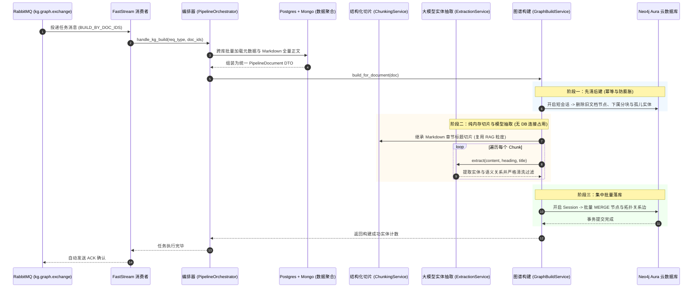

# Neo4j 知识图谱 (KG) 入库流水线开发与架构设计学习指南

> **文档版本**: v1.0.0  
> **编写日期**: 2026-09-04  
> **技术栈**: Python 3.13 / Neo4j 6.0 (AuraDB 异步驱动) / LangChain / FastStream (RabbitMQ) / Pydantic V2 / SQLAlchemy / MongoDB Motor  
> **对标实现**: NestJS `knowledge-hub-backend-v5` 数据管道系统

---

## 一、系统概述与架构全景

本项目基于事件驱动架构（EDA），实现从**原始文档发布**到**多路索引自动化构建**的全流程。其中，**Neo4j 知识图谱（Knowledge Graph, 简称 KG）** 与 **RAG 向量切片**、**ES/Postgres 全文检索**并行，构成了现代智能知识库的三大核心检索底座。

### 1.1 全链路流转时序图



---

## 二、图谱数据模型 (Graph Schema)

本系统采用工业级知识图谱标准的 **“三层节点 + 两类关系”** 拓扑架构：

```
(KnowledgeDocument) ──[:HAS_CHUNK]──► (DocumentChunk) ──[:MENTIONS]──► (KnowledgeEntity)
                                                                            │
                                                                   [:RELATED_TO]
                                                                            ▼
                                                                    (KnowledgeEntity)
```

### 2.1 节点模型规范 (Nodes)

| 节点 Label | 唯一主键约束 | 核心属性 | 设计考量与业务价值 |
| :--- | :--- | :--- | :--- |
| `KnowledgeDocument` | `id` (业务文档 ID) | `title`, `summary`, `categoryId`, `authorId`, `status`, `createdAt`, `updatedAt` | 文档元数据入口节点，记录文章归属与生命周期。保留首次创建时间戳 |
| `DocumentChunk` | `chunkId` (全局唯一哈希) | `documentId`, `content`, `heading`, `chunkIndex`, `totalChunks`, `updatedAt` | **复用 RAG 相同切片粒度**，支持溯源到具体章节与原文文本 |
| `KnowledgeEntity` | `name` (实体名) | `type`, `description`, `aliases`, `createdAt`, `updatedAt` | **全局跨文档聚合**：同名实体跨多篇文章自动 MERGE，打通知识孤岛 |

### 2.2 关系边模型规范 (Edges)

1. **`[:HAS_CHUNK]` (文档 ➔ 分块)**：
   - 方向：`(KnowledgeDocument)-[:HAS_CHUNK]->(DocumentChunk)`
   - 属性：`chunkIndex`（数字序号，保证文档切片按原文阅读顺序遍历）。
2. **`[:MENTIONS]` (分块 ➔ 实体)**：
   - 方向：`(DocumentChunk)-[:MENTIONS]->(KnowledgeEntity)`
   - 含义：表达“该文本片段明确提及或讨论了该知识实体”，支持后续图谱增强检索（GraphRAG）。
3. **`[:RELATED_TO]` (实体 ➔ 实体)**：
   - 方向：`(KnowledgeEntity)-[:RELATED_TO]->(KnowledgeEntity)`
   - 属性：
     - `relation`: 标准化语义谓词（如 `HAS_PART`, `RESPONSIBLE_FOR` 等）。
     - `weight`: 关系置信度权重（`0.0 ~ 1.0`）。
     - `createdAt`: 关系建立时间戳。

### 2.3 分类体系标准（10 大实体类型与 12 大语义关系）

```python
# 10 大核心实体类别 (app/modules/document/pipeline/kg_extraction_schema.py)
KG_ENTITY_TYPES = (
    "PERSON",        # 人物、角色（如 架构师、审核员）
    "ORGANIZATION",  # 组织、部门（如 研发中心、长城汽车）
    "CONCEPT",       # 术语、概念（如 分布式事务、双电机混联拓扑）
    "DOCUMENT",      # 文档、规范（如 《安全作业SOP》）
    "PROCESS",       # 流程、活动（如 OTA发布流程、故障排障）
    "PRODUCT",       # 产品、系统（如 柠檬混动DHT、Coffee OS）
    "LOCATION",      # 地点、厂区（如 徐水制造基地、会议室A）
    "TIME",          # 时间周期（如 2026-Q1、每周一）
    "POLICY",        # 政策、合规条款
    "RESOURCE",      # 工具、设备、库（如 Docker、激光雷达）
)

# 12 大实体语义关联谓词
KG_RELATION_TYPES = (
    "HAS_PART",        # 组成、包含（长城汽车 HAS_PART 咖啡智能）
    "BELONGS_TO",      # 归属（电芯研发团队 BELONGS_TO 蜂巢能源）
    "RELATED_TO",      # 泛关联（兜底关系）
    "DEFINES",         # 定义、阐释（规范 DEFINES 接口标准）
    "REQUIRES",        # 依赖、前置条件（城市NOH REQUIRES 激光雷达）
    "USES",            # 使用、调用（总装线 USES AGV小车）
    "RESPONSIBLE_FOR", # 负责、主导（软件工程院 RESPONSIBLE_FOR GEEP4.0）
    "PARTICIPATES_IN", # 参与
    "LOCATED_IN",      # 位于（总装车间 LOCATED_IN 徐水基地）
    "OCCURS_AT",       # 发生于
    "CAUSES",          # 导致、因果
    "CONFLICTS_WITH",  # 冲突、排他
)
```

---

## 三、大模型抽取与数据清洗机制

知识图谱质量的关键在于**过滤噪声与防止幻觉**。`ExtractionService` 实现了端到端的结构化提取与防御机制：

### 3.1 结构化输出设计 (Structured Output)
摒弃传统的非结构化正则匹配，采用 LangChain `ChatOpenAI.with_structured_output(KgExtractionResult)`：
- 底层基于模型的 JSON Schema 模式，确保输出 100% 格式合法。
- 模型入参自动拼接文档标题、分块章节标题与分块正文（截断 4000 字符防止溢出）。

### 3.2 四大防御性清洗机制 (Defensive Cleaning)

```
[原始 LLM 返回数据]
        │
        ├─ 1. 数量截断 ────► 单块最多 12 个实体、15 个关系 (防止长文本图爆炸)
        │
        ├─ 2. 类型归一化 ──► normalize_entity_type / normalize_relation_type
        │                   (LLM 返回非标中文或拼写错误时兜底为 CONCEPT / RELATED_TO)
        │
        ├─ 3. 悬空关系过滤 ─► 严格校验 source 与 target 是否在抽取的实体集内
        │                   (任意一方不存在则彻底剔除，严禁在 Neo4j 中产生未定义悬空边)
        │
        ▼
[高纯净合规知识图谱数据]
```

---

## 四、Neo4j 异步落库核心实现与 Cypher 详解

所有落库操作均封装在 [graph_build_service.py](file:///d:/self/agent-wll/app/modules/document/pipeline/graph_build_service.py) 中。

### 4.1 先清后建机制 (Clear-Before-Build)

**为什么必须先清后建？**
在文档经历“编辑 -> 重新发布”时，如果直接追加写入，会导致旧分块、废弃关系和重名边成倍翻倍，产生严重脏数据。

```cypher
// 1. 删除该文档及其下属所有切片（DETACH 会一并拆掉挂接在其上的所有关联边）
MATCH (d:KnowledgeDocument {id: $id})
OPTIONAL MATCH (d)-[:HAS_CHUNK]->(c:DocumentChunk)
DETACH DELETE c, d
```

### 4.2 孤儿实体级联清理（防图膨胀核心）

**什么是孤儿实体？**
当文档 A 包含独有实体“临时故障代码X”，后续该文档被删除或修改，如果图数据库中仅删除了文档和分块，实体节点“临时故障代码X”就会永远悬挂在库中，久而久之导致图谱严重膨胀。

```cypher
// 孤儿实体清理：没有任何 DocumentChunk MENTIONS 的实体视为悬空孤儿，整节点彻底清理
MATCH (e:KnowledgeEntity)
WHERE NOT (e)<-[:MENTIONS]-()
DETACH DELETE e
```
> **设计价值**：由于其他文档所引用的共享实体（如“长城汽车”）依然存在来自其他文档 Chunk 的 `MENTIONS` 入边，因此共享实体会安全保留，只有**真正无任何引用的孤立废弃节点**才会被回收。

### 4.3 文档主节点 Upsert（保留首次创建时间）

```cypher
MERGE (d:KnowledgeDocument {id: $id})
SET d.title = $title,
    d.summary = $summary,
    d.categoryId = $categoryId,
    d.authorId = $authorId,
    d.status = $status,
    d.updatedAt = $now,
    // 关键技巧：若 d.createdAt 已存在则保持原值，仅首次写入时赋值为 $now
    d.createdAt = coalesce(d.createdAt, $now)
```

### 4.4 分块与从属关系边落库

```cypher
// 幂等创建或刷新分块节点
MERGE (c:DocumentChunk {chunkId: $chunkId})
SET c.documentId = $documentId,
    c.content = $content,
    c.heading = $heading,
    c.chunkIndex = $chunkIndex,
    c.totalChunks = $totalChunks,
    c.updatedAt = $now
WITH c
// 定位所属文档并建立从属关系边
MATCH (d:KnowledgeDocument {id: $documentId})
MERGE (d)-[r:HAS_CHUNK]->(c)
SET r.chunkIndex = $chunkIndex
```

### 4.5 实体跨文档聚合与关系边落图

```cypher
// 1. 实体节点写入（按 name 幂等 MERGE，跨文档复用，描述更新采用 CASE WHEN 保留非空值）
MERGE (e:KnowledgeEntity {name: $name})
ON CREATE SET e.type = $type,
              e.description = $description,
              e.aliases = $aliases,
              e.createdAt = $now,
              e.updatedAt = $now
ON MATCH SET e.type = coalesce($type, e.type),
             e.description = CASE WHEN $description <> '' THEN $description ELSE e.description END,
             e.updatedAt = $now;

// 2. 块到实体的提及边写入
MATCH (c:DocumentChunk {chunkId: $chunkId})
MATCH (e:KnowledgeEntity {name: $name})
MERGE (c)-[:MENTIONS]->(e);

// 3. 实体间的语义关系边写入
MATCH (a:KnowledgeEntity {name: $source})
MATCH (b:KnowledgeEntity {name: $target})
MERGE (a)-[r:RELATED_TO]->(b)
ON CREATE SET r.relation = $relType,
              r.weight = $weight,
              r.createdAt = datetime()
ON MATCH SET r.weight = coalesce($weight, r.weight);
```

---

## 五、关键踩坑经历与架构高可用设计

在实际落地的测试联调中，我们踩过了几个具有普遍指导意义的底层技术坑，解决方案值得深入总结：

### 5.1 坑点一：长连接闲置与 `SessionExpired: No data`

- **问题现象**：
  在早期版本中，执行构建时偶发抛出：
  `neo4j.exceptions.SessionExpired: Failed to read from defunct connection ... OSError('No data')`
- **根本原因**：
  在代码实现中，直接使用了：
  ```python
  async with neo4j_manager.get_session() as session:
      # 在同一个 DB 会话块内执行了 chunk 分块和 LLM 大模型网络请求
      for chunk in chunks:
          extracted = await self.extraction_service.extract(...) # 耗时 10-20 秒
          await session.run(...)
  ```
  云端 Neo4j Aura 或本地透明代理（NAT/VPN 网关）在 Socket 闲置 10-15 秒无数据交互时，会主动丢弃或重置 TCP 连接，导致 LLM 调用返回后再向同一个连接发送 Cypher 时连接已死。
- **架构重构解法（先抽取后落库）**：
  分块和模型抽取属于纯内存与 HTTP 计算，**根本不需要持有数据库连接**。
  修改为：
  1. 先在内存中并发/顺序完成全部分块的实体抽取；
  2. 抽取就绪后，瞬时开启 `neo4j_manager.get_session()`，一次性在几百毫秒内完成所有 Cypher 的批量执行；
  3. **彻底根除了长连接闲置断开隐患，且显著减轻了数据库连接池负载**。

### 5.2 坑点二：大模型额度不足时的服务高可用降级

- **问题现象**：
  当云端模型配额耗尽（如 DashScope 返回 `403 Free quota exhausted`）或网络抖动时，若直接向上抛出异常，会导致整篇文档发布失败、RabbitMQ 发生反复 NACK 消息死循环。
- **架构解法**：
  在 `extraction_service.py` 与 `graph_build_service.py` 内部使用分层 `try...catch`：
  - 单个分块抽取失败，记录错误日志并以空实体降级返回；
  - 保证文档基础节点、分块节点和 RAG 向量能够正常入库，**绝不阻断主线发布流程**。

### 5.3 坑点三：无关系库环境下的安全隔离

- **问题现象**：
  在独立运行测试脚本或在轻量开发容器中运行时，若本地没有安装配置 PostgreSQL，仅仅导入 `app.modules.document.pipeline` 就会因为 `create_async_engine("")` 解析空 URL 而崩溃。
- **架构解法**：
  在 `app/core/database.py` 中增加安全兜底占位（`settings.DATABASE_URL or "postgresql+asyncpg://localhost/postgres"`），使脚手架在任何无关系库环境下导入都不会致命崩溃。

---

## 六、本地调试与运维速查 (Runbook)

### 6.1 运行测试脚本
本项目采用 Doppler 集中管理云端敏感密钥，执行测试时通过 Doppler 注入环境变量：
```powershell
# 运行 Neo4j 连通性测试
doppler run -- .venv\Scripts\python.exe scripts/test_neo4j_connection.py

# 运行知识图谱构建全链路自动化测试
doppler run -- .venv\Scripts\python.exe scripts/test_kg_pipeline.py
```

### 6.2 常用 Neo4j Cypher 调试排查命令速查

在 Neo4j 官方 Web 控制台或通过脚本可执行以下 Cypher 进行巡检：

```cypher
// 1. 统计当前图谱各类节点总数
MATCH (n) RETURN labels(n) AS Label, count(n) AS Count;

// 2. 查看某一特定文档的完整图谱（包含文档、分块及提及的实体）
MATCH path = (d:KnowledgeDocument {id: "test_doc_99999"})-[:HAS_CHUNK]->(c:DocumentChunk)-[:MENTIONS]->(e:KnowledgeEntity)
RETURN path LIMIT 50;

// 3. 查看实体之间的强关联语义网络
MATCH (a:KnowledgeEntity)-[r:RELATED_TO]->(b:KnowledgeEntity)
RETURN a.name AS Source, r.relation AS Relation, r.weight AS Weight, b.name AS Target
ORDER BY r.weight DESC LIMIT 20;

// 4. 排查是否存在孤儿实体（正常情况下应为 0）
MATCH (e:KnowledgeEntity)
WHERE NOT (e)<-[:MENTIONS]-()
RETURN count(e) AS OrphanCount;

// 5. 危险操作：清空测试数据（仅限测试环境）
MATCH (n) DETACH DELETE n;
```
