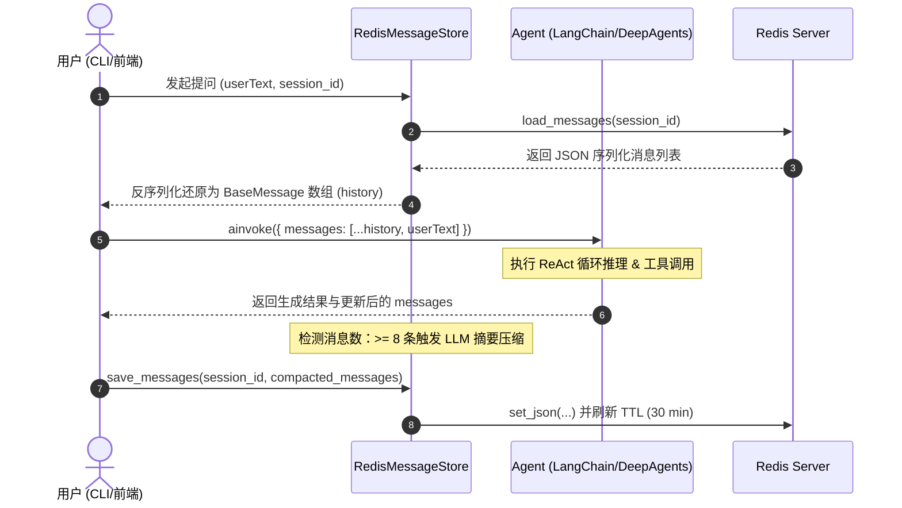

# Redis 核心原理与 Agent 短期记忆架构实战总结

## 一、 Redis 基础与企业级特性概述

### 1. Redis 核心定位与技术优势
Redis（Remote Dictionary Server）是一个开源的内存高性能 Key-Value 数据库。因其基于**内存存储、单线程非阻塞 I/O 多路复用**机制，读写吞吐量可达十万级 QPS，是现代高性能分布式架构不可或缺的核心组件。

### 2. 日常业务中的 8 大通用应用场景
在企业级日常业务开发中，Redis 主要应用于以下场景：
1. **高性能缓存 (Cache)**：热点数据缓存（如商品详情、用户信息），减轻关系型数据库读压力。
2. **分布式 Session / Token 集中共享**：微服务架构下统一存储用户登录状态（包含 Token 强制失效与黑名单）。
3. **分布式锁 (Distributed Lock)**：基于 `SET key val NX EX ttl` 或 Redlock 解决高并发竞争（抢单、扣减库存、防重提交）。
4. **计数器与 API 限流 (Rate Limiter)**：
   * **计数**：点赞数、文章阅读量、在线人数 (`INCR` / `HINCRBY`)。
   * **限流**：滑动窗口限流、令牌桶算法接口防刷。
5. **排行榜系统 (Leaderboard)**：基于 `ZSet`（跳表实现），支持游戏积分榜、热搜榜、实时消费排行。
6. **消息队列与延时任务 (Message Queue & Delay Queue)**：
   * `List` (`LPUSH` + `BRPOP`) 异步队列。
   * `ZSet` 存储毫秒时间戳实现延时订单取消。
   * `Stream` 支持消费组与 ACK 持久化队列。
7. **社交关系与去重 (Set & HyperLogLog & BloomFilter)**：
   * `Set`：共同好友 (`SINTER`)、随机抽奖。
   * `HyperLogLog`：海量 UV 去重统计（极小内存消耗）。
   * `BloomFilter`（布隆过滤器）：缓存穿透拦截、海量数据推荐防重。
8. **地理位置服务 (GEO)**：基于 GeoHash 算法实现“附近的人/门店”和距离计算。

### 3. 企业级规范 Redis 服务最佳实践
在生产环境中，不能简单地直接调用原生客户端，需要通过企业级服务组件（如项目中的 `EnterpriseRedisService`）封装以下防护机制：

* **读穿透闭环 (`get_or_set`)**：自动完成 `查缓存 ➔ 未命中查 DB ➔ 回写缓存`。
* **防缓存雪崩 (TTL Jitter)**：基础 TTL 上增加 10% 随机时间抖动，避免海量 Key 同一秒并发失效。
* **防缓存穿透 (Null Protection)**：数据库也不存在时，写入短暂的 `NULL` 占位符。
* **命名空间约束 (Namespace Key Governance)**：强制多级 Key 隔离，如 `project:module:session_id`。

---

## 二、 Agent 记忆体系：短期记忆 vs 长期记忆

在构建 AI Agent 时，只依赖大模型自带的上下文窗口（Context Window）无法满足持续、复杂的交互需求。我们需要建立清晰的记忆层级架构：

```
                      ┌─────────────────────────────────────────┐
                      │              AI Agent 记忆体系           │
                      └────────────────────┬────────────────────┘
                                           │
                   ┌───────────────────────┴───────────────────────┐
                   ▼                                               ▼
     ┌──────────────────────────┐                    ┌──────────────────────────┐
     │  短期记忆 (Short-Term)   │                    │  长期记忆 (Long-Term)    │
     ├──────────────────────────┤                    ├──────────────────────────┤
     │ • 介质: Redis / 内存      │                    │ • 介质: 向量数据库/Mem0  │
     │ • 范围: 当前会话 (Session)│                    │ • 范围: 全局/跨会话      │
     │ • 特性: 带 TTL / 动态压缩 │                    │ • 特性: 语义检索 (RAG)   │
     └──────────────────────────┘                    └──────────────────────────┘
```

### 1. 什么是 Agent 短期记忆？
Agent 的短期记忆（Short-term Working Memory）对应人类的**工作记忆**。它负责保存当前会话（Session）正在进行的对话上下文，具备 **会话隔离、滑动续期、超时挥发、自动压缩** 4 大核心特征。

### 2. 短期记忆与长期记忆对比表

| 维度 | 短期记忆 (Short-Term Memory) | 长期记忆 (Long-Term Memory) |
| :--- | :--- | :--- |
| **存储介质** | **Redis** / 内存字典 | **向量数据库 (Milvus/Chroma)** / Mem0 / MySQL |
| **生命周期** | **临时（带 TTL，如 30 分钟）** | **永久保存** |
| **作用范围** | 单次连续会话内部 (`session_id`) | 跨会话、全局用户画像 |
| **核心用途** | **回答“我刚才说了什么”、“按我刚才的要求修改”** | **回答“我的个人偏好是什么”、“我上个月买了什么”** |
| **检索方式** | 按 `session_id` 读取完整/切片消息队列 | 按 Embedding 语义相似度召回 (RAG) |

---

## 三、 基于 Redis 的 Agent 短期记忆架构设计

### 1. 核心交互流转架构

基于 Redis 的 Agent 短期记忆架构采用**无状态存储模式**：应用服务本身不持有所谓的 Memory 状态，而是“即读即用，用完写回”。



### 2. 消息序列化与反序列化
因为 LangChain 的消息（`HumanMessage`, `AIMessage`, `SystemMessage`）属于类实例（包含了 `tool_calls` 等复杂结构），在存入 Redis 时必须进行 JSON 转化：

* **Python 序列化标准**：
  ```python
  from langchain_core.messages import messages_to_dict, messages_from_dict

  # 序列化为 JSON List 存入 Redis
  dict_list = messages_to_dict(messages)

  # 从 Redis 读取并反序列化回 Message 对象列表
  messages = messages_from_dict(dict_list)
  ```
* **TypeScript / Node.js 序列化标准**：
  ```typescript
  import { mapChatMessagesToStoredMessages, mapStoredMessagesToChatMessages } from "@langchain/core/messages";

  const raw = await redis.get(key);
  const messages = mapStoredMessagesToChatMessages(JSON.parse(raw));
  ```

### 3. 过期策略与动态续期机制 (TTL & Keep-Alive)
* **基础 TTL 配置**：默认设置 `1800` 秒（30 分钟）。
* **企业级防雪崩抖动**：通过 `EnterpriseRedisService` 自动为 1800s 叠加 ±10% 的随机时间抖动，实际存活时间在 **1620秒 ~ 1980秒** 之间，防止海量并发会话同时失效崩溃。
* **滑动窗口续期 (Keep-Alive)**：只要用户与 Agent 产生新的交互，重新 `save_messages` 时都会自动重置并刷新 30 分钟计时。

---

## 四、 3 种短期记忆上下文压缩与截断策略

随着对话轮次增加，消息会超出大模型的上下文窗口。以下是 3 种主流的上下文控制策略：

### 策略 1：按消息数量滑动窗口截断 (Count-based Truncation)
* **原理**：只保留最新的 $N$ 条消息，最早的消息直接从队列头部抛弃。
* **实现**：在 `deep_agents` 中设置 `max_context_messages=10`。
* **优点**：**0 额外大模型调用开销**，延迟极低。

### 策略 2：动态 LLM 摘要压缩 (Dynamic LLM Summarization)
* **原理**：当消息数量超出阈值（如 $\ge 8$ 条）时，抽取早期消息提交给大模型生成中文摘要，再将摘要构造成 `SystemMessage` 放在头部，尾部拼接最新的 4 条原始对话。
* **优点**：**信息保留度高**，避免大模型“忘掉前文提到的重要事实/约束”。

### 策略 3：按 Token 数量精确截断 (Token-based Truncation)
* **原理**：利用 `tiktoken` 计算真实的 Token 消耗，确保总 Token 控制在指定预算（如 2000 tokens）以内，并永久保留 `SystemPrompt`。

---

## 五、 完整生产级代码实战 (Python 实现)

以下为 Python 环境下结合 `deep_agents`、`EnterpriseRedisService` 和**动态 LLM 摘要压缩**的完整可运行实战代码：

**文件**：`redis/agent_memory.py`

```python
import sys
import os
import json
import asyncio
from typing import List

# 将项目根目录加入 Python 模块搜索路径
sys.path.append(os.path.dirname(os.path.dirname(os.path.abspath(__file__))))

from langchain_core.tools import tool
from langchain_core.messages import (
    HumanMessage, 
    SystemMessage,
    BaseMessage, 
    messages_to_dict, 
    messages_from_dict
)
from deep_agents import create_agent
from modules.core.llm import default_model
from redis.service import EnterpriseRedisService


class RedisMessageStore:
    """
    基于 Redis 的 Agent 短期记忆存储器
    负责 LangChain 消息对象的 JSON 序列化、反序列化、TTL 控制及内存降级保护
    """

    def __init__(self, redis_service: EnterpriseRedisService, module_name: str = "short_memory", ttl_seconds: int = 1800):
        self.redis_service = redis_service
        self.module_name = module_name
        self.ttl_seconds = ttl_seconds
        # 内存降级字典（当本地未配置 Redis 连接凭证时保底可用）
        self._memory_fallback = {}

    def load_messages(self, session_id: str) -> List[BaseMessage]:
        """从 Redis 读取并反序列化 LangChain 消息列表"""
        dict_list = self.redis_service.get_json(self.module_name, session_id)
        if dict_list is None:
            dict_list = self._memory_fallback.get(session_id)

        if not dict_list:
            return []
        try:
            return messages_from_dict(dict_list)
        except Exception as e:
            print(f"❌ 解析历史消息失败: {e}")
            return []

    def save_messages(self, session_id: str, messages: List[BaseMessage]):
        """序列化消息列表并写回 Redis (带有 TTL 过期时间)"""
        dict_list = messages_to_dict(messages)
        success = self.redis_service.set_json(self.module_name, session_id, dict_list, ttl=self.ttl_seconds)
        if not success:
            # 降级写本地内存
            self._memory_fallback[session_id] = dict_list

    def clear(self, session_id: str):
        """清空指定会话在 Redis 中的记忆"""
        self.redis_service.delete(self.module_name, session_id)
        self._memory_fallback.pop(session_id, None)


@tool
def get_weather(city: str) -> str:
    """查询指定城市的天气信息。"""
    return f"{city} 当前天气晴朗，温度 25℃。"


async def invoke_with_memory(agent, store: RedisMessageStore, session_id: str, user_text: str):
    """
    带记忆的 Agent 调用管道：
    1. 从 Redis 读取历史消息
    2. 拼接 [history + current_user_message]
    3. 调用 Agent 获取推理结果
    4. 若消息 >= 8 条，触发 LLM 自动总结摘要，并保存回 Redis 刷新 TTL
    """
    # 1. 加载历史
    history = store.load_messages(session_id)
    print(f"  ↳ 从 Redis 加载了 {len(history)} 条历史消息")

    # 2. 拼接当前提问
    current_messages = history + [HumanMessage(content=user_text)]

    # 3. 执行 Agent
    result = await agent.ainvoke({"messages": current_messages})

    # 4. 自动摘要压缩：当消息超过 8 条时，提炼前部对话为摘要
    updated_messages = result.get("messages", [])
    if len(updated_messages) >= 8:
        to_summarize = updated_messages[:-4]
        summary_res = await default_model.ainvoke(f"请用中文简短总结以下对话的关键信息与事实：\n{to_summarize}")
        summary_msg = SystemMessage(content=f"【前文对话摘要】：{summary_res.content}")
        updated_messages = [summary_msg] + updated_messages[-4:]
        print("  ⚡ 已触发 LLM 动态上下文摘要压缩")

    # 5. 写回 Redis 并更新 TTL
    store.save_messages(session_id, updated_messages)
    print(f"  ↳ 已将 {len(updated_messages)} 条最新消息写回 Redis (TTL {store.ttl_seconds}s)")

    return updated_messages


async def main():
    redis_service = EnterpriseRedisService(project_prefix="my_push")
    store = RedisMessageStore(redis_service=redis_service, ttl_seconds=1800)
    session_id = "demo_user_001"

    agent = create_agent(
        llm=default_model,
        tools=[get_weather],
        system_prompt="你是会话助手。记住用户提到的关键事实，中文简短回答。",
        max_context_messages=10
    )

    print("=== 基于 Redis 的 Agent 记忆交互控制台 (Python 版) ===")
    print("输入 exit / quit / :q 退出，:clear 清空记忆\n")

    while True:
        try:
            user_text = input("你: ").strip()
        except (KeyboardInterrupt, EOFError):
            break

        if not user_text:
            continue

        if user_text.lower() in ["exit", "quit", ":q"]:
            break

        if user_text == ":clear":
            store.clear(session_id)
            print("已清空当前会话记忆\n")
            continue

        messages = await invoke_with_memory(agent, store, session_id, user_text)
        if messages:
            print(f"\n助手: {messages[-1].content}")
            print(f"当前会话消息数: {len(messages)}\n")


if __name__ == "__main__":
    asyncio.run(main())
```

---

## 六、 记忆策略综合对比与选型指南

| 策略方案 | 实现复杂度 | 内存/Token 消耗 | 信息保留度 | 适合场景 |
| :--- | :--- | :--- | :--- | :--- |
| **纯 Redis 存储 (不压缩)** | ⭐ | 极高 (容易 Context 溢出) | 100% 原始保留 | 3-5 轮短促任务 |
| **Redis + 按条数滑动窗口截断** | ⭐⭐ | 低 (固定长度) | 丢弃早期历史 | 高频问答、轻量助手 |
| **Redis + 动态 LLM 摘要压缩 (推荐)** | ⭐⭐⭐ | 极低 | 高 (保留事实与偏好) | 复杂多轮对话、客服 Agent |
| **向量数据库长期记忆 (RAG)** | ⭐⭐⭐⭐ | 极低 | 语义精准召回 | 个人知识库、跨会话档案 |

---

## 七、 总结

1. **Redis 是短期记忆的最优解**：凭借高并发、低延迟和原生 TTL 机制，Redis 是处理 Agent 分布式 Session 记忆的工业级首选。
2. **状态外置与无状态服务**：将 `messages` 从 Agent 逻辑中解耦存入 Redis，是实现微服务横向扩展（Scale Out）的关键。
3. **压缩防护不可或缺**：必须在写回 Redis 前通过**滑动窗口截断**或**动态 LLM 摘要**处理，从根本上防止 Token 溢出与 API 成本飙升。
