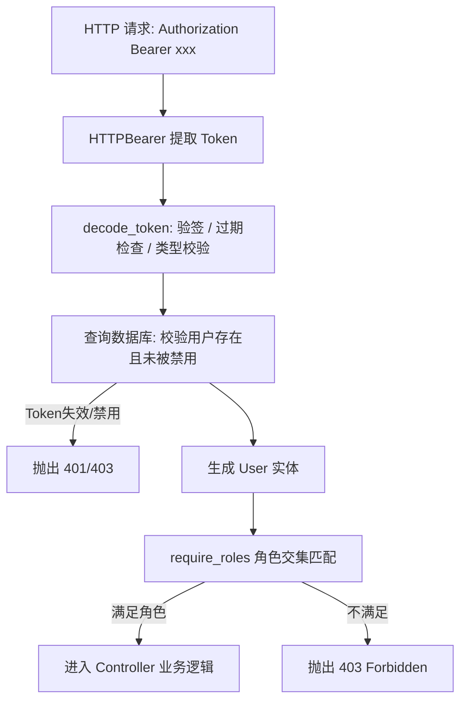

# Agent WLL - 用户管理与双 Token 鉴权体系架构设计与开发思路

> **文档定位**：本文档详细复盘与阐述 **用户管理、注册登录与双 Token 鉴权体系** 的完整架构设计思路、技术选型权衡（Trade-offs）、核心安全决策与工程落地细节，供团队开发与架构演进参考。

---

## 🎯 1. 设计背景与核心目标

在构建知识库平台（Knowledge Hub）的过程中，文档创建（`author_id`）、版本迭代、文档审核（`reviewer_id`）等业务场景均强依赖**明确的用户主体**与**细粒度的权限控制**。

为了实现高安全、高可用且易于扩展的用户中枢，本模块确立了以下四大核心目标：
1. **RBAC 权限解耦**：通过多对多模型实现灵活的角色赋权，满足多重身份与权限动态调整需求；
2. **高强度密码防线**：杜绝明文与弱哈希存储，采用工业级标准 Bcrypt 算法及防时序攻击校验；
3. **双 Token 无感刷新**：在兼顾接口高性能无状态验签的同时，解决“令牌窃取风险”与“强制下线/主动注销”的矛盾；
4. **NestJS 风格分层在 FastAPI 中的最佳实践**：保持职责边界清晰（Controller / Service / DTO / Schemas / Dependencies）。

---

## 🏗️ 2. 数据架构与模型设计思路

### 2.1 为什么选择 RBAC 多对多模型？

在权限系统设计初期，通常有三种方案可选：

```
方案 A (1:1 / 字段存角色)    ──►  方案 B (1:N / 单 role_id)    ──►  方案 C (M:N / 中间表桥接) 【当前采纳】
[User] 表直接存 role 字符串        [User] 表关联 1 个 role_id           [User] 1 ─── M [UserRole] M ─── 1 [Role]
```

- **方案 A (字符串或逗号分割)**：违反数据库第一范式（1NF），无法建立索引加速，查询“某个角色的所有用户”必须全表模糊扫描（`LIKE '%admin%'`），性能灾难；
- **方案 B (用户表直接存单个 `role_id`)**：极度死板。现实中一名员工往往兼具多重身份（例如既是“文档创作者”，又是“合规审核员”），单列无法支持兼职赋权；
- **方案 C (当前方案：引入 `kh_user_role` 中间表)**：
  - **核心思路**：将“用户实体”与“角色定义”彻底解耦，中间表只负责记录“谁领了哪把钥匙”；
  - **优势**：增发、撤销角色只需在中间表增删一行记录，主表数据保持绝对纯净，支持无限灵活扩展。

---

### 2.2 为什么坚持使用「逻辑外键」而非「物理外键」？

在 Supabase / PostgreSQL 拓扑图中，有开发者会疑惑为什么 `kh_user_role` 与 `kh_user` 之间没有画物理连线箭头。这是我们在企业级架构下的**主动技术决策**：

| 考量维度 | 物理外键 (`FOREIGN KEY REFERENCES`) | 逻辑外键 + 索引 (`index=True`) 【当前设计】 |
| :--- | :--- | :--- |
| **并发与锁开销** | 写入中间表时，数据库必须强锁父表查询，高并发下极易发生**死锁 (Deadlock)** | **无锁冲突**，插入性能达到数据库极致 |
| **数据安全性** | 若配置 `ON DELETE CASCADE`，误删用户会导致关联数据被**物理全量抹除** | 配合**软删除 (`deleted=true`)**，业务可追溯、防误删 |
| **分布式与微服务** | 当用户表未来拆分到独立“用户中心库”时，物理外键直接失效 | **天然支持分库分表与微服务拆分** |
| **查询性能保障** | 依赖外键附带索引 | 显式声明 `index=True`，在底层建立 B+ 树索引，$O(\log N)$ 极速命中 |

---

### 2.3 雪花算法 ID（Snowflake ID）与精度防丢策略

- **自增 ID 的弊端**：连续自增容易被爬虫/黑客遍历猜测用户总量，且在多实例分库分表时会产生主键冲突；
- **UUID 的弊端**：字符串长度达到 36 位且完全无序，作为 B+ 树主键时会导致严重的**页分裂（Page Split）**与存储空间膨胀；
- **雪花 ID 的优势**：基于时间戳单调递增，64 位整型（`BigInteger`），天然支持分布式并发生成；
- **防前端精度丢失设计**：JavaScript 的 `Number.MAX_SAFE_INTEGER` 为 $2^{53}-1$（9007199254740991），而 64 位雪花 ID 为 19 位数字，前端直接接收会丢失末尾精度。**我们在 DTO 响应层通过 Pydantic 自动将 ID 序列化为 `string` 输出**，彻底规避前端精度截断。

---

## 🔐 3. 密码安全机制的演进思路

密码存储是系统安全的第一道红线，本模块的设计思路经历了如下推导：

```
明文存储 ──► MD5/SHA256 ──► 加盐哈希 PBKDF2 ──► 工业级标准 Bcrypt (当前方案)
(0分: 泄露即死)   (20分: 彩虹表秒破)   (80分: 满足合规)        (100分: 抗 GPU/ASIC 暴力破解)
```

1. **动态随机盐 (Salt)**：使用 `bcrypt.gensalt(rounds=12)`，即使两个用户密码完全相同，生成的哈希串也完全不同，彻底粉碎彩虹表攻击；
2. **运算成本因子 (Cost Factor)**：设置 12 轮（$2^{12} = 4096$ 次哈希循环），将单次验证耗时控制在 50~100ms 左右。对正常用户毫无感知，但能让试图用 GPU 集群每秒尝试数亿次破解的攻击者成本提升上万倍；
3. **抗时序攻击 (Timing Attack)**：密码比对使用底层常量时间算法，防止黑客通过测量响应时间差来逐字节推测哈希内容；
4. **防枚举报错**：用户不存在与密码错误均统一返回 `401: 用户名或密码错误`，不向外界暴露用户名是否存在的信息。

---

## 🔄 4. 双 Token 体系与无感刷新的设计思路

### 4.1 传统单 Token 的死局与矛盾

- **设为短期（如 30 分钟）**：用户每隔半小时就被强制登出一次，填写一半的文档丢失，用户体验极差；
- **设为长期（如 7 天）**：JWT 是无状态的，一旦 Token 被 XSS 或网络抓包截获，后端在 7 天内**无法主动作废该 Token**，系统形同裸奔。

---

### 4.2 双 Token 的破局思路

```
                ┌─────────────────────────────────────────────────────────────┐
                │                         用户登录成功                         │
                └──────────────────────────────┬──────────────────────────────┘
                                               │
                       ┌───────────────────────┴───────────────────────┐
                       ▼                                               ▼
         ┌───────────────────────────┐                   ┌───────────────────────────┐
         │       Access Token        │                   │       Refresh Token       │
         ├───────────────────────────┤                   ├───────────────────────────┤
         │ • 有效期: 2 小时 (短命)    │                   │ • 有效期: 7 天 (长命)      │
         │ • 传输频次: 极高 (每次请求)│                   │ • 传输频次: 极低 (仅换票)  │
         │ • 携带: user_id, roles    │                   │ • 携带: user_id, 唯一 jti │
         │ • 作用: 业务鉴权          │                   │ • 作用: 换取新 AccessToken│
         └───────────────────────────┘                   └───────────────────────────┘
```

#### 关键机制 1：令牌类型隔离 (`TokenType`)
在 Token Payload 中硬编码 `"type": "access"` 或 `"type": "refresh"`。解码时强制校验预期类型，**彻底杜绝攻击者使用 `refresh_token` 直接当作 `access_token` 请求业务接口的提权漏洞**。

#### 关键机制 2：结合 Redis 黑名单实现「主动登出」
JWT 自身无法注销，但我们在 `refresh_token` 中埋入了全局唯一的雪花 ID **`jti`**：
- 当用户点击退出登录（`POST /user/logout`）时，后端将该 `jti` 写入 Redis：
  ```text
  SET token:blacklist:{jti} 1 EX 604800 (设置与 Token 剩余寿命一致的 TTL)
  ```
- 后续刷新接口在换票前强制检查 `GET token:blacklist:{jti}`，若已在黑名单则立即拒绝。

#### 关键机制 3：滚动刷新与防重放 (Refresh Token Rotation)
当客户端使用 `refresh_token` 换取新令牌时，后端会：
1. 签发新的 `access_token`；
2. **同时签发一个新的 `refresh_token`（新 `jti`）**；
3. **将刚刚用过的旧 `jti` 立即打入 Redis 黑名单**。
- **效果**：每个刷新令牌只能使用一次。若黑客截获了已用过的 Refresh Token 试图换票，会立即被拦截并报警。

---

## 🛡️ 5. FastAPI 鉴权体系对标 NestJS 守卫的设计思路

TypeScript (NestJS) 使用 `@Injectable() class RolesGuard` + `@Roles()` 装饰器 + 反射 `Reflector`。
FastAPI 虽无类元数据反射机制，但其 **函数式依赖注入系统（Dependency Injection）** 更加灵活优雅：



### 为什么在 `require_roles` 中使用闭包工厂？
```python
def require_roles(required_roles: List[str]):
    async def role_checker(
        current_user: User = Depends(get_current_user),
        db: AsyncSession = Depends(get_db),
    ) -> User:
        # 1. 自动继承 get_current_user 的登录校验
        # 2. 查询当前用户启用的所有角色
        # 3. 使用集合求交集 (intersection) 判定权限
        ...
        return current_user
    return role_checker
```
- **单一依赖搞定全部**：业务接口只需写 `current_user: User = Depends(require_roles(["admin"]))`，一行代码自动串联：**Token 提取 $\to$ 签名校验 $\to$ 账号状态查验 $\to$ 角色命中判断 $\to$ 注入强类型 `User` 实例**。

---

## 🏛️ 6. 模块分层与工程目录规范

模块严格遵循单一职责原则（SRP）进行组织：

```
app/modules/user/
├── __init__.py               # 模块统一入口与对外符号导出 (AppModule 概念)
├── controller.py             # 控制器层：负责 HTTP 路由注册、状态码定义与入参/出参绑定
├── service.py                # 业务逻辑层：负责事务编排、查重、密码哈希、Token 签发与 Redis 交互
├── dependencies.py           # 鉴权守卫层：负责 Bearer 提取、Token 解密、当前用户注入与 RBAC 守卫
├── dto.py                    # 数据传输层：负责 Pydantic V2 校验、字段长度约束与时区序列化
├── schemas/                  # 数据持久层：SQLModel 数据库实体定义
│   ├── __init__.py
│   └── pg_models.py          # kh_user, kh_role, kh_user_role 表结构与索引定义
└── index.md                  # 模块速查文档与预置账号说明
```

---

## 🧪 7. 全链路验证与自动化测试覆盖

为确保生产环境的高可靠性，编写了 `test_jwt_flow.py` 端到端全链路测试脚本，覆盖以下场景：

| 测试用例 | 验证目标 | 预期结果 | 实测状态 |
| :--- | :--- | :--- | :--- |
| **TC-01 正常注册** | 用户名查重、雪花 ID 生成、Bcrypt 加密、默认绑定普通用户 | 返回 201，密码为 `$2b$` 哈希，角色为 `user` | ✅ 通过 |
| **TC-02 重复用户名注册** | 唯一性校验拦截 | 抛出 400 Bad Request | ✅ 通过 |
| **TC-03 正常登录** | 密码校验正确，签发双 Token，记录最后登录时间 | 返回 200，包含 Access/Refresh Token 及用户画像 | ✅ 通过 |
| **TC-04 错误密码登录** | 密码错误拦截 | 抛出 401 Unauthorized | ✅ 通过 |
| **TC-05 不存在用户登录** | 防枚举模糊拦截 | 抛出 401 Unauthorized | ✅ 通过 |
| **TC-06 Bearer 鉴权获取画像** | `get_current_user` 依赖从 Header 解析有效用户 | 返回 200 及该用户详细数据 | ✅ 通过 |
| **TC-07 角色守卫权限隔离** | 普通用户访问管理员专享接口 | 抛出 403 Forbidden | ✅ 通过 |
| **TC-08 无感换票刷新** | 使用 Refresh Token 换取全新 Access Token | 返回新双 Token，旧 Token 鉴权依然有效 | ✅ 通过 |
| **TC-09 登出与 Redis 黑名单** | 调用注销接口后，再次尝试用旧 Refresh Token 换票 | 命中 Redis 黑名单，抛出 401 拦截 | ✅ 通过 |

---

## 💡 8. 总结与后续扩展建议

1. **已达成**：完整的 RBAC 多对多数据底座、Bcrypt 安全加密、双 Token 无感刷新、Redis 防重放黑名单与 FastAPI 角色守卫；
2. **后续可平滑扩展**：
   - **多端登录控制**：在 Redis 中记录 `user_id -> [jti1, jti2]`，支持“只允许单端在线”或“踢掉其他设备”；
   - **图形/短信验证码**：在 `UserLoginDto` 中增加验证码字段，结合 Redis 验证码缓存实现防爆破登录。
