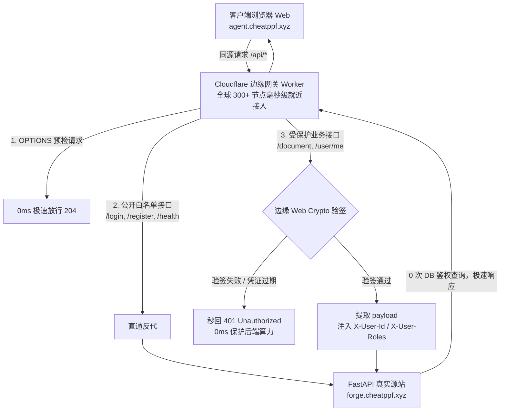
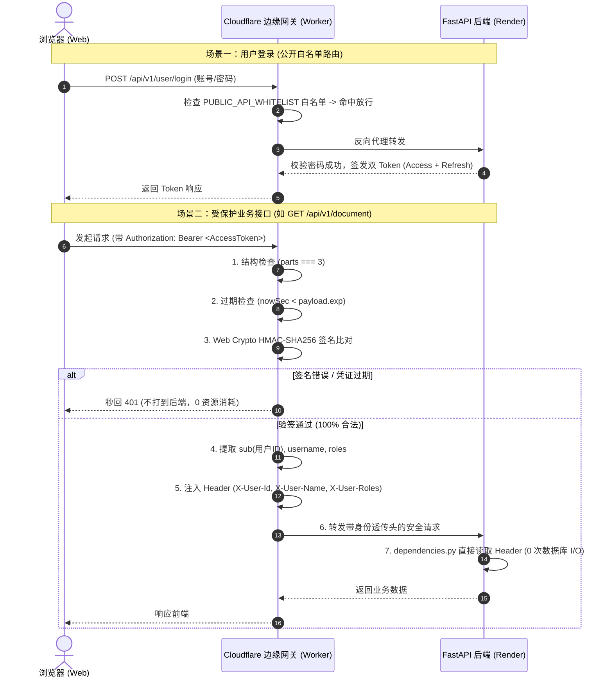

# Cloudflare Edge API Gateway 边缘网关：架构原理与核心实现指南

---

## 0. 网关基础概念通俗白话

### 0.1 为什么需要 API 网关与反向代理？
* **正向代理 (Forward Proxy)**：**代表客户端**。比如公司 VPN，外部服务器只知道代理服务器的 IP，不知道员工的真实 IP。
* **反向代理 (Reverse Proxy)**：**代表服务端**。客户端只访问公开域名（如 `agent.cheatppf.xyz`），网关收到请求后在后台悄悄转发给后端真实服务器（如 Render 的 `forge.cheatppf.xyz`），客户端完全不知道后端真实地址。

#### 💡 为什么必须加一层边缘网关？
1. **隐藏后端真实源站**：保护 Render 后端不被直接扫描或暴力破解；
2. **边缘 0ms 极速拦截**：伪造 Token 或未登录的非法请求在全球离用户最近的 Cloudflare 边缘机房就被秒拒（返回 401），**0 次网络请求打到后端，100% 保护后端算力**；
3. **彻底消除 CORS 跨域**：前端页面和 API 请求共用同一个域名，从物理层面消除浏览器同源策略限制。

---

### 0.2 跨域 (CORS) 是什么？网关是如何消除它的？
* **跨域的本质**：浏览器的同源策略要求前端页面与接口的 **协议 (https)**、**域名 (domain)**、**端口 (port)** 必须完全一致。若前端在 `agent.cheatppf.xyz`，后端在 `forge.cheatppf.xyz`，二级域名不同就会触发跨域阻断。
* **网关消除法**：
  * 用户访问网页：`https://agent.cheatppf.xyz/` -> 访问 Cloudflare Pages 静态页面；
  * 用户调用接口：`https://agent.cheatppf.xyz/api/v1/...` -> 边缘网关拦截 `/api/` 流量并在后台反向代理给真实后端；
  * **在浏览器看来，页面与接口始终同源，CORS 报错彻底消失！**

---

### 0.3 鉴权基础：Session vs JWT 有什么区别？
* **传统 Session (有状态)**：后端必须在 Redis/数据库存一张 Session 表。每次请求都必须查一次库，高并发时数据库连接池瞬间被挤爆。
* **现代 JWT (无状态自包含)**：服务端不存任何数据，而是给用户一张带有**数学防伪签名**的电子门票。
  * **三段式结构**：`Header.Payload.Signature`
    - **Header**：声明算法（如 HS256）
    - **Payload**：用户数据（如 `userId`, `username`, `roles`, `exp`）
    - **Signature**：防伪指纹，公式为 $\text{HMAC-SHA256}(\text{Header} + "." + \text{Payload}, \text{SECRET\_KEY})$
  * **网关如何 0ms 验签？** 网关拿到 Token 后，在内存中用相同的数学公式算一次，若与 Signature 一致，即可**在数学上 100% 证明数据未经篡改且真实有效**，全程 0 次数据库查询！

---

## 1. 边缘网关架构拓扑与全景流程



---

## 2. 边缘网关核心鉴权时序图 (零 DB 消耗)



---

## 3. 网关关键代码与实现解析

### 3.1 Web Crypto 硬件级极速验签算法
在 [cloudflare-gateway/worker.js](file:///d:/self/agent-wll/cloudflare-gateway/worker.js#L163-L214) 中：

```javascript
async function verifyJwt(token, secret) {
  const parts = token.split(".");
  if (parts.length !== 3) return { valid: false, error: "令牌结构格式非法" };

  const [headerB64, payloadB64, signatureB64] = parts;

  // 1. 安全解码 UTF-8 Payload 并校验过期时间
  const payloadJson = base64UrlDecode(payloadB64);
  const payload = JSON.parse(payloadJson);
  const nowSec = Math.floor(Date.now() / 1000);
  if (payload.exp && payload.exp < nowSec) {
    return { valid: false, error: "登录凭证已过期，请刷新或重新登录" };
  }

  // 2. 边缘原生 Web Crypto 导入密钥与验签 (C++ 硬件级加速，耗时 < 0.1ms)
  const enc = new TextEncoder();
  const key = await crypto.subtle.importKey(
    "raw",
    enc.encode(secret),
    { name: "HMAC", hash: "SHA-256" },
    false,
    ["verify"]
  );

  const dataToVerify = enc.encode(`${headerB64}.${payloadB64}`);
  const signatureBytes = base64UrlToUint8Array(signatureB64);

  const isValid = await crypto.subtle.verify("HMAC", key, signatureBytes, dataToVerify);
  if (!isValid) return { valid: false, error: "令牌签名无效" };

  return { valid: true, payload };
}
```

---

### 3.2 用户上下文安全注入与后端接收

#### 1. 网关端注入（安全编码防崩溃）
```javascript
if (userId) {
  newHeaders.set("X-User-Id", userId);
  newHeaders.set("X-User-Name", encodeURIComponent(userName)); // URI 编码，防 ByteString 异常
  newHeaders.set("X-User-Roles", userRoles);
}
```

#### 2. 后端 FastAPI 零开销读取
在 [app/modules/user/dependencies.py](file:///d:/self/agent-wll/app/modules/user/dependencies.py#L45-L58) 中：
```python
gateway_user_id = request.headers.get("X-User-Id")
if gateway_user_id:
    # 0 次 SQL 查询！直接将网关透传的身份封装为 UserContext
    return UserContext(
        id=int(gateway_user_id),
        username=unquote(request.headers.get("X-User-Name", "")),
        roles=request.headers.get("X-User-Roles", "").split(","),
    )
```

---

## 4. 网关生产级运维与安全加固

### 4.1 密钥云端加密管理（0 明文入 Git）
* 密钥通过 Cloudflare 专用命令行加密上传，不在 `wrangler.toml` 或代码中留下任何明文：
  ```bash
  npx wrangler secret put JWT_SECRET_KEY
  ```

### 4.2 Cloudflare WAF API 放行规则
* 为防止 Cloudflare 自带的“五秒盾 / 人机验证”阻断前端 Axios POST 异步请求，在 Cloudflare WAF 中配置规则：
  - **匹配条件**：`URI 路径 开头为 /api/`
  - **操作**：`跳过 (Skip) 所有托管规则与人机验证`

### 4.3 24 小时永不休眠保活 (UptimeRobot)
* 配置 UptimeRobot 每 5 分钟请求一次 `https://forge.cheatppf.xyz/health`；
* 不断重置 Render 容器的 15 分钟闲置休眠计时，确保网关转发时后端始终处于**热启动、毫秒级就绪**状态。
