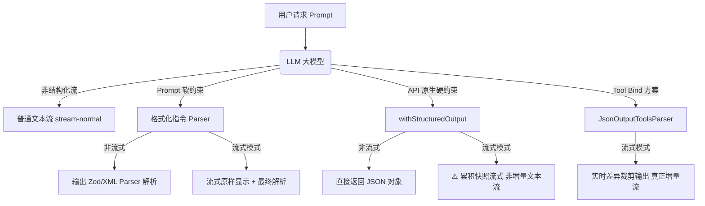
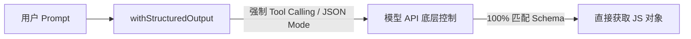
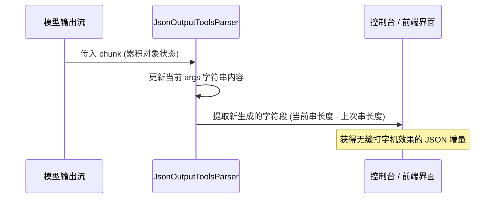

# Agent 结构化输出与流式解析实战总结

在构建 AI Agent 的实际业务中，我们不仅需要大模型以自然的语言进行回复，更需要它输出规范的、可被程序直接处理的结构化数据（如 JSON、XML）。此外，为了提升用户交互体验，流式传输（Streaming）也是必不可少的。

本文将结合实战代码，对大模型的**结构化输出（Structured Output）**以及**结构化流式解析（Structured Streaming Parser）**进行深度归纳总结。

---

## 一、 结构化输出与流式解析全景图

结构化输出主要分为**“基于 Prompt 指引的软约束”**和**“基于模型原生的硬约束”**。当结合流式响应时，由于数据是碎片化返回的，如何进行流式解析也是开发中的一大核心难点：



---

## 二、 基于 Prompt 指引的格式化解析 (Instruction-based Parsers)

这类方案的本质是在 Prompt 中拼接一段“格式说明语”（Format Instructions），告诉大模型必须输出符合特定语法的文本（如 JSON/XML），最后使用对应的 Parser 进行解析。

### 1. 简易键值对解析器 (`StructuredOutputParser.fromNamesAndDescriptions`)

#### 核心思路
通过定义字段名和对应的描述，由 LangChain 自动生成格式化指令并注入 Prompt。模型返回后，通过 Parser 解析为扁平的 JavaScript 对象。

#### 关键代码
**文件**：`src/out-put/index.ts`
```typescript
import { StructuredOutputParser } from "@langchain/core/output_parsers";

// 1. 定义期望输出的字段与含义
const stringParse = StructuredOutputParser.fromNamesAndDescriptions({
  name: "string",
  english_name: "string",
  type: "string",
  moons_count: "number",
  notable_features: "array",
});

// 2. 将格式化指令拼入 Prompt
const question = `请介绍一下水星的信息\n${stringParse.getFormatInstructions()}`;

// 3. 拦截响应并解析
const response = await model.invoke(question);
const result = await stringParse.parse(response.content as string);
```

#### 适用场景
- 数据结构简单、扁平（不含复杂嵌套）的原型开发。
- 快速格式化少量基本字段的场景。

---

### 2. 强类型 Zod 验证解析器 (`StructuredOutputParser.fromZodSchema`)

#### 核心思路
当数据结构比较复杂、存在多层嵌套或数组时，简易键值对已无法满足要求。此时可以使用 **Zod** 编写强类型 Schema。它不仅能控制字段类型，还能描述复杂的嵌套关系，并通过 `parser.parse()` 提供自动的数据类型转换与安全校验。

#### 关键代码
**文件**：`src/out-put/output-zod.ts`
```typescript
import { StructuredOutputParser } from '@langchain/core/output_parsers';
import { athleteSchema } from '@/schemas/athlete.js'; // Zod Schema

// 1. 从 Zod Schema 生成解析器
const athleteParser = StructuredOutputParser.fromZodSchema(athleteSchema);

// 2. 生成注入格式化的提示词
const question = `请介绍一下英雄联盟职业选手 Faker 的详细信息...\n${athleteParser.getFormatInstructions()}`;

// 3. 获取响应并进行 Zod 校验解析
const result = await model.invoke(question);
const parsedResult = await athleteParser.parse(result.content as string);
```

#### Zod Schema 定义示例 (`src/schemas/athlete.ts`)
```typescript
export const athleteSchema = z.object({
    name: z.string().describe("电竞选手的全名"),
    games: z.array(z.string()).describe("参与的电竞游戏项目列表"),
    awards: z.array(
        z.object({
            name: z.string().describe("奖项名称"),
            year: z.number().describe("获奖年份")
        })
    ).describe("获得的重要奖项列表"),
    biography: z.string().describe("简短传记，100字以内")
});
```

#### 适用场景
- **生产环境首选**。
- 具有复杂嵌套、数组、可选字段的高保真数据落地场景。
- 需要严格数据校验与字段过滤的 API 服务。

---

### 3. 通用 JSON 文本解析器 (`JsonOutputParser`)

#### 核心思路
`JsonOutputParser` 不强制绑定任何 Schema 验证。它只负责将大模型吐出的 JSON 格式的文本，安全地反序列化为 JS 对象。

#### 关键代码
**文件**：`src/out-put/index.ts`
```typescript
import { JsonOutputParser } from "@langchain/core/output_parsers";

const parser = new JsonOutputParser();
const question = `请以 JSON 格式返回木星信息...\n${parser.getFormatInstructions()}`;

const response = await model.invoke(question);
const result = await parser.parse(response.content as string);
```

#### 适用场景
- 动态属性较多、结构多变的 JSON 数据流。
- 信任模型的输出质量，不需要在代码层做强 schema 字段校验。

---

### 4. XML 标签解析器 (`XMLOutputParser`)

#### 核心思路
要求模型使用 XML 标签来包裹对应的内容，而后由 Parser 解析为嵌套的对象结构。

#### 关键代码
**文件**：`src/out-put/xml-output-parser.ts`
```typescript
import { XMLOutputParser } from "@langchain/core/output_parsers";

const parser = new XMLOutputParser();
const prompt = `请提取以下文本中的人物信息...\n${parser.getFormatInstructions()}`;

const response = await model.invoke(prompt);
// 原始输出形如: <人物信息><姓名>爱因斯坦</姓名></人物信息>
```

#### 适用场景
- 某些大语言模型（如 Claude 或特定开源模型）在处理 **XML 格式** 时的指令遵循度显著优于 JSON。
- 传统企业级系统需要直接消费 XML 数据的场景。

---

## 三、 模型原生支持的强结构化输出 (`withStructuredOutput`)

### 核心思路
前文提到的所有 Parsers，本质上都是通过 Prompt 进行的“软约束”。一旦大模型在回复时“多嘴”（例如在 JSON 前后加了 `Here is the JSON:`），解析器就会崩溃报错。

为了彻底解决这一痛点，现代大模型 API（如 OpenAI、Gemini）提供了原生的结构化约束机制（即 JSON Mode 或强制 Tool Calling）。通过 `model.withStructuredOutput(schema)` 建立的“硬约束”，可以确保大模型**只返回且必须返回**符合 Schema 的对象，彻底免去了 Prompt 拼接以及手动 parse 的繁琐。



### 关键代码
**文件**：`src/out-put/width-structured.ts`
```typescript
import { model } from '@/model.js';
import { athleteSchema } from '@/schemas/athlete.js';

// 1. 创建强约束模型
const structuredModel = model.withStructuredOutput(athleteSchema);

// 2. 直接调用，返回值已经是一个格式化好的对象，无需手动 parse
const result = await structuredModel.invoke("介绍一下神超");
console.log(result.name, result.biography);
```

### 适用场景
- **极度要求高稳定性的商业系统**。
- 需要完全杜绝解析器异常（Json Parse Error）的场景。

---

## 四、 流式响应与结构化流式解析 (Streaming Real-time Parsers)

在需要“打字机”实时输出效果的 UI 中，使用结构化输出会遇到很大挑战。以下是针对流式输出场景的不同实现模式：

### 1. 普通文本流式输出 (`stream-normal.ts`)


最基础的打字机流式，通过循环迭代 `model.stream(prompt)` 的 chunk，实时输出至前台。不支持结构化解析。

---

### 2. 结构化流式：边输出原样 JSON，边保存解析 (`stream-structured-partial.ts`)


#### 核心思路
大模型依然通过 Prompt 软约束生成 JSON。我们在流式读取时，直接向用户展示未解析的原始 JSON 字符。等到所有 chunk 传输完毕后，再调用 `parser.parse(fullContent)` 还原为对象。

#### 关键代码
```typescript
const stream = await model.stream(prompt);
let fullContent = '';

for await (const chunk of stream) {
  if (chunk.content) {
    fullContent += chunk.content;
    process.stdout.write(chunk.content as string); // 实时向用户吐出原始 JSON 字符串
  }
}
const finalObject = await parser.parse(fullContent); // 结束后一次性解析
```

#### ⚠️ 局限性
用户体验差。用户在界面上看到的是一堆反人类的原始 JSON 代码（包含花括号、双引号等），而非美观的 UI 卡片或排版后的文字。

---

### 3. 避坑指南：`withStructuredOutput` 配合 `.stream()` 的流式伪命题


在实战中，许多开发者会尝试编写如下代码：
```typescript
const structuredModel = model.withStructuredOutput(athleteSchema);
const stream = await structuredModel.stream("介绍一下 faker");
for await (const chunk of stream) { ... }
```
并期望它能带来既结构化又流畅的打字机输出。**但实际上，这是一个伪命题**。

#### 核心原因分析
`withStructuredOutput` 底层依赖于 **Tool Calling**。大模型在进行 Tool Calling 时，必须在内部生成**完整的 JSON 参数包**才能触发工具调用并返回。
因此，虽然你调用了 `.stream()`，但：
1. **它无法逐字输出**：你收到的每一个 chunk 都不是新产生的“单个字符”，而是模型内部已经构建出来的**累积合并后的完整对象快照**（或者是阶段性属性合并状态）。
2. **延迟依然高**：用户体验上与非流式调用无异，依然需要等待长达数秒的“白屏时间”后，最后几个 chunk 突然蹦出完整结果。

---

### 4. 终极解决方案：基于 Tool 调用与实时差异裁剪的增量流式 (`stream-tool-calls-parser.ts`)


如果我们需要**“一边生成 JSON，界面上一边根据生成的字段增量渲染 UI”**，必须使用 Tool Calling 并搭配 `JsonOutputToolsParser`，手动计算字符流的**“长度差异”**来实现增量打印。



#### 关键代码
**文件**：`src/out-put/stream-tool-calls-parser.ts`
```typescript
// 1. 显式将 Schema 绑定为工具
const modelWithTools = model.bindTools([
  { name: "get_user_info", schema: athleteSchema, description: "结构化人物信息" }
]);

const parser = new JsonOutputToolsParser();
const chain = modelWithTools.pipe(parser);

const stream = await chain.stream(`介绍一下 faker`);

let lastContent = '';

for await (const chunk of stream) {
  const toolCalls = chunk as any[];
  if (toolCalls && toolCalls.length > 0) {
    const toolCall = toolCalls[0];
    // 每次拿到的都是累积的完整 args 对象 JSON 串
    const currentContent = JSON.stringify(toolCall.args || {}, null, 2);

    // 💡 核心魔法：只输出长度增长的部分，实现真正的“增量打字机”流
    if (currentContent.length > lastContent.length) {
      const newText = currentContent.slice(lastContent.length);
      process.stdout.write(newText); // 实时增量输出到控制台/前端
      lastContent = currentContent;  // 更新上一次的数据进度
    }
  }
}
```

#### 适用场景
- 对用户体验要求极高，既需要 JSON 格式填充 UI 组件，又需要立即看到加载进度的“双赢”场景。

---

## 五、 五种方案综合对比与决策指南

### 1. 综合对比维度

| 方案 | 实现难度 | 解析稳定性 | 嵌套支持度 | 流式友好度 | 核心适用场景 |
| :--- | :--- | :--- | :--- | :--- | :--- |
| **简易键值对 Parser** | ⭐ | ⭐⭐ | ❌ | ⭐ | 扁平结构的快速开发 |
| **Zod Schema Parser** | ⭐⭐ | ⭐⭐⭐ | ⭐⭐⭐⭐⭐ | ⭐⭐ | 生产环境下强类型复杂嵌套解析 |
| **XML Output Parser** | ⭐⭐ | ⭐⭐⭐ | ⭐⭐⭐ | ⭐ | 对 XML 支持更好的模型/旧系统集成 |
| **`withStructuredOutput`** | ⭐ | ⭐⭐⭐⭐⭐ | ⭐⭐⭐⭐⭐ | ❌ (无打字机流) | 核心业务、后台批处理、非流式 API |
| **Tool Calling + 差异剪裁流** | ⭐⭐⭐⭐ | ⭐⭐⭐⭐⭐ | ⭐⭐⭐⭐⭐ | ⭐⭐⭐⭐⭐ (真正流) | 极致体验的前端 AI 智能对话看板 |

### 2. 开发者选型决策树

```mermaid
graph TD
    Q1{是否需要打字机流式效果?}
    Q1 -->|否| Q2{结构是否简单?}
    Q1 -->|是| Q3{是否需要即时更新UI卡片?}

    Q2 -->|是| Opt1[StructuredOutputParser]
    Q2 -->|否| Opt2[withStructuredOutput]

    Q3 -->|是| Opt3[Tool Calling + 长度差异剪裁流]
    Q3 -->|否 (仅展示JSON源码)| Opt4[stream-structured-partial]
```
