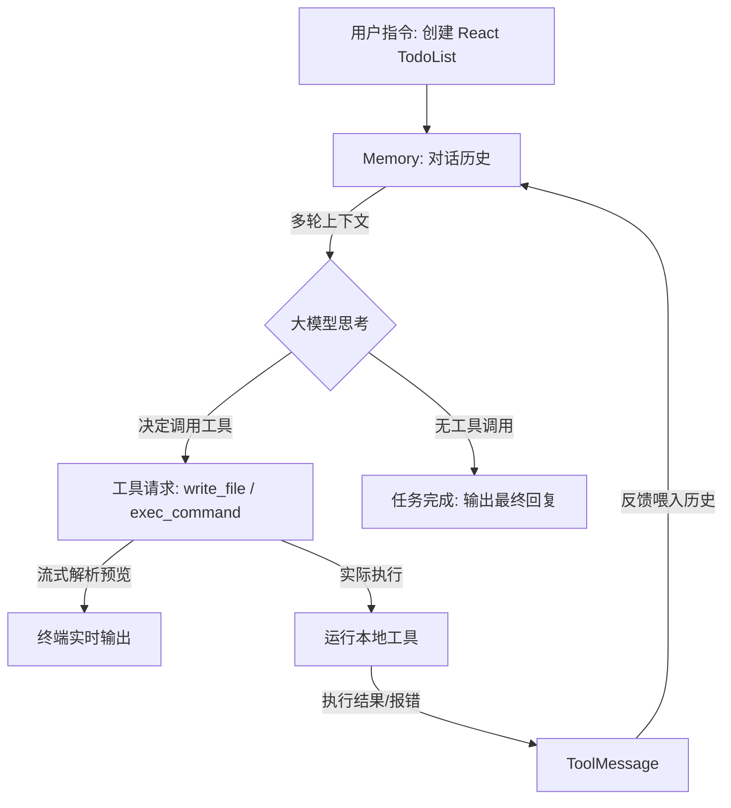

# 打造迷你 AI 编程助手：基于 LangChain Tool Calling 的 Agent 实战

在日常开发中，诸如 Cursor、GitHub Copilot 等 AI 编程助手凭借其强大的“读写代码、运行命令”的能力极大地提升了我们的工作效率。其背后的核心技术，正是 **ReAct（Reasoning + Acting，推理与行动）** 模式下的 AI Agent。

本文将以实战项目 `mini-cursor` 为例，深入剖析如何使用 LangChain + Zod + 大模型 Tool Calling 来从零构建一个具备文件读写、系统命令执行、流式输出预览，并且能够自动处理任务反馈的“自适应编程助手”。

---

## 一、 编程助手（Agent）核心架构设计

一个具备编程能力的 Agent 必须具备三个要素：
1. **工具箱（Tools）**：能够接触现实世界的“手和脚”（如读写文件、执行终端指令）。
2. **记忆系统（Memory）**：记录上下文，使得模型能在多轮工具调用中维持逻辑连贯。
3. **推理环（ReAct Loop）**：驱动大模型思考，并根据执行反馈决定下一步的“大脑循环”。




---

## 二、 工具定义：大模型的“手和脚”

模型要具备编程能力，首先需要在本地定义系统级工具。我们使用 LangChain 的 `tool` 函数配合 **Zod Schema** 来显式声明工具的入参和用法描述（这些描述会被直接作为模型生成的约束指南）。

### 1. 本地工具库实现

我们在 `src/tools/tools.ts` 中声明了以下工具：

- **`read_file`**：读取指定路径的文件内容。
- **`write_file`**：写入或覆盖文件内容。
- **`exec_command`**：在指定的工作目录下执行 Shell 终端指令。
- **`list_dir`**：列出目录下的文件列表。

**核心示例代码**：
```typescript
import { tool } from "@langchain/core/tools";
import { spawn } from "child_process";
import fs from "fs";
import { z } from "zod";

// 写入文件的 Tool 声明
export const writeFileTool = tool(
  async ({ filePath, content }) => {
    await fs.promises.writeFile(filePath, content, 'utf-8');
    return `成功写入到文件: ${filePath}`;
  },
  {
    name: 'write_file',
    description: '当需要修改、写入或创建文件内容时，使用该工具。支持覆盖。',
    schema: z.object({
      filePath: z.string().describe('目标文件的绝对或相对路径'),
      content: z.string().describe('写入的具体代码或文本内容'),
    }),
  }
);

// 执行终端命令的 Tool 声明
export const execCommandTool = tool(
  async ({ command, workingDirectory }) => {
    const cwd = workingDirectory ?? process.cwd();
    return new Promise((resolve) => {
      // 使用 spawn 执行底层命令，并保持工作目录一致
      const child = spawn(command, { cwd, shell: true });
      let output = "";
      child.stdout.on("data", (data) => output += data.toString());
      child.stderr.on("data", (data) => output += data.toString());
      child.on("close", (code) => {
        resolve(`命令执行完毕，退出码: ${code}\n输出内容:\n${output}`);
      });
    });
  },
  {
    name: 'exec_command',
    description: '执行系统命令。支持指定工作目录。注意：绝对不要在 command 中使用 cd！',
    schema: z.object({
      command: z.string().describe('要执行的 shell 指令'),
      workingDirectory: z.string().optional().describe('推荐指定的工作目录'),
    }),
  }
);
```

---

## 三、 Agent 推理环与多轮对话管理 (ReAct Loop)

Agent 的核心是一个限制了最大执行步数（如 `maxIterations = 30`）的 `for` 循环。在每一步中，它扮演的角色如同一个决策机器。

### 1. 记忆机制与消息链
我们需要维护一条消息历史链。AI 发出的工具请求（`AIMessage`）与工具执行的返回反馈（`ToolMessage`）必须一一对应，格式必须严密。

- `SystemMessage`：设定环境参数、行为守则。
- `HumanMessage`：用户的终极任务（如“创建一个 React 动画”）。
- `AIMessage`：大模型的思考流，可能包含 `tool_calls`。
- `ToolMessage`：工具执行完后的真实结果，必须带上 `tool_call_id`。

### 2. 状态循环伪代码

```typescript
for (let i = 0; i < maxIterations; i++) {
  // 1. 发送所有的历史消息给模型，获取流式回复
  const messages = await history.getMessages();
  const rawStream = await modelWithTools.stream(messages);
  
  // 2. 拼接流式碎片，并实时处理终端输出 (流式解析细节见下文...)
  
  // 3. 将 AI 的最终完整回复存入历史
  await history.addMessage(fullAiMessage);
  
  // 4. 终结条件：如果大模型本轮不需要调用工具，代表任务圆满完成
  if (!fullAiMessage.tool_calls || fullAiMessage.tool_calls.length === 0) {
    break;
  }
  
  // 5. 逐个执行 AI 要求的工具调用，并回传给大模型
  for (const toolCall of fullAiMessage.tool_calls) {
    const foundTool = tools.find(t => t.name === toolCall.name);
    const result = await foundTool.invoke(toolCall.args);
    
    // 6. 存入 ToolMessage
    await history.addMessage(new ToolMessage({
      content: result,
      tool_call_id: toolCall.id
    }));
  }
}
```

---

## 四、 核心难点突破：结构化流式解析与增量预览

在传统的交互中，模型调用工具是**静默**的，直到写完几百行文件，用户才会一次性看到结果。为了获得媲美 Cursor 的流式体验，我们需要让模型生成的“工具 JSON”在流式输出期间就被**增量解析并打印**。


### 1. `JsonOutputToolsParser` 的妙用
因为流式传输返回的是被切碎的字符片段，如果用常规的 `JSON.parse` 绝对会崩溃。
我们必须引入 `@langchain/core/output_parsers/openai_tools` 里的 **`JsonOutputToolsParser`**，它是一个增量解析器，能在 JSON 还没传完（甚至不合法）时，尽最大可能解析出目前已生成的键值对。

### 2. 增量打字机算法（Incremental Typing Effect）
当大模型流式生成 `write_file` 字段时，我们要实现“只打印新增代码”的清爽效果，不能每次都重复输出。
为此我们设计了 **`printedLengths`（记录已打印字符长度）** 的增量剪裁算法：

```typescript
const toolParser = new JsonOutputToolsParser();
const printedLengths = new Map<string, number>(); // 键为 toolCallId

for await (const chunk of rawStream) {
  // 1. 拼接 chunk 到大容器
  fullAiMessage = fullAiMessage ? fullAiMessage.concat(chunk) : chunk;

  // 2. 尝试从半残的 JSON 中解析工具调用
  let parsedTools = null;
  try {
    parsedTools = await toolParser.parseResult([{ message: fullAiMessage }] as any) as any[];
  } catch (e) {
    // 忽略未闭合 JSON 的解析报错
  }

  // 3. 如果解析出 write_file，做增量剪裁输出
  if (parsedTools && parsedTools.length > 0) {
    for (const toolCall of parsedTools) {
      if (toolCall.type === 'write_file' && toolCall.args?.content) {
        const toolCallId = toolCall.id || toolCall.args.filePath;
        const currentContent = String(toolCall.args.content);
        const previousLength = printedLengths.get(toolCallId) ?? 0;

        if (printedLengths.get(toolCallId) === undefined) {
          console.log(chalk.bgBlue(`\n[工具调用] write_file("${toolCall.args.filePath}") 启动预览：\n`));
          printedLengths.set(toolCallId, 0);
        }

        // 💡 增量剪裁：只截取超出上一次打印长度的内容
        if (currentContent.length > previousLength) {
          const newContent = currentContent.slice(previousLength);
          process.stdout.write(newContent); // 实时打字机渲染
          printedLengths.set(toolCallId, currentContent.length); // 更新打印进度
        }
      }
    }
  } else {
    // 4. 如果是非工具的普通文本思考回复，直接输出
    if (chunk.content) {
      process.stdout.write(typeof chunk.content === 'string' ? chunk.content : JSON.stringify(chunk.content));
    }
  }
}
```

---

## 五、 端到端测试用例：自动化构建 React 工程

我们在底层配置的测试用例是让 Agent 自行从零构建一个完整的 React 项目，并处理其环境依赖与样式：

```typescript
const testQuery = `创建一个功能丰富的 React TodoList 应用：
1. 创建项目: echo -e "n\\nn" | pnpm create vite react-todo-app --template react-ts
2. 修改 src/App.tsx，实现完整功能的 TodoList（含 localStorage 缓存、统计、筛选）。
3. 添加 App.css 完成复杂样式（渐变背景、过渡动画）。
4. 修改 main.tsx 去掉 index.css 的导入。
5. 在 react-todo-app 项目中安装依赖，并跑起 pnpm run dev。
`;
```

在运行这个测试时，大模型会表现出惊人的自适应调整行为：
- **步骤 1**：大模型调用 `exec_command`，执行 `pnpm create vite ...`。
- **观察 1**：工具返回退出码 `0`，提示项目创建成功。
- **步骤 2**：大模型检测到项目内有 `App.tsx` 和 `App.css`，调用 `write_file` 依次写入代码和动画样式，终端实时展示代码流。
- **步骤 3**：大模型调用 `exec_command` 切换到子文件夹执行 `pnpm install` 安装依赖。
- **步骤 4**：最后执行 `pnpm run dev` 挂起进程。至此，一个真实的项目已由 AI 独立搭建并准备就绪。

---

## 六、 最佳实践与避坑指南

在开发类似编程助手的 Agent 时，有以下几点需要高度重视：

### 1. 规避“cd 指令陷阱”
大模型经常习惯性地在 `exec_command` 里面写 `cd folder && npm run dev`。但是 Node.js 的子进程在执行完毕后会**自动丢失工作路径上下文**。
- **做法**：在 System Prompt 里严厉警告，要求大模型在调用命令时必须将子路径传给 `workingDirectory` 参数，而不是在命令行中写 `cd`。

### 2. 多工具冲突的类型处理
TypeScript 中，`Array.find` 获取的工具实例由于入参 Zod 模式各不相同，会导致其 `invoke` 方法的类型签名不兼容。
- **做法**：在执行前，先将其断言为 `any` 避开静态检查：`await (foundTool as any).invoke(toolCall.args)`。

### 3. 未闭合 JSON 的容错
因为是流式解析，流还没输出完时 `toolCall.args.content` 往往是不完整的。解析器会不断报错，需要做好 `try...catch` 以保证大模型能够顺利吐完所有字符流。

---

## 七、 总结

| 阶段 | 传统 Chat 方式 | mini-cursor Agent 方式 |
| :--- | :--- | :--- |
| **交互流程** | 用户提问 ➔ AI 给代码 ➔ 用户手动去复制执行 | 用户提问 ➔ AI 思考 ➔ 自动读写文件、跑命令 ➔ 用户坐享其成 |
| **错误恢复** | 如果代码运行报错，用户手动贴回对话框问 AI | AI 执行命令，从 stdout 读到报错后**自动**调用 write_file 修复代码 |
| **流式呈现** | 只有 markdown 纯文本流，无法预览文件变动 | 支持特定文件工具的**增量打字机式预览**，开发体验极度顺滑 |

通过合理地为 LLM 绑定工具，配合增量流解析算法，我们仅用 100 多行 TypeScript 代码便能够构建出一个真正具备自愈、自执行能力的 AI 编程助手。这正是下一代软件开发范式的雏形。
