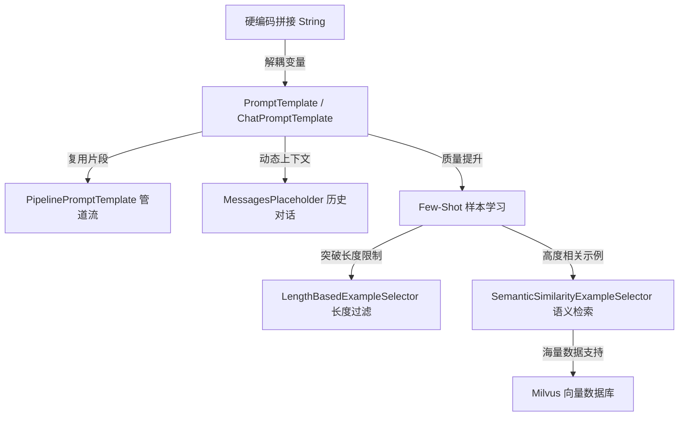

# LangChain 提示词工程深度实践：从基础模板到动态语义检索

在构建大语言模型（LLM）应用时，如何编写、组织和优化提示词（Prompt）是决定应用效果的关键。提示词不仅是用户输入的包装，更是模型行为的约束指南、上下文结构的骨架以及 Few-Shot（少样本学习）的传递媒介。

本文将以项目 `tool-test` 中的 Prompt 实践为例，结合 LangChain 框架，深入剖析提示词的组织范式：从基础的占位符模板，到模块化的管道流（Pipeline），再到基于 Milvus 向量库的动态语义示例检索（Semantic Few-Shot）。

**前置依赖安装：**

```bash
pnpm add @langchain/core @langchain/community
# 如需接入 Zilliz/Milvus 向量库（用于第七节 Semantic Few-Shot）
pnpm add @langchain/community @zilliz/milvus2-sdk-node
```

---

## 一、 Prompt 工程核心演进路径

随着应用复杂度的增加，硬编码拼接 Prompt 的缺陷愈发明显。我们需要一套结构化、可复用且高度灵活的提示词构建方案。




---

## 二、 基础模板与 Chat 消息管理

在 LangChain 中，提示词的核心基石是 `PromptTemplate` 和 `ChatPromptTemplate`。


### 1. 基础占位符模板 (`PromptTemplate`)
在 [index.ts](https://github.com/wllcyg/my-push/blob/main/two/tool-test/src/prompt/index.ts) 中展示了最基础的模版定义。通过 `{variable}` 占位符解耦数据与结构：

```typescript
import { PromptTemplate } from "@langchain/core/prompts";

const nativePrompt = PromptTemplate.fromTemplate(
  `你是一名严谨的工程负责人。请根据以下本周数据写一份周报。
  公司名称: {company_name}
  部门名称: {team_name}
  核心目标: {team_goal}
  开发数据: {dev_activities}
  请输出 Markdown 格式周报。`
);

const formattedPrompt = await nativePrompt.format({
  company_name: "忘忧科技",
  team_name: "AI 应用开发组",
  team_goal: "完成 mini-cursor 的 MVP 版本开发",
  dev_activities: "- git commit: feat: 引入 JsonOutputToolsParser"
});
```

### 2. Chat 消息角色管理 (`ChatPromptTemplate`)
面向聊天模型（如 GPT-4, Claude），我们不仅需要生成一段文本，还需要区分不同的角色（System, Human, AI）。
[chat-prompt.ts](https://github.com/wllcyg/my-push/blob/main/two/tool-test/src/prompt/chat-prompt.ts) 和 [chat-prompt-v2.ts](https://github.com/wllcyg/my-push/blob/main/two/tool-test/src/prompt/chat-prompt-v2.ts) 演示了如何显式管理角色消息：

```typescript
import { ChatPromptTemplate, SystemMessagePromptTemplate, HumanMessagePromptTemplate } from '@langchain/core/prompts';

// 方法 A：通过 fromMessages 数组声明
const chatPrompt = ChatPromptTemplate.fromMessages([
  ['system', '你是一名资深团队 Leader。写作风格要求：{tone}。'],
  ['human', '本周开发数据如下：\n{dev_activities}']
]);

// 方法 B：通过 MessagePromptTemplate 实例显式组装
const systemTemplate = SystemMessagePromptTemplate.fromTemplate("写作风格要求：{tone}。");
const humanTemplate = HumanMessagePromptTemplate.fromTemplate("本周数据：\n{dev_activities}");
const composedTemplate = ChatPromptTemplate.fromMessages([systemTemplate, humanTemplate]);
```

---

## 三、 模块化 Prompt 设计：Pipeline 管道流

在复杂的业务场景下，一个 Prompt 可能会包含“人设说明”、“上下文背景”、“具体任务描述”以及“格式输出规范”等多个部分。如果全部写在一个模版里，会造成复用困难。


LangChain 提供了 **`PipelinePromptTemplate`**，允许我们将 Prompt 拆分成模块化的“子片段”，然后在运行时动态拼接。

### 1. 组合式 Pipeline 实现
在 [pip-prompt.ts](https://github.com/wllcyg/my-push/blob/main/two/tool-test/src/prompt/pip-prompt.ts) 中，我们定义了 `personTemplate`、`contextPrompt`、`taskPrompt` 和 `formatPrompt` 模块，并通过主模版组合：

```typescript
import { PipelinePromptTemplate, PromptTemplate } from "@langchain/core/prompts";

// 1. 定义最终的主模板骨架
const finalWeeklyPrompt = PromptTemplate.fromTemplate(
  `{person_block}
  {context_block}
  {task_block}
  {format_block}
  现在请生成本周的最终周报：`
);

// 2. 组装 Pipeline
const pipeline = new PipelinePromptTemplate({
  pipelinePrompts: [
    { name: 'person_block', prompt: personTemplate },
    { name: 'context_block', prompt: contextPrompt },
    { name: 'task_block', prompt: taskPrompt },
    { name: 'format_block', prompt: formatPrompt }
  ],
  finalPrompt: finalWeeklyPrompt,
});
```
> [!IMPORTANT]
> **拼装映射规则**：Pipeline 中每个子模板的 `name` 必须与 `finalPrompt` 中的占位符名称（如 `{person_block}`）严格 1:1 保持一致，无需手动添加前缀或后缀。

### 2. 跨场景复用（pip-prompt-v2）

在 [pip-prompt-v2.ts](https://github.com/wllcyg/my-push/blob/main/two/tool-test/src/prompt/pip-prompt-v2.ts) 中，直接从 `pip-prompt.ts` 导入共享模块，只声明本场景独有的任务模块，即可快速派生「季度 OKR 回顾邮件」场景：

```typescript
// 从 pip-prompt.ts 直接复用人设与背景模块
import { personTemplate, contextPrompt } from './pip-prompt.js';

// 仅声明本场景自己的任务模块
const okrReviewTaskPrompt = PromptTemplate.fromTemplate(
  `以下是本季度数据：\n{okr_facts}\n
  请整理一份发给 {manager_name} 的【季度 OKR 回顾邮件】。`
);

// 组装 Pipeline，复用 person_block 和 context_block
const okrReviewPipeline = new PipelinePromptTemplate({
  pipelinePrompts: [
    { name: 'person_block', prompt: personTemplate },   // ✅ 直接复用
    { name: 'context_block', prompt: contextPrompt },   // ✅ 直接复用
    { name: 'okr_review_task_block', prompt: okrReviewTaskPrompt }, // 本场景专属
  ],
  finalPrompt: PromptTemplate.fromTemplate(
    `{person_block}\n{context_block}\n{okr_review_task_block}\n
    现在请生成本季度的最终 OKR 回顾邮件：`
  )
});
```

### 3. Chat 管道流（pip-prompt-v3）

在 [pip-prompt-v3.ts](https://github.com/wllcyg/my-push/blob/main/two/tool-test/src/prompt/pip-prompt-v3.ts) 中展示了更高级的用法：**将最终模板定义为 `ChatPromptTemplate`**。格式化时需要使用 `formatPromptValue` 代替 `format`，从而将结果转换为 Chat 消息对象数组：

```typescript
const finalChatPrompt = ChatPromptTemplate.fromMessages([
  ['system', '你是一名资深工程负责人。'],
  ['human', '{persona_block}\n{context_block}\n{task_block}']
]);

// 拼装 Pipeline（finalPrompt 为 ChatPromptTemplate）
const weeklyChatPipelinePrompt = new PipelinePromptTemplate({
  pipelinePrompts: [
    { name: 'persona_block', prompt: personTemplate },
    { name: 'context_block', prompt: contextPrompt },
    { name: 'task_block', prompt: weeklyTaskPrompt },
    { name: 'format_block', prompt: weeklyFormatPrompt },
  ],
  finalPrompt: finalChatPrompt as any
});

// 使用 formatPromptValue 代替 format，得到 PromptValue 对象
const promptValue = await weeklyChatPipelinePrompt.formatPromptValue({
  tone: '专业、清晰',
  dev_activities: '...'
});

// 转换为聊天模型所需的消息数组
console.log(promptValue.toChatMessages());
// 也可以直接喂给 model.stream()
const stream = await model.stream(promptValue);
```

---

## 四、 局部参数预绑定 (Partial Prompt)

有时我们希望在配置加载或系统启动时，预先绑定一些相对静态的参数（如 `company_name`, `tone`），而将高频波动的运行时参数（如 `dev_activities`）留给实际请求时传入。


[partial.ts](https://github.com/wllcyg/my-push/blob/main/two/tool-test/src/prompt/partial.ts) 演示了使用 `partial` 方法进行静态绑定，从而避免每次调用重复传参：

```typescript
// 1. 预置静态参数
const pipelineWithPartial = await pipeline.partial({
  company_name: "忘忧科技",
  tone: "偏正式但不僵硬"
});

// 2. 运行时仅传入动态变更参数，即可格式化
const result1 = await pipelineWithPartial.format({
  team_name: 'AI 平台组',
  dev_activities: '- 小明: 完成 Git 集成封装'
});
```

---

## 五、 动态历史对话填充 (MessagesPlaceholder)

对于多轮对话（Chat-based Agent），我们需要把多轮的历史聊天记录动态插入到 Prompt 的中间。


[chat-placeholder.ts](https://github.com/wllcyg/my-push/blob/main/two/tool-test/src/prompt/chat-placeholder.ts) 演示了如何利用 **`MessagesPlaceholder`** 占位符管理历史消息链路：

```typescript
import { ChatPromptTemplate, MessagesPlaceholder } from '@langchain/core/prompts';
import { HumanMessage, AIMessage } from '@langchain/core/messages';

const chatPromptHistory = ChatPromptTemplate.fromMessages([
  ['system', '你是一名效率顾问。'],
  new MessagesPlaceholder('history'), // 动态注入历史对话链的插槽
  ['human', '这是新问题：{current_input}']
]);

const formattedMessages = await chatPromptHistory.formatMessages({
  history: [
    new HumanMessage("如何优化前端构建速度？"),
    new AIMessage("1. 依赖缓存；2. 使用 Vite/Esbuild...")
  ],
  current_input: "如何把这些整合进 GitLab CI？"
});
```

> [!WARNING]
> **防止 Token 溢出**：随着对话轮次增加，`history` 数组会无限增长，最终超出模型 Context Window 导致报错。在生产场景中，务必在存入历史前对消息数组进行裁剪（如保留最近 N 轮）或引入专属的 Memory 管理模块（如 `BufferWindowMemory`）。

---

## 六、 Few-Shot 示例少样本学习

在处理高度定制化的写作风格或特定输出结构时，光靠指令（Instruction）很难描述到位。通过向模型提供若干“输入-输出对”的示例（Few-Shot），能极大提升生成的稳定性和专业度。


### 1. 静态 Few-Shot 构建 (`FewShotPromptTemplate`)
在 [fewshot-prompt.ts](https://github.com/wllcyg/my-push/blob/main/two/tool-test/src/prompt/fewshot-prompt.ts) 中，我们将示例拼装成一个纯文本 Block，然后作为全局上下文喂给 System 提示词：

```typescript
import { FewShotPromptTemplate, PromptTemplate } from "@langchain/core/prompts";

const examplesPrompt = PromptTemplate.fromTemplate(
  `用户输入: {user_requirement}\n模型示例输出片段:\n{report_snippet}`
);

const fewShotPrompt = new FewShotPromptTemplate({
  examples, // 静态示例数组
  examplePrompt: examplesPrompt,
  prefix: "下面是几条写好的【周报示例】：\n",
  suffix: "\n基于上述风格，生成新周报。"
});

const fewShotBlock = await fewShotPrompt.format({});
// 随后注入 ChatPromptTemplate 的 system 消息中
```

### 2. 聊天上下文 Few-Shot 构建 (`FewShotChatMessagePromptTemplate`)
对于聊天模型，更推荐的做法是将 Few-Shot 示例作为真实的对话历史（多轮 HumanMessage 和 AIMessage）插入。
[chat-fewshot.ts](https://github.com/wllcyg/my-push/blob/main/two/tool-test/src/prompt/chat-fewshot.ts) 演示了如何实现这一点：

```typescript
import { FewShotChatMessagePromptTemplate, ChatPromptTemplate } from "@langchain/core/prompts";

const fewShotExamples = new FewShotChatMessagePromptTemplate({
  examplePrompt: ChatPromptTemplate.fromMessages([
    ['human', '工作概述：\n{input}'],
    ['ai', '{output}']
  ]),
  examples: EXAMPLES // 包含 input 和 output 键的数组
});

const chatPrompt = ChatPromptTemplate.fromMessages([
  ['system', '你是一名资深技术负责人。'],
  fewShotExamples as any, // 直接作为对话流消息插入
  ['human', '这是我本周实际工作，请整理：\n{current_work}']
]);
```

---

## 七、 进阶：示例选择器与向量库检索

当 Few-Shot 示例非常多，或者单条示例篇幅很大时，如果将所有示例全部塞进 Prompt，会产生两大问题：
1. **Token 超出限制**，或者产生不必要的 API 计费。
2. **无关的示例会干扰模型的注意力**（Attention Distraction）。

为此，我们需要使用 **Example Selector（示例选择器）** 动态挑选最合适的示例。

### 1. 基于长度的示例选择器 (`LengthBasedExampleSelector`)
在 [example-select.ts](https://github.com/wllcyg/my-push/blob/main/two/tool-test/src/prompt/example-select.ts) 中，我们利用长度选择器来避免 Token 溢出。它会根据最大长度限制自动裁剪示例数量，确保生成的 Prompt 长度始终在安全范围内：


```typescript
import { LengthBasedExampleSelector } from "@langchain/core/example_selectors";

const exampleSelector = await LengthBasedExampleSelector.fromExamples(
  examples,
  {
    examplePrompt,
    maxLength: 500, // 限制最大字符长度
    getTextLength: (text) => text.length,
  }
);
```

### 2. 基于向量库的动态语义相似度选择器 (`SemanticSimilarityExampleSelector`)
更进一步，我们可以利用向量数据库（如 Milvus），在运行时根据用户当前的提问（Query），去向量库里**动态检索出语义最相近的 k 条示例**塞进 Prompt。


其完整流转如下：

**第一步：向量化写入 Milvus**（[milvus-writer.ts](https://github.com/wllcyg/my-push/blob/main/two/tool-test/src/prompt/milvus-writer.ts)）

```typescript
import { Milvus } from "@langchain/community/vectorstores/milvus";
import { Document } from "@langchain/core/documents";

// 将每条示例的「场景描述」转化为向量，批量写入 Milvus
const documents = examples.map(item => new Document({
  pageContent: item.scenario,          // 被 Embedding 的文本（用于相似度搜索）
  metadata: {
    scenario: item.scenario,
    report_snippet: item.report_snippet // 检索命中后真正使用的示例内容
  }
}));

await Milvus.fromDocuments(documents, embeddingModel, {
  collectionName: "weekly_report_examples",
  clientConfig: {
    address: process.env.ZILLIZ_ENDPOINT as string,
    token: process.env.ZILLIZ_API_KEY as string,
  },
});
```

> [!TIP]
> `pageContent` 是被向量化索引的字段（用于相似度匹配），`metadata` 中的字段则是检索命中后真正被注入到 Prompt 中的内容，两者分工明确。

**第二步：语义检索组装 Prompt**（[semantic-select.ts](https://github.com/wllcyg/my-push/blob/main/two/tool-test/src/prompt/semantic-select.ts)）

**语义选择核心代码实现：**
```typescript
import { SemanticSimilarityExampleSelector } from "@langchain/core/example_selectors";
import { Milvus } from "@langchain/community/vectorstores/milvus";
import { FewShotPromptTemplate } from "@langchain/core/prompts";

// 1. 加载或检索已存在的向量库
const vectorStore = await Milvus.fromExistingCollection(embeddingModel, {
  collectionName: "weekly_report_examples",
  clientConfig: {
    address: process.env.ZILLIZ_ENDPOINT,
    token: process.env.ZILLIZ_API_KEY,
  },
});

// 2. 实例化语义相似度选择器
const exampleSelector = new SemanticSimilarityExampleSelector({
  vectorStore,
  k: 2, // 每次只筛选出语义最贴近的 2 条示例
});

// 3. 将选择器注入 FewShotPromptTemplate
const fewShotPrompt = new FewShotPromptTemplate({
  examplePrompt,
  exampleSelector,
  prefix: "系统已自动从 Milvus 选出与当前场景最相近的示例：\n",
  suffix: "\n当前场景：{current_scenario}\n生成 Markdown 周报草稿：",
  inputVariables: ['current_scenario'],
});
```

---

## 八、 总结与技术选型指南

下表对比了这几种不同的 Prompt 技术，帮助您在实际开发中进行合理的架构选型：

| 技术方案 | 适用场景 | 优点 | 缺点 | 复杂度 |
| :--- | :--- | :--- | :--- | :--- |
| **PromptTemplate** | 静态单轮任务、参数较少的通用提示词包装 | 简单直接，开箱即用 | 无法有效结构化管理多角色对话 | ★☆☆☆☆ |
| **ChatPromptTemplate** | 经典的聊天交互、Role-Play（角色扮演） | 规范化 System/Human/AI 消息结构 | 模板块过大时维护成本高 | ★★☆☆☆ |
| **PipelinePromptTemplate** | 复杂的大型 Prompt、需要多场景复用或团队共用模版 | 高度模块化，解耦人设、背景和任务，复用度极高 | 拼装逻辑复杂，需保证占位符强一致 | ★★★☆☆ |
| **MessagesPlaceholder** | Chatbot 聊天机器人、智能客服、多轮 Agent 环 | 动态注入无限轮次的历史对话，结构清爽 | 需手动维护并裁剪历史消息长度以防溢出 | ★★☆☆☆ |
| **FewShot (静态/Chat)** | 强格式约束、特定语气写作（如公文风格、精炼数据总结） | 显著提升生成质量，使大模型输出更具稳定性与条理性 | 示例全部硬编码塞入，浪费 Token | ★★★☆☆ |
| **Semantic Few-Shot (向量库)** | 面对成百上千种复杂场景、需要千人千面针对性参考示例时 | 动态按需加载高相似度示例，Token 利用率最高，智能度极高 | 需要引入 Embedding 模型和向量库（如 Milvus），冷启动开销大 | ★★★★★ |

通过将这些技术进行合理拼装与组合，你将能构建出一套可配置、自适应、高复用且低 Token 损耗的生产级 LLM Prompt 治理系统。这不仅是 Prompt Engineering 的艺术，更是迈向高阶 AI Agent 架构的坚实基础。
