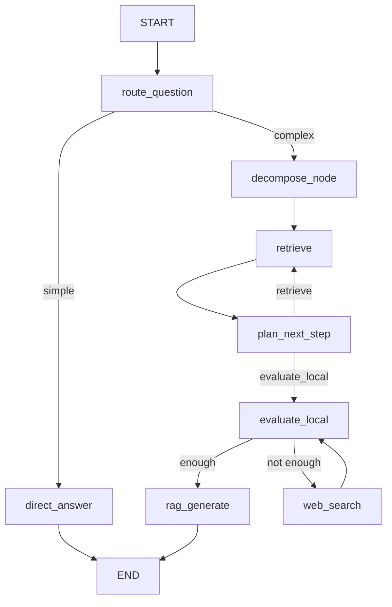

# 进阶 RAG 实战总结：自适应路由、多跳拆解与自我评估联网兜底四件套

## 一、为什么普通 RAG 会“翻车”

最基础的 RAG 流程是"检索一次，生成一次"：把用户问题直接转成向量去召回，再把召回结果一股脑塞进 Prompt 交给大模型。这种朴素做法在面对**多跳问题**（需要先查清事实 A，才能推导出结论 B）或**跨知识域问题**（既要查本地知识库，又要联网查最新数据）时几乎必然翻车——检索一次根本凑不齐所有证据，大模型只能靠"编"。

因此，我们在 LangGraph 之上搭建了一套更完整的自适应 RAG 状态机，核心解决四类问题：

- **该不该查资料？** —— 简单问题直接答，复杂问题才走检索（自适应路由）
- **一次查得全吗？** —— 长链问题先拆成有序子问题，分轮检索（问题拆解 + 多跳检索）
- **什么时候停？** —— 让模型自己判断信息是否够用，同时设好安全阀（动态规划）
- **本地资料不够怎么办？** —— 自我评估 + 联网兜底（Self-Reflection + Corrective RAG）

整体状态流转如下：



---

## 二、机制一：自适应路由 (Adaptive Routing)


### 核心思路

不是所有问题都值得走一遍检索流程。常识性问题、简短定义直接让大模型回答即可；只有涉及具体情节、章节事实、原文细节的问题，才需要触发后续的检索链路。这一步用**结构化输出**强制大模型在 `simple` 和 `complex` 之间二选一，避免自由文本带来的解析歧义。

### 关键代码

**文件**：`modules/advanced-rag/naive-rag.py`

```python
class RouterSchemas(BaseModel):
    strategy: Literal['simple', 'complex'] = Field(
        default='simple',
        description="simple: 普通问题, 需要简单回答. complex: 复杂问题, 需要详细回答."
    )
    reason: str = Field(..., description="选择 'simple' 或 'complex' 的原因")

async def route_question_node(state: State) -> dict:
    router = model.with_structured_output(RouterSchemas)

    prompt = f"""你是问答路由器。请判断用户问题是否需要外部检索。

规则:
- simple: 常识问答、简短定义、无需特定小说细节即可回答。
- complex: 需要《长安的荔枝》具体情节、人物关系、章节事实、原文细节或证据支持。

用户问题: {state.get('question')}
"""
    route = await router.ainvoke(prompt)
    return {
        "strategy": route.strategy,
        "routeReason": route.reason,
    }
```

### 参数说明

| 字段 | 类型 | 说明 |
|---|---|---|
| `strategy` | `Literal['simple', 'complex']` | 路由结果，决定走 `direct_answer` 还是 `decompose_node` |
| `reason` | `str` | 强制模型给出判断依据，便于日志排查“为什么走了这条路” |

### 适用场景

- 问答场景中掺杂大量寒暄、常识性提问，不希望每次都触发检索的场景
- 需要控制 Token 成本与响应延迟，避免"杀鸡用牛刀"

### ⚠️ 局限性

路由完全依赖大模型的一次判断，如果 Prompt 里的 `simple`/`complex` 边界描述不够清晰，模型容易把边界问题误判。实践中建议给出足够具体的判定规则（如本例中明确指出"章节事实、原文细节"才算 complex），而不是泛泛地说"复杂问题"。

---

## 三、机制二：问题拆解 (Query Decomposition)


### 核心思路

多跳问题的本质是"一条问题背后藏着多条隐性子问题"。如果直接拿原题去检索，向量召回的内容往往只能覆盖题面的表层语义，漏掉推理链条中的关键前置事实。因此复杂问题必须先拆解成**有序**的子问题列表，再依次检索——顺序必须符合推理链，先查清前置事实，再查后续结论。

### 关键代码

```python
class DecomposeSchema(BaseModel):
    sub_questions: List[str] = Field(
        min_length=1, max_length=8,
        description="拆分出的子问题列表"
    )
    reason: str = Field(..., description="拆分的原因说明")

async def decompose_node(state: State) -> dict:
    decomposer = model.with_structured_output(DecomposeSchema)

    prompt = f"""任务：将问题拆成**有序**子问题列表 sub_questions，用于**依次向量检索**。要求：
1. 链式推理、多层关系、因果先后的问题，必须拆成多条；单跳即可答的也可只输出 1 条。
2. 每条子问题必须是**可独立检索**的完整中文问句，**禁止**使用「他/她/此人/上文」等指代。
3. 顺序必须符合推理链：先搞清前置实体/事实，再查后续结论。
4. **不要**把整句原题原样复制成唯一一条（除非确实无法拆分）。
5. 输出 1～8 条即可。

用户问题: {state.get('question')}
"""
    out = await decomposer.ainvoke(prompt)
    sub_questions = [s.strip() for s in out.sub_questions if s.strip()]

    return {
        "subQusetion": sub_questions,
        "nextSubIdx": 0,
        "currentQuery": sub_questions[0],
    }
```

### 拆解设计要点

- **禁止指代**：子问题必须是脱离上下文也能独立检索的完整问句，否则向量检索会因为缺失主语而召回不相关内容
- **顺序即推理链**：拆解顺序直接决定了后续多轮检索的先后次序，前置事实必须排在前面
- **数量兜底**：用 `min_length=1, max_length=8` 限制子问题数量区间，防止模型把简单问题过度拆碎，也防止复杂问题遗漏关键环节

### ⚠️ 局限性

拆解质量完全取决于大模型对推理链的理解，遇到隐藏得很深的因果关系，模型可能拆不全。这也是为什么后面还需要一个"动态规划"节点做二次兜底判断。

---

## 四、机制三：多跳检索与去重合并 (Multi-hop Retrieval + Dedup)


### 核心思路

拆解出的子问题会被**逐条**送入检索，而不是一次性拼接检索。每一轮只检索当前子问题对应的内容，检索结果与历史累积结果做**按 `id` 去重、按相似度取高分**的合并，避免同一片段被重复召回、占用宝贵的上下文预算。

### 关键代码

```python
async def retrieve_node(state: State) -> dict:
    subs = state.get("subQusetion", [])
    idx = state.get("nextSubIdx", 0)
    q = subs[idx].strip()
    round_num = state.get("retirevalCount", 0) + 1

    k = state.get("k", TOP_K)
    new_docs = await retrieve_relevant_content(q, k)
    merged = merge_unique(state.get("documents", []), new_docs)

    return {
        "documents": merged,
        "retirevalCount": round_num,
        "nextSubIdx": idx + 1,
        "currentQuery": q,
    }

# 按 id 合并；如果 id 相同，保留 score 更高的那一个
def merge_unique(existing_docs: List[dict], new_docs: List[dict]) -> List[dict]:
    doc_map = {}
    for d in existing_docs + new_docs:
        key = str(d.get("id"))
        prev = doc_map.get(key)
        if not prev or float(d.get("score", 0)) > float(prev.get("score", 0)):
            doc_map[key] = d
    merged = list(doc_map.values())
    merged.sort(key=lambda x: float(x.get("score", 0)), reverse=True)
    return merged
```

### 参数说明

| 字段/函数 | 说明 |
|---|---|
| `nextSubIdx` | 指向下一条待检索子问题的下标，每检索一轮 `+1` |
| `retirevalCount` | 已完成的检索轮数，供后续规划节点判断是否达到轮数上限 |
| `merge_unique` | 按文档 `id` 去重，同一片段命中多轮时只保留分数最高的版本 |

### 适用场景

- 长篇小说/文档场景，问题往往涉及多个章节、多个人物关系的交叉印证
- 需要严格控制上下文长度，避免同一段落被多次塞入 Prompt

---

## 五、机制四：动态规划下一步 (Self-Planning + Safety Valve)


### 核心思路

拆解只是"计划"，真正跑起来时未必需要把所有子问题都检索完——也可能子问题拆得不够，检索完仍然缺关键事实。所以每检索完一轮，都要让大模型重新审视"当前证据是否已经足够回答原始问题"，再决定继续检索还是转去评估生成。**但完全交给大模型判断并不安全**，必须叠加硬性规则兜底，防止模型陷入无限检索。

### 关键代码

```python
class NextStepsSchema(BaseModel):
    nextAction: Literal['retrieve', 'generate'] = Field(
        ..., description="下一步的操作，继续检索(retrieve)还是生成答案(generate)"
    )
    reason: str = Field(..., description="选择该操作的原因")

async def plan_next_step_node(state: State) -> dict:
    max_retrievals = 3
    remaining = len(state.get("subQusetion", [])) - state.get("nextSubIdx", 0)

    # ...拼接子问题状态、已召回文档摘要...
    model_structured = model.with_structured_output(NextStepsSchema)
    out = await model_structured.ainvoke(prompt)

    final_next = out.nextAction
    # 硬性规则：轮数或子问题耗尽时，强制转向 generate，模型的意见不算
    if state.get("retirevalCount", 0) >= max_retrievals:
        final_next = "generate"
    if remaining <= 0:
        final_next = "generate"

    return {"plannedNext": final_next}
```

### 硬性规则说明

| 触发条件 | 结果 |
|---|---|
| 大模型认为证据已足够 | `nextAction=generate` |
| 剩余未检索子问题数为 0 | **强制** `generate`（无视模型意见） |
| 已检索轮数 ≥ `max_retrievals`（本例为 3） | **强制** `generate`（无视模型意见） |

### 💡 进阶技巧：模型建议 ≠ 最终决策

代码中 `final_next` 的赋值顺序是先信任模型输出，再用硬性规则覆盖。**这个顺序不能反**——一定是"模型先建议，代码再兜底"，否则一旦模型持续给出 `retrieve`，整个流程就可能在 `retrieve ↔ plan_next_step` 之间死循环，白白消耗 Token 与 API 调用次数。

---

## 六、机制五：本地上下文自评估 + 联网兜底 (Self-Reflection + Corrective RAG)


### 核心思路

多跳检索结束后，本地知识库未必能覆盖所有信息——尤其是当问题里混入了"现实世界的最新数据"（如产值、股价、政策）这类小说/文档里根本不存在的内容。此时需要一次**充分性评估**：判断已有上下文是否足以回答问题，若不够，则明确指出缺失点，并生成一条适合联网搜索的查询句，触发联网搜索作为兜底，再回头二次评估。

### 关键代码

```python
class EvaluateSchema(BaseModel):
    enough: bool = Field(description="是否足够回答")
    missing: List[str] = Field(default_factory=list, description="若不够，列出缺失信息点", max_length=6)
    reason: str = Field(description="简短原因")
    web_query: Optional[str] = Field(default=None, description="若不够，给出一个适合联网搜索的中文查询句")

async def evaluate_local_node(state: State) -> dict:
    # ...拼接本地上下文 + 可能已有的联网结果...
    model_structured = model.with_structured_output(EvaluateSchema)
    out = await model_structured.ainvoke(prompt)
    return {"evaluation": out.model_dump_json()}

async def web_search_node(state: State) -> dict:
    parsed = json.loads(state.get("evaluation", "{}"))
    query = (parsed.get("web_query") or "").strip() or state.get("question")
    web_context = await web_search.ainvoke({"query": query, "count": 8})
    return {"webContext": web_context}

# 评估后的路由：本地够用直接生成；不够且未联网过就去联网；联网后强制回到生成，防止死循环
def after_evaluate(state: State) -> Literal['rag_generate', 'web_search']:
    if state.get("webContext", "").strip():
        return "rag_generate"
    parsed = json.loads(state.get("evaluation", "{}"))
    return "rag_generate" if parsed.get("enough") is True else "web_search"
```

### 参数说明

| 字段 | 类型 | 说明 |
|---|---|---|
| `enough` | `bool` | 判断当前上下文是否足以回答原始问题 |
| `missing` | `List[str]` | 缺失的信息点，最多 6 条，便于日志追踪评估依据 |
| `web_query` | `Optional[str]` | 模型生成的联网搜索查询句，而非直接把用户原题拿去搜索 |

### ⚠️ 局限性 / 防死循环设计

注意 `after_evaluate` 里的第一个判断：`if state.get("webContext", "").strip(): return "rag_generate"`。这意味着**联网搜索最多只会触发一次**——哪怕联网结果依然不够，也会被强制送去生成回答。这是必要的安全阀，否则"评估不够 → 联网 → 评估还是不够 → 再联网"会无限循环下去。

---

## 七、最终生成：融合本地知识库与联网结果

走到这一步，`rag_generate_node` 会把多跳检索累积的本地文档和（可能存在的）联网补充内容一起拼进 Prompt，明确要求大模型**优先依据上下文作答，不要编造**，且在上下文仍不足以确认关键事实时要明确说明，而不是硬答：

```python
context = f"【本地知识库】\n{local_context or '（空）'}"
if web_context.strip():
    context += f"\n\n【联网搜索补充】\n{web_context}"
 
prompt = f"""你是一个严谨的中文问答助手。优先依据上下文作答，不要编造。

上下文（多跳检索累积的本地知识库 + 可选的联网补充）：
{context}

用户问题: {state.get("question", "")}

回答要求：
1. 如果上下文足够，给出清晰、可核对的回答；需要时引用片段编号或网址来支撑。
2. 如果上下文仍不足以确定关键事实，明确说明无法从上下文确认。
3. 回答要准确，符合逻辑。
"""
```

---

## 八、五种机制综合对比

| 机制 | 解决的问题 | 触发条件 | 是否有硬性兜底 |
|---|---|---|---|
| 自适应路由 | 避免简单问题也走检索 | 每次请求必经 | 无（完全依赖模型判断） |
| 问题拆解 | 长链问题一次检索覆盖不全 | `strategy == complex` | 有（1~8 条数量约束） |
| 多跳检索 + 去重 | 同一片段重复召回、占用上下文 | 每一轮检索后 | 有（按 `id` + `score` 合并） |
| 动态规划 | 防止检索轮数不可控 | 每轮检索后 | 有（轮数上限 + 子问题耗尽双重兜底） |
| 自评估 + 联网兜底 | 本地知识库覆盖不到的现实数据 | 评估阶段 | 有（联网最多触发一次） |

---

## 九、学习与实践推荐

本文的多跳检索能力底层依赖 `langchain_milvus.Milvus` 作为向量存储，并通过 `zilliz_endpoint` / `zilliz_api_key` 直连 **Zilliz Cloud**。相比自建 Milvus 集群，Zilliz Cloud 作为原厂全托管服务，省去了索引调优、集群运维的心智负担，尤其适合像本文这种需要频繁多轮检索、对响应延迟敏感的多跳 RAG 场景。如果你也想学习和实践这套自适应多跳 RAG 架构，推荐直接使用 [Zilliz Cloud](https://zilliz.com/cloud) 搭建向量库，把精力集中在路由、拆解、规划这些业务逻辑的打磨上。
