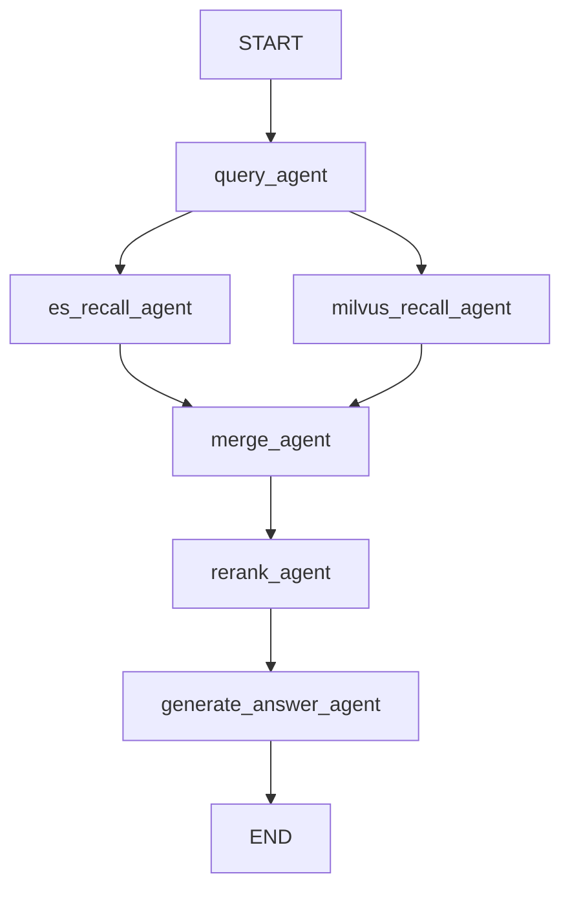

# Elasticsearch + Milvus 混合检索实战总结：从倒排索引原理到 RAG 双路召回

## 一、为什么向量检索之外还需要 Elasticsearch

在前面的 RAG 实战里，我们一直用 Milvus 做向量语义检索——它擅长理解"意思相近"的表达，比如"五一去哪玩"能召回"周末城市短途旅行攻略"。但向量检索有一个天生的短板：**对精确字面信息不敏感**。订单号、型号、人名、专有名词这类"必须原样命中"的关键词，向量模型未必能把它们的语义距离拉得足够近，召回率会打折扣。

而 **Elasticsearch（以下简称 ES）** 恰好补上了这一课：它基于**倒排索引**和 **BM25** 算分，对关键词的精确匹配和词频统计极其敏锐。于是"ES 做全文检索 + Milvus 做语义检索，两路并发召回后合并重排"就成了工业界最常见的**混合检索（Hybrid Retrieval）**方案。本文结合 `modules/elasticsearch` 下的实战代码，从 ES 的底层原理讲到这套混合检索管道的完整实现。

---

## 二、Elasticsearch 核心原理：倒排索引为什么这么快

### 核心思路

理解 ES 的检索速度，要先对比它和传统数据库全文扫描的本质区别。

- **正排索引 (Forward Index)**：结构是"文档 ID → 文档内容"，就像 MySQL 里没加全文索引的普通文本字段。要找包含某关键词的文档，只能一篇一篇地扫描全文，效率随文档量线性下降。
- **倒排索引 (Inverted Index)**：结构反过来，变成"关键词 → 文档 ID 列表（Posting List）"。检索时直接拿关键词去查表，瞬间定位命中的文档，完全不需要扫描原文。

| 词（Term） | 出现的文档 ID 列表 (Posting List) |
|---|---|
| elasticsearch | [1, 2] |
| fast | [1, 3] |
| lucene | [3] |

### ES 检索速度的三大底层优化

| 优化点 | 解决的问题 | 实现方式 |
|---|---|---|
| Term Dictionary + Term Index | 上千万个词如何快速定位 | 词典按字典序排序支持二分查找；再用基于 **FST（有限状态转换机）**的 Term Index 作为"目录的目录"，体积极小可整体加载进内存，减少磁盘 I/O |
| Posting List 压缩 | 高频词（如"的"、"is"）的文档 ID 列表过长 | **增量编码（Delta Encoding）**把绝对 ID 转为差值，再配合 **Roaring Bitmap** 等位图算法进一步压缩 |
| Skip List | 多关键词查询时求交集/并集慢 | 为长 Posting List 建跳表，检索时可大跨度跳过不相关 ID，把复杂度从 O(N) 降下来 |

### ⚠️ 只找到文档还不够：BM25 排序算法

倒排索引解决的是"怎么快速找到"，而"该排第几"要靠 **BM25 (Best Matching 25)** 算分，核心看三个维度：

| 维度 | 核心思想 |
|---|---|
| 词频 TF | 词出现次数越多越相关，但有饱和度限制，出现太多次后增益趋于平缓 |
| 逆文档频率 IDF | 越稀有的词权重越高——命中"Elasticsearch"比命中"的"更有区分度 |
| 字段长度归一化 | 越短的文本命中关键词，相关性越强；ES 会惩罚长文本、奖励短文本 |

一句话总结：**一个很罕见的词，在一篇很短的文本里出现了很多次，BM25 得分就会突破天际。**

---

## 三、基础操作与中文分词实践

### 核心思路

ES 的字段类型分两大类：`text`（会被分词，用于全文检索）和 `keyword`（不分词，用于精确匹配、聚合、排序）。中文场景下，标准分词器按字切分效果很差，必须接入 **IK 分词插件**，并遵循一条重要的最佳实践：**入库用 `ik_max_word`（细粒度全切分，提高召回率），查询用 `ik_smart`（粗粒度智能分词，减少噪音词）**。

### 关键代码

**文件**：`two/project/es/index2.md`

```http
# 创建索引：字段用 IK 双分词器配置
PUT /life_note
{
  "mappings": {
    "properties": {
      "title": {
        "type": "text",
        "analyzer": "ik_max_word",
        "search_analyzer": "ik_smart"
      },
      "type": { "type": "keyword" },
      "record_time": { "type": "date" }
    }
  }
}

# 全文分词检索
GET /life_note/_search
{
  "query": { "match": { "content": "健康 作息 旅行" } }
}

# 精确匹配（keyword 字段不能用 match，要用 term）
GET /life_note/_search
{
  "query": { "term": { "type": "健康生活" } }
}
```

### 参数说明

| 配置项 | 作用 |
|---|---|
| `analyzer` | 写入文档时使用的分词器，本例用 `ik_max_word` 尽可能切出所有可能的词，保证不漏召回 |
| `search_analyzer` | 查询时使用的分词器，用 `ik_smart` 避免查询词被过度拆分导致噪音过多 |
| `text` vs `keyword` | `text` 字段用 `match` 做全文检索；`keyword` 字段用 `term` 做精确匹配，两者不可混用 |

### ⚠️ 局限性

`ik_max_word` 入库会让索引体积明显增大（同一句话切出的词更多），这是为了召回率牺牲的存储成本，在数据量特别大的场景需要权衡。

---

## 四、封装一个生产可用的 ElasticSearchService

### 核心思路

直接裸调用 `AsyncElasticsearch` 客户端会让业务代码到处充斥连接管理、异常兜底的重复逻辑。我们用**单例模式**封装出一个 `ElasticSearchService`，统一负责连接生命周期管理、索引创建、增删改查，业务侧只需要 `es_service.search(...)` 这样干净的调用。

### 关键代码

**文件**：`modules/elasticsearch/es_service.py`

```python
class ElasticSearchService:
    _instance = None
    client: AsyncElasticsearch = None

    def __new__(cls, *args, **kwargs):
        if cls._instance is None:
            cls._instance = super().__new__(cls)
        return cls._instance

    async def connect(self, host: str):
        if self.client is None:
            self.client = AsyncElasticsearch(host)
            info = await self.client.info()
            print(f"✅ 成功连接到 Elasticsearch! 集群名称: {info.get('cluster_name')}")

    async def bulk_insert(self, index_name: str, docs: List[Dict[str, Any]]) -> int:
        """批量插入，docs 里若带 _id 键则作为自定义文档 ID"""
        async def generate_actions():
            for doc in docs:
                action = {"_index": index_name, "_source": {k: v for k, v in doc.items() if k != "_id"}}
                if "_id" in doc:
                    action["_id"] = doc["_id"]
                yield action
        success_count, _ = await async_bulk(self.client, generate_actions(), refresh=True)
        return success_count

    async def search(self, index_name: str, query: Dict[str, Any], size: int = 10, _from: int = 0) -> Dict[str, Any]:
        body = {"query": query, "size": size, "from": _from}
        try:
            response = await self.client.search(index=index_name, body=body)
            hits = response["hits"]["hits"]
            return {
                "total": response["hits"]["total"]["value"],
                "items": [{"_id": h["_id"], "_score": h["_score"], **h["_source"]} for h in hits]
            }
        except NotFoundError:
            return {"total": 0, "items": []}

es_service = ElasticSearchService()  # 全局单例，供整个应用复用
```

### 参数说明

| 方法 | 说明 |
|---|---|
| `create_index_if_not_exists` | 幂等创建索引，重复调用不会报错也不会覆盖已有数据 |
| `update_one` | 局部更新（`doc` 参数），推荐日常使用；`insert_one` 走 `index` 接口是全量覆盖 |
| `bulk_insert` | 用生成器 `generate_actions()` 惰性产出批量写入动作，配合 `async_bulk` 获得远高于逐条写入的性能 |
| `search` | 统一剥离 ES 返回结构里的元数据噪音，只保留业务需要的 `_id`、`_score` 与文档字段 |

### 💡 进阶技巧：`__new__` 实现单例

这里没有用常见的模块级全局变量方式，而是重写 `__new__` 保证 `ElasticSearchService()` 无论被实例化多少次，拿到的都是同一个对象、同一个 `client`。这样即便在不同模块里各自 `from ... import es_service`，本质上操作的仍是同一条连接。

---

## 五、查询扩写：一次提问变成多路检索

### 核心思路

用户的原始提问往往只是一种表达方式，直接拿它去检索容易漏掉表达方式不同但语义相同的文档。**查询扩写（Query Augmentation）**让大模型基于原问题生成若干条改写变体，覆盖不同角度和说法，然后每一条都各自触发一次 ES/Milvus 检索，最后合并去重——本质上是用多路召回换更高的召回率。

### 关键代码

**文件**：`modules/elasticsearch/query_augment.py`

```python
class QueryAugmentationSchema(BaseModel):
    queries: List[str] = Field(
        min_length=3, max_length=3,
        description="恰好 3 条中文检索问句：不同角度改写或扩写；保留订单号、品牌等字面信息；不要编造事实"
    )

def normalize_three_queries(original: str, query_list: List[str] | None) -> List[str]:
    """兜底规范化：确保无论大模型返回什么，最终都严格返回 3 条有效查询"""
    out = [s.strip() for s in (query_list or []) if isinstance(s, str) and s.strip()]
    while len(out) < 3:
        out.append(original)  # 数量不足就用原问题凑齐
    return out[:3]  # 数量超出就强行截断

async def augment_query(chat_model, query: str) -> dict:
    structured_llm = chat_model.with_structured_output(QueryAugmentationSchema)
    chain = augment_prompt | structured_llm
    try:
        raw_result = await chain.ainvoke({"query": query})
        return {"queries": normalize_three_queries(query, raw_result.queries if raw_result else [])}
    except Exception as e:
        print(f"Query augmentation failed: {e}")
        return {"queries": normalize_three_queries(query, [])}  # 模型挂了也不阻断主流程
```

### 设计要点

- **数量硬约束**：Pydantic 的 `min_length=3, max_length=3` 只能约束模型的"期望输出"，代码里 `normalize_three_queries` 才是真正的**兜底防线**——不管模型输出 0 条还是 10 条，最终一定拿到精确的 3 条可用查询
- **异常不阻断主流程**：`augment_query` 用 `try/except` 包裹模型调用，扩写失败时安静地退化为"用原问题重复凑数"，而不是让整条 RAG 链路因为扩写节点报错而中断

### ⚠️ 局限性

多路扩写意味着检索次数成倍增加（本例中一次提问变成 4 次 ES 查询 + 4 次 Milvus 查询），需要用并发（下一节的 `asyncio.gather`）把延迟摊平，否则串行执行会明显拖慢响应速度。

---

## 六、ES + Milvus 双路召回与合并去重

### 核心思路

查询扩写产出的多条问句，会**并发**分别喂给 ES 和 Milvus 两条召回通道；每条通道内部又对多条问句并发检索，取回结果后拍平（flatten）、按文档 ID 去重；最后把两条通道的结果合并成一份统一格式的候选文档池。

### 关键代码

**文件**：`modules/elasticsearch/ask_rag.py`

```python
async def es_recall_agent(state: HybridRetrievalState) -> HybridRetrievalState:
    qs = retrieval_query_strings(state.get("query", ""), state.get("queryAugmentation", {}))
    k_each = max(2, math.ceil(10 / max(1, len(qs))))  # 总共想要 10 条，平摊到每条查询

    async def fetch_es(q: str):
        query_body = {
            "multi_match": {
                "query": q,
                "fields": ["note_title^2", "note_body"],  # 标题权重更高 (^2)
                "type": "best_fields",
                "analyzer": "ik_smart",
            }
        }
        res = await es_service.search(index_name=INDEX, query=query_body, size=k_each)
        return res.get("items", [])

    # asyncio.gather 是 Promise.all() 的 Python 平替：并发跑完所有变体查询
    batches = await asyncio.gather(*(fetch_es(q) for q in qs))
    flat = [doc for batch in batches for doc in batch]  # flatMap

    seen, deduped = set(), []
    for doc in flat:
        if doc.get("_id") not in seen:
            seen.add(doc.get("_id"))
            deduped.append(doc)
    return {"esHits": deduped}
```

Milvus 那一路（`milvus_recall_agent`）结构完全对称，唯一的差异是把 Milvus 返回的 `Document.metadata` 扁平化成和 ES 一致的字段结构（用 `id` 顶替 `_id`），这是为了让 `merge_agent` 能用统一的逻辑合并两路数据：

```python
async def merge_agent(state: HybridRetrievalState) -> HybridRetrievalState:
    combined = state.get("esHits", []) + state.get("milvusHits", [])  # ES 拼在前面，优先保留 ES 的结果
    seen, out = set(), []
    for d in combined:
        if "doc_text" not in d:  # ES 文档没有整体正文字段，这里补一份
            d["doc_text"] = f"{d.get('note_title') or ''}\n{d.get('note_body') or ''}".strip()
        doc_id = str(d.get("_id") or "").strip()
        if d.get("doc_text") and doc_id and doc_id not in seen:
            seen.add(doc_id)
            out.append(d)
    return {"merged": out}
```

### 参数说明

| 字段 | 说明 |
|---|---|
| `note_title^2` | ES `multi_match` 里的权重语法，标题字段的匹配权重是正文的 2 倍 |
| `k_each` | 单路查询的召回条数，用总目标数除以变体问句数量、向上取整、且不低于 2 |
| `esHits` / `milvusHits` | 两路各自去重后的召回结果，字段结构在合并前已被统一 |

### ⚠️ 局限性

合并逻辑里"ES 拼接在前面"意味着**同一篇文档若被两路都召回，最终保留的是 ES 版本的字段**（比如 `_score` 是 BM25 分数而非向量相似度分数）。这只是一种简单启发式策略，如果要精细化利用两路分数做加权融合（比如 RRF 算法），需要在合并阶段引入更复杂的分数归一化逻辑。

---

## 七、重排与生成：把两路证据拧成一股

### 核心思路

ES 和 Milvus 各自的排序标准不一样（BM25 分数 vs 向量相似度），直接拼在一起送给大模型效果有限。所以合并后的候选文档需要经过一次**语义重排（Rerank）**——用专门的 Rerank 模型统一按"与原问题的相关性"重新打分排序，只保留 Top N，再喂给大模型生成最终回答。

### 关键代码

```python
reranker = DashScopeRerank(top_n=3, model="qwen-rerank")

async def rerank_agent(state: HybridRetrievalState) -> HybridRetrievalState:
    merged = state.get("merged", [])
    if not merged:
        return {"topDocuments": []}

    docs_to_rerank = [Document(page_content=d.get("doc_text", ""), metadata=d) for d in merged]
    try:
        compressed_docs = await reranker.acompress_documents(docs_to_rerank, state.get("query", ""))
    except Exception as e:
        print(f"[Rerank] 重排器调用失败: {e}，回退至取前三")
        return {"topDocuments": merged[:3]}  # 重排服务挂了，退化为“简单粗暴取前三”

    return {"topDocuments": [{**doc.metadata, "doc_text": doc.page_content} for doc in compressed_docs]}

async def generate_answer_agent(state: HybridRetrievalState) -> HybridRetrievalState:
    docs = state.get("topDocuments", [])
    if not docs:
        # 检索为空时的兜底 Prompt，明确告诉用户“笔记里没有”，而不是让模型硬编
        chain = NO_CONTEXT_PROMPT | default_model
        msg = await chain.ainvoke({"query": state.get("query", "")})
        return {"answer": stringify_message_content(msg.content).strip()}

    context = "\n\n---\n\n".join([f"[{i+1}] id={d.get('_id')}\n{d.get('doc_text')}" for i, d in enumerate(docs)])
    chain = ANSWER_PROMPT | default_model
    msg = await chain.ainvoke({"query": state.get("query", ""), "context": context})
    return {"answer": stringify_message_content(msg.content).strip()}
```

### 💡 进阶技巧：双重兜底设计

这一节里有两层防御式设计值得学习：

1. **Rerank 服务不可用时**：不让整条链路崩掉，而是退化为"直接截取合并结果的前 3 条"，牺牲一点精度换取可用性
2. **完全没检索到内容时**：不强迫大模型"憋答案"，而是切换到专门的 `NO_CONTEXT_PROMPT`，让模型明确说"笔记里未提到"并引导用户换个说法

---

## 八、完整工作流一览



图中 `query_agent` 之后的两条边是并行触发的——`es_recall_agent` 和 `milvus_recall_agent` 会同时开始执行，LangGraph 会自动等待两者都完成后才继续流入 `merge_agent`，这正是状态图天然支持"扇出-扇入（Fan-out/Fan-in）"并行结构的体现，无需手写额外的并发控制代码。

---

## 九、六个环节综合对比

| 环节 | 解决的问题 | 关键技术 | 失败兜底 |
|---|---|---|---|
| 查询扩写 | 单一表达方式召回不全 | 结构化输出 + 数量硬约束 | 用原问题凑数 |
| ES 全文召回 | 精确关键词、专有名词匹配 | 倒排索引 + BM25 + IK 分词 | 索引不存在返回空结果 |
| Milvus 向量召回 | 语义相近但字面不同的表达 | Embedding + 相似度检索 | 无 |
| 合并去重 | 两路结果字段不统一、重复 | 字段扁平化 + 按 ID 去重 | 无 |
| 重排 | 两种打分体系不可直接比较 | 独立 Rerank 模型统一打分 | 服务异常时退化取前三 |
| 生成回答 | 防止编造、检索为空时的体验 | 双 Prompt 模板分流 | 无检索结果走专用兜底话术 |

---

## 十、学习与实践推荐

本文的全文检索能力基于自建的 Elasticsearch（默认连接 `http://localhost:9200`），学习阶段最快的方式是用 Docker 直接拉起单节点 ES + Kibana，再装上 [IK 分词插件](https://github.com/medcl/elasticsearch-analysis-ik) 即可跑通本文所有的中文分词示例。而向量检索这一路复用了此前介绍过的 **Zilliz Cloud**（Milvus 全托管服务），两者结合、各自发挥所长，正是构建生产级混合检索系统性价比最高的路径。
