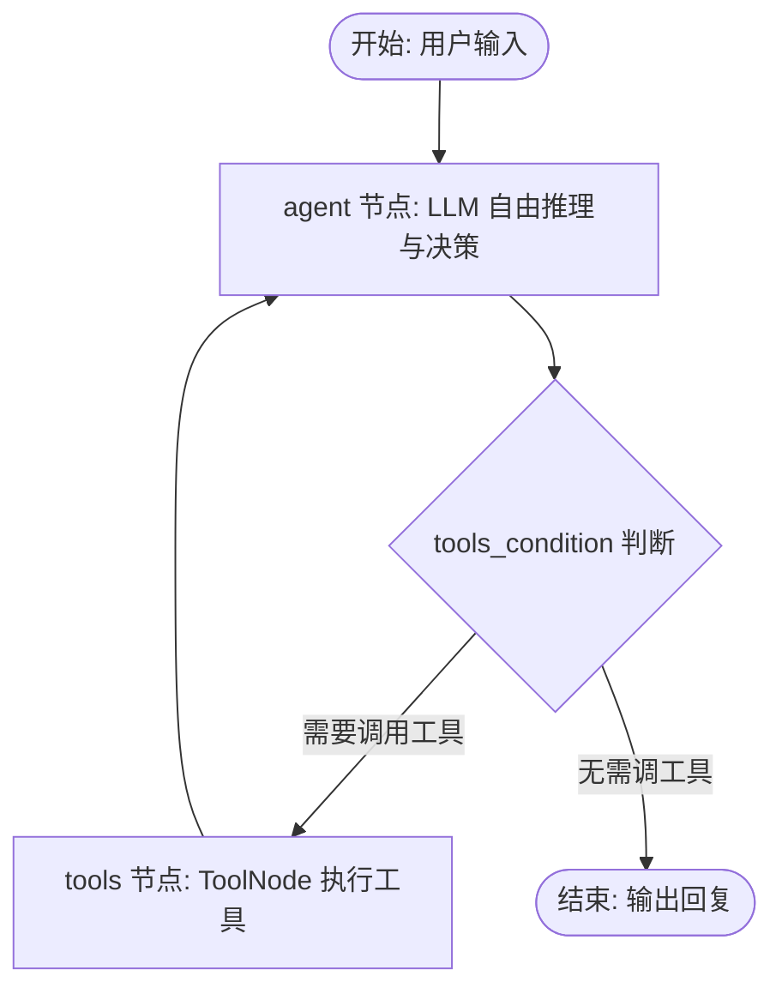
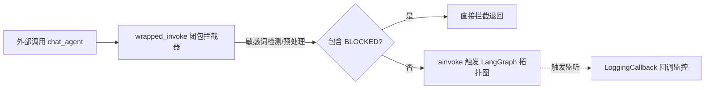
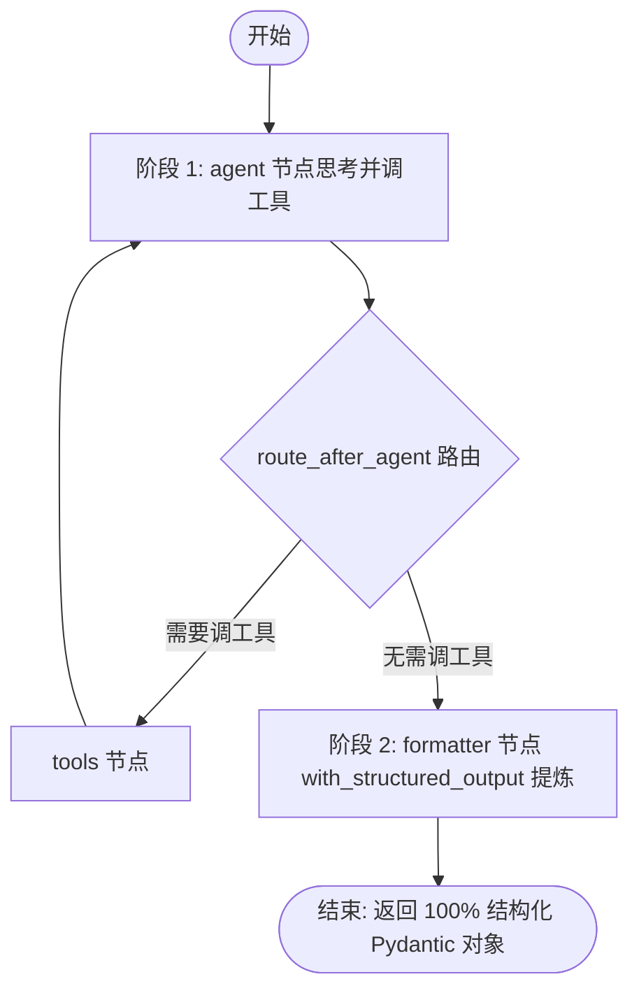

# LangGraph Python 架构实战：从 ReAct 图引擎到两阶段结构化硬约束

在构建企业级 AI Agent 系统时，我们常常需要在“灵活的工具调用思考”与“严谨的输出格式控制”之间取得平衡。本文将基于 LangGraph Python 生态，深度总结 Agent 核心拓扑图构建、闭包中间件机制以及两阶段解耦硬约束架构。

---

## 一、 Agent 核心拓扑图架构 (`react_agent.py`)

### 1. 架构设计哲学
原生的 LangGraph 摒弃了传统的黑盒执行引擎，采用显式的**有向无环图 (DAG)** 来表示 Agent 的控制流。我们将核心 ReAct 逻辑封装为一个纯粹的工厂函数 `create_agent(llm, tools, system_prompt)`，实现业务与引擎的解耦。



### 2. 核心实现代码

```python
from typing import Annotated
from langchain_core.messages import BaseMessage, SystemMessage
from langgraph.graph import StateGraph, END, add_messages
from langgraph.prebuilt import ToolNode, tools_condition
from typing_extensions import TypedDict

class AgentState(TypedDict):
    messages: Annotated[list[BaseMessage], add_messages]

def create_agent(llm, tools, system_prompt: str = ""):
    llm_with_tools = llm.bind_tools(tools)

    async def agent_node(state: AgentState):
        messages = state["messages"]
        if system_prompt and not any(isinstance(m, SystemMessage) for m in messages):
            messages = [SystemMessage(content=system_prompt)] + messages
        response = await llm_with_tools.ainvoke(messages)
        return {"messages": [response]}

    workflow = StateGraph(AgentState)
    workflow.add_node("agent", agent_node)
    workflow.add_node("tools", ToolNode(tools))

    workflow.set_entry_point("agent")
    workflow.add_conditional_edges("agent", tools_condition)
    workflow.add_edge("tools", "agent")

    return workflow.compile()
```

---

## 二、 Python 闭包包装器与全局监听 (`middlewares.py`)

在 TypeScript 生态中，开发者习惯使用洋葱圈中间件（Onion Middleware）。而在 Python 中，我们采用**高阶函数（闭包）**与 **LangChain Callbacks** 实现等价的非侵入式扩展。



### 1. 全局日志回调与敏感词拦截

```python
from langchain_core.callbacks import BaseCallbackHandler
from langchain_core.messages import SystemMessage, HumanMessage

class LoggingCallback(BaseCallbackHandler):
    def __init__(self):
        self.call_count = 0

    def on_chat_model_start(self, serialized, messages, **kwargs):
        self.call_count += 1
        print(f"[Logging] 模型准备生成，已调用: {self.call_count} 次")

    def on_tool_start(self, serialized, input_str, **kwargs):
        print(f"[Logging] 正在调用工具，参数: {input_str}")

def apply_middlewares(graph_app):
    logger = LoggingCallback()

    async def wrapped_invoke(user_text: str):
        # 1. 前置敏感词短路拦截
        if "BLOCKED" in user_text:
            return "系统拦截到了敏感词"

        # 2. 上下文预处理与挂载回调
        injected_messages = [HumanMessage(content=user_text)]
        response_state = await graph_app.ainvoke(
            {"messages": injected_messages},
            config={"callbacks": [logger]}
        )
        return response_state["messages"][-1].content

    return wrapped_invoke
```

---

## 三、 两阶段解耦硬约束架构 (Two-Stage Decoupled Pipeline)

### 1. 核心矛盾
在带工具调用的 ReAct Agent 中，如果直接给底层 LLM 绑定 `llm.with_structured_output(Schema)`，模型会被强制要求输出 JSON，从而**失去调用其他业务工具的能力**。

### 2. 解决方案：双节点分工模式

我们将图结构扩展为两阶段：
- **阶段 1 (agent + tools)**：自由推理节点，专注于调用外部 API 搜集数据。
- **阶段 2 (formatter)**：硬约束提炼节点，在不需要调用工具时拦截 `END` 信号，使用 `with_structured_output` 强行将全部上下文转化为 100% 合规的 Pydantic 对象。



### 3. 图拓扑图关键改造代码

```python
if response_schema:
    # 创建 100% 硬约束提炼模型
    structured_llm = llm.with_structured_output(response_schema)

    async def formatter_node(state: AgentState):
        messages = state["messages"]
        structured_data = await structured_llm.ainvoke(messages)
        return {
            "structured_response": structured_data,
            "messages": [AIMessage(content=f"【结构化输出】\n{structured_data}")]
        }

    workflow.add_node("formatter", formatter_node)

    # 动态路由：拦截原本的 END，切入 formatter 节点
    def route_after_agent(state: AgentState):
        next_step = tools_condition(state)
        if next_step == END:
            return "formatter"
        return next_step

    workflow.add_conditional_edges("agent", route_after_agent)
    workflow.add_edge("formatter", END)
```

---

## 四、 总结与选型对比

| 架构维度 | 传统单节点 Prompt 约束 | 两阶段解耦硬约束 (Two-Stage) |
| :--- | :--- | :--- |
| **工具调用能力** | 受限或容易冲突崩溃 | **完全不受影响**（阶段 1 自由调工具） |
| **JSON 合规率** | 约 95%（偶发解析异常） | **100%**（阶段 2 采用底层采样硬约束） |
| **适用场景** | 简单对话与原型 | 生产级 API、数据提炼、金融/报表 Agent |
