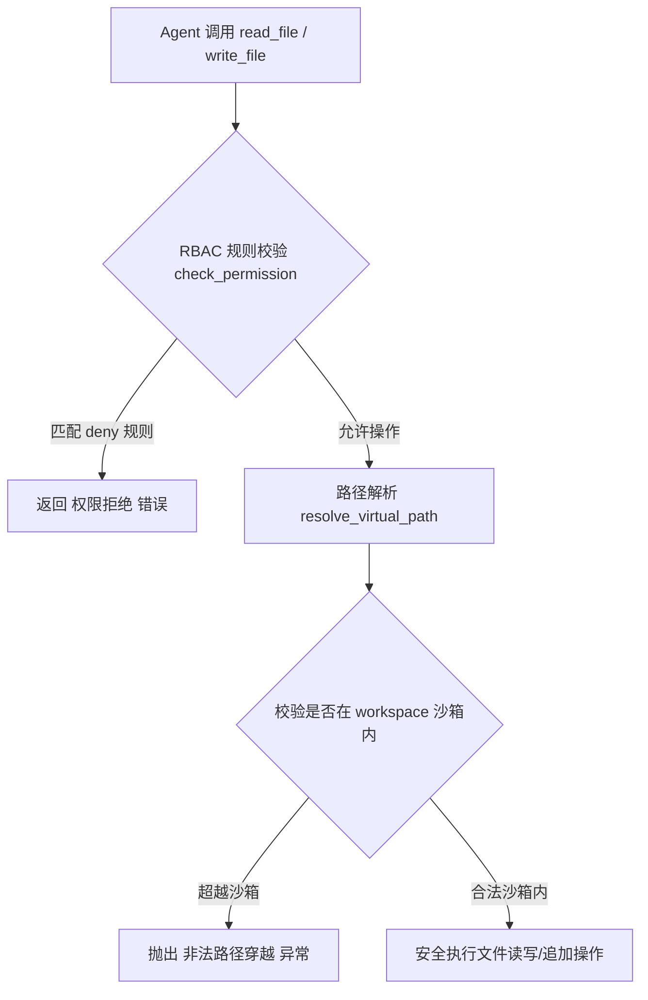
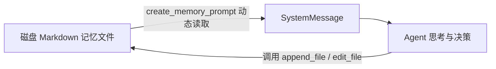
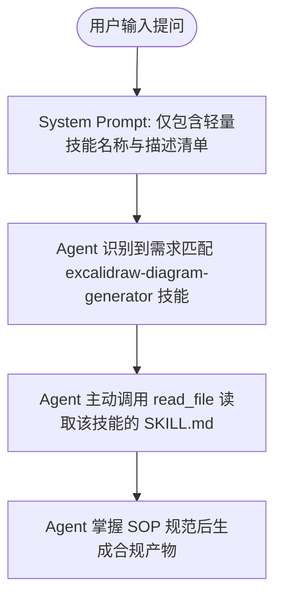
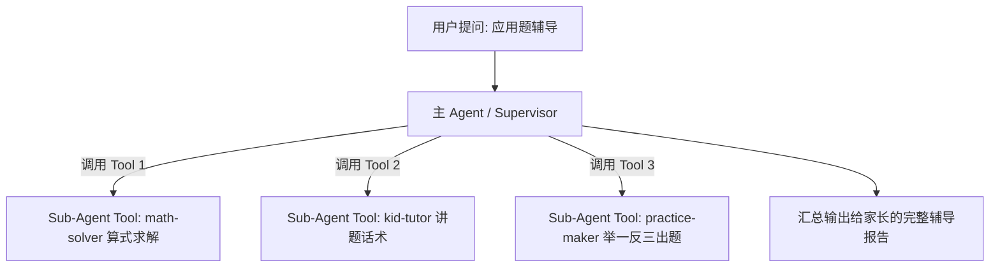

# Agent 高级基础设施实战：虚拟沙箱 RBAC、Markdown 持久化记忆、Skills 动态 SOP 与 Sub-Agent 协作

在构建可落地的生产级 AI Agent 时，除了核心的推理逻辑外，还需要完善的基础设施保障系统的安全性、可扩展性与记忆能力。本文将基于 Python 生态，深度剖析文件沙箱、RBAC 鉴权、长短期记忆、Skills 动态 SOP 以及多 Agent 协作四大高级能力。

---

## 一、 虚拟文件沙箱与 RBAC 细粒度权限控制 (`fs_middleware.py`)

### 1. 核心安全机制
为了防止 Agent 越权访问操作系统底层文件，我们构建了虚拟文件系统沙箱，包含两大安全防线：
- **防路径穿越 (Path Traversal Protection)**：将虚拟路径 `/xxx` 映射到本地物理路径 `./workspace/xxx`，并强制校验 `startswith(workspace_dir)`。
- **通配符 RBAC 鉴权引擎 (First-Match-Wins)**：基于 `fnmatch` 匹配操作类型与 Glob 路径规则。



### 2. 关键实现代码

```python
import fnmatch
from pathlib import Path
from langchain_core.tools import tool

def create_filesystem_tools(root_dir: str | Path, permissions: list[dict] = None):
    root_path = Path(root_dir).resolve()
    permissions = permissions or []

    def check_permission(op: str, vpath: str) -> bool:
        for rule in permissions:
            if op in rule.get("operations", []) and any(fnmatch.fnmatch(vpath, p) for p in rule.get("paths", [])):
                return rule.get("mode") == "allow"
        return True

    def get_real_path(vpath: str) -> Path:
        real = (root_path / vpath.lstrip("/")).resolve()
        if not str(real).startswith(str(root_path)):
            raise PermissionError("非法路径穿越")
        return real

    @tool
    def append_file(virtual_path: str, content: str) -> str:
        """向指定文件的末尾追加新内容（非常适用于追加记忆）"""
        if not check_permission("write", virtual_path):
            return f"【权限拒绝】禁止追加文件: {virtual_path}"
        p = get_real_path(virtual_path)
        existing = p.read_text(encoding="utf-8") if p.exists() else ""
        p.write_text(f"{existing}\n{content}" if existing else content, encoding="utf-8")
        return f"成功追加文件: {virtual_path}"

    return [read_file, write_file, append_file, edit_file, ls]
```

---

## 二、 长短期 Markdown 持久化记忆系统 (`memory_middleware.py`)

### 1. 记忆管理架构
我们摒弃了黑盒中间件，采用纯文本 Markdown 文件（如 `/AGENTS.md` 和 `/memory/preferences.md`）作为记忆存储介质。



### 2. 数据库迁移平滑性
当前方案将记忆的**读取（Prompt 注入）**与**写入（工具调用）**彻底解耦。未来迁移到 MySQL、PostgreSQL 或 Redis 时，只需要在 `create_memory_prompt` 函数内部将 `file.read_text()` 替换为 `db.fetch_user_memory()`，业务层代码 100% 保持不变。

---

## 三、 Agent Skills 动态技能库与角色鉴权 (`skills_middleware.py`)

### 1. 按需延迟加载协议 (Lazy-Loading Protocol)
Agent Skills 解决了盲目拼装长 Prompt 导致的 Token 浪费与延迟问题。

- **索引扫描**：启动时仅扫描 `.agents/skills/**/SKILL.md` 的 YAML 元数据（名称、描述），注入轻量级技能清单。
- **按需加载**：只有当用户任务触发特定技能时，Agent 才主动调用 `read_file` 去读取完整的 SOP 指南文件。



### 2. 基于角色的 Prompt 物理隐形隔离 (Role-Based Skill RBAC)

为了防止越权攻击（Prompt Injection），我们在技能扫描阶段引入 `user_role` 物理隔离：

```python
# 如果技能要求的角色不在用户的角色权限内，直接从 Prompt 中物理消除！
allowed = meta.get("allowed_roles", ["all"])
if "all" not in allowed and user_role not in allowed:
    continue  # 越权技能直接隐藏，大模型压根不知道其存在！
```

---

## 四、 Multi-Agent / Sub-Agent 协作架构 (`test5.py`)

### 1. "Agent-as-a-Tool" 核心范式
在多 Agent 协作中，最地道的工业级模式是将每一个专门化的**子 Agent（Sub-Agent）包装成主 Agent（Supervisor）手里的一个 Tool**。



### 2. 核心代码实现

```python
@tool
async def run_math_solver(problem: str) -> str:
    """解题子 Agent 工具代理"""
    solver_agent = create_agent(default_model, tools=[calc, divide_evenly], system_prompt="你是解题子 Agent...")
    res = await solver_agent.ainvoke({"messages": [("human", problem)]})
    return res["messages"][-1].content

# 主 Agent 将子 Agent 作为工具进行调度
subagent_tools = [run_math_solver, run_kid_tutor, run_practice_maker]
main_agent_graph = create_agent(default_model, tools=subagent_tools, system_prompt="你是主调度 Agent...")
```

---

## 五、 全套基础设施总结

通过以上四大模块的有机组合，我们成功在 Python / LangGraph 体系下构建了涵盖 **控制流路由、沙箱安全、权限隔离、持久化记忆、动态技能扩展与多 Agent 协同** 的完整生产级 AI Agent 架构体系。
