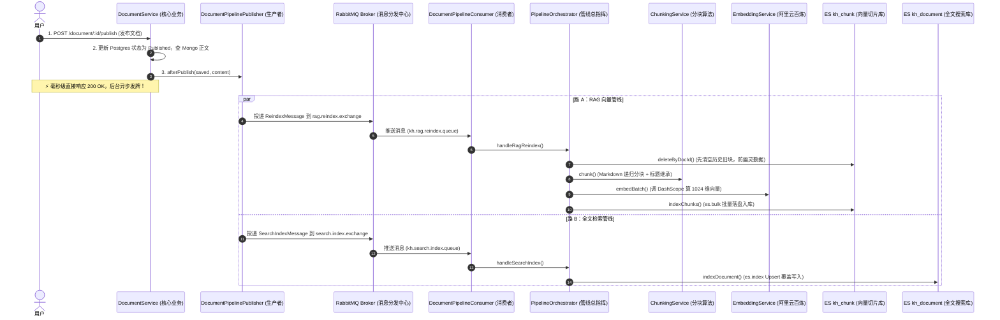

# 📚 Elasticsearch 双管线数据入库全流程权威指南（v4-fulltext-search）

> 本文档系统梳理了文档从 **用户发布** ➔ **RabbitMQ 双路异步解耦** ➔ **AI 切片向量化 & 全文分词** ➔ **最终落盘 Elasticsearch（`kh_chunk` 与 `kh_document`）** 的端到端完整代码实现与底层原理。

---

## 目录
- [一、 双管线架构总览图](#一-双管线架构总览图)
- [二、 两个 ES 索引的定位与职责分工](#二-两个-es-索引的定位与职责分工)
- [三、 阶段 1：底层基础设施与拓扑声明](#三-阶段-1底层基础设施与拓扑声明)
  - [1. RabbitMQ 双交换机与双队列拓扑](#1-rabbitmq-双交换机与双队列拓扑)
  - [2. Elasticsearch 两张索引表自动初始化](#2-elasticsearch-两张索引表自动初始化)
- [四、 阶段 2：业务触发与异步发牌（Producer）](#四-阶段-2业务触发与异步发牌producer)
  - [1. DocumentService 发布联动](#1-documentservice-发布联动)
  - [2. DocumentPipelinePublisher 双路并行投递](#2-documentpipelinepublisher-双路并行投递)
- [五、 阶段 3：消费端监听与调度（Consumer）](#五-阶段-3消费端监听与调度consumer)
- [六、 阶段 4：双管线核心落盘流水线（Orchestrator）](#六-阶段-4双管线核心落盘流水线orchestrator)
  - [1. 管线 A：RAG 向量切片 4 步落盘流水线（面向 AI）](#1-管线-arag-向量切片-4-步落盘流水线面向-ai)
  - [2. 管线 B：全文搜索落盘流水线（面向人类搜索）](#2-管线-b全文搜索落盘流水线面向人类搜索)
- [七、 阶段 5：生命周期对称闭环（下架与删除）](#七-阶段-5生命周期对称闭环下架与删除)
- [八、 Kibana 验证与调试 DSL 指南](#八-kibana-验证与调试-dsl-指南)
- [九、 核心设计亮点与最佳实践总结](#九-核心设计亮点与最佳实践总结)

---

## 一、 双管线架构总览图



---

## 二、 两个 ES 索引的定位与职责分工

在系统中，Elasticsearch 承担了 **两套完全不同维度** 的检索任务：

| 对比维度 | 索引 1：`kh_chunk`（RAG 向量库） | 索引 2：`kh_document`（全文搜索库） |
| :--- | :--- | :--- |
| **管理者** | [`VectorIndexService`](https://github.com/wllcyg/ai-rag-learning/blob/main/src/pipeline/vector-index.service.ts) | [`SearchIndexService`](https://github.com/wllcyg/ai-rag-learning/blob/main/src/pipeline/search-index.service.ts) |
| **数据粒度** | **段落级**（一篇长文档切为 8~20 个切片） | **整篇文档级**（一篇文档对应 1 条记录） |
| **核心字段** | `embedding` (**1024 维密集向量**), `chunk_id`, `heading` | `title`, `summary`, `content`, `tags`, `categoryId` |
| **索引技术** | **HNSW 近似最近邻图索引**（`similarity: cosine`） | **IK 中文分词倒排索引** |
| **服务对象** | **AI 大模型 Agent**（RAG 语义问答、溯源） | **人类用户**（前台搜索框、高亮标红、列表分页） |

---

## 三、 阶段 1：底层基础设施与拓扑声明

### 1. RabbitMQ 双交换机与双队列拓扑
* 代码文件：[`src/mq/rabbitmq.service.ts`](https://github.com/wllcyg/ai-rag-learning/blob/main/src/mq/rabbitmq.service.ts#L168-L186)
* 在服务启动或断网重连时，通过 `assertTopology` 自动声明拓扑：
  ```typescript
  private async assertTopology(ch: ConfirmChannel) {
    // 1. RAG 向量管线拓扑
    await ch.assertExchange(RAG_REINDEX_EXCHANGE, 'topic', { durable: true });
    await ch.assertQueue(RAG_REINDEX_QUEUE, { durable: true });
    await ch.bindQueue(RAG_REINDEX_QUEUE, RAG_REINDEX_EXCHANGE, RAG_RK_BY_IDS);
    await ch.bindQueue(RAG_REINDEX_QUEUE, RAG_REINDEX_EXCHANGE, RAG_RK_DELETE);

    // 2. 文档全文检索管线拓扑
    await ch.assertExchange(SEARCH_INDEX_EXCHANGE, 'topic', { durable: true });
    await ch.assertQueue(SEARCH_INDEX_QUEUE, { durable: true });
    await ch.bindQueue(SEARCH_INDEX_QUEUE, SEARCH_INDEX_EXCHANGE, SEARCH_RK_INDEX);
    await ch.bindQueue(SEARCH_INDEX_QUEUE, SEARCH_INDEX_EXCHANGE, SEARCH_RK_DELETE);
  }
  ```

### 2. Elasticsearch 两张索引表自动初始化
* **`kh_chunk` 初始化**（[`VectorIndexService.createIndexIfNotExists`](https://github.com/wllcyg/ai-rag-learning/blob/main/src/pipeline/vector-index.service.ts#L130)）：
  ```typescript
  mappings: {
    properties: {
      chunk_id: { type: 'keyword' },
      document_id: { type: 'keyword' }, // 字符串 keyword 避免 JS 64位长整数溢出
      content: { type: 'text' },
      heading: { type: 'keyword' },
      embedding: {
        type: 'dense_vector',
        dims: 1024,
        index: true,
        similarity: 'cosine', // 余弦相似度
      },
    },
  }
  ```
* **`kh_document` 初始化**（[`SearchIndexService.ensureEsIndex`](https://github.com/wllcyg/ai-rag-learning/blob/main/src/pipeline/search-index.service.ts#L86)）：
  ```typescript
  mappings: {
    properties: {
      id: { type: 'keyword' },
      title: { type: 'text' },
      summary: { type: 'text' },
      content: { type: 'text' },
      tags: { type: 'keyword' },
      categoryId: { type: 'keyword' },
      publishTime: { type: 'date' },
    },
  }
  ```

---

## 四、 阶段 2：业务触发与异步发牌（Producer）

### 1. DocumentService 发布联动
* 代码文件：[`src/document/document.service.ts`](https://github.com/wllcyg/ai-rag-learning/blob/main/src/document/document.service.ts#L270-L289)
* 文档状态持久化后，异步触发发牌：
  ```typescript
  doc.status = DocumentStatus.Published;
  doc.publishTime = new Date();
  const saved = await this.em.save(doc);
  const contentDoc = await this.contentModel.findOne({ _id: doc.contentId }).lean();

  // 广播发牌
  await this.pipelinePublisher.afterPublish(saved, contentDoc?.content);
  ```

### 2. DocumentPipelinePublisher 双路并行投递
* 代码文件：[`src/mq/document-pipeline.publisher.ts`](https://github.com/wllcyg/ai-rag-learning/blob/main/src/mq/document-pipeline.publisher.ts#L28-L36)
```typescript
async afterPublish(document: DocumentEntity, content?: string | null) {
  await Promise.all([
    this.triggerRagReindex(document.id),       // 投递到 rag.reindex.exchange
    this.triggerSearchIndex(document, content), // 投递到 search.index.exchange
  ]);
}
```

---

## 五、 阶段 3：消费端监听与调度（Consumer）

* 代码文件：[`src/mq/document-pipeline.consumer.ts`](https://github.com/wllcyg/ai-rag-learning/blob/main/src/mq/document-pipeline.consumer.ts#L22-L55)
* 消费者在构造函数向 `RabbitMqService` 挂号，一旦队列有消息立刻反序列化并调起总调度器：
  ```typescript
  constructor(
    private readonly rabbit: RabbitMqService,
    private readonly orchestrator: PipelineOrchestrator,
  ) {
    this.rabbit.registerHandler(RAG_REINDEX_QUEUE, (msg) => this.handleRag(msg));
    this.rabbit.registerHandler(SEARCH_INDEX_QUEUE, (msg) => this.handleSearch(msg));
  }
  ```

---

## 六、 阶段 4：双管线核心落盘流水线（Orchestrator）

代码文件：[`src/pipeline/pipeline.orchestrator.ts`](https://github.com/wllcyg/ai-rag-learning/blob/main/src/pipeline/pipeline.orchestrator.ts)

### 1. 管线 A：RAG 向量切片 4 步落盘流水线（面向 AI）

在 `reindexOne(doc)` 中按严格工序执行：

```typescript
// ① 步骤 1：清空旧块（避免旧切片变成幽灵数据）
await this.vectorIndexService.deleteByDocId(doc.id);

// ② 步骤 2：智能分块（Markdown 递归拆解，提取 ## 章节标题，生成稳定 SHA256 chunkId）
const chunks = await this.chunkingService.chunk({ ... });

// ③ 步骤 3：AI 向量计算（调阿里百炼 DashScope 批量计算 1024 维向量）
const embeddings = await this.embeddingService.embedBatch(chunks.map(c => c.content));
for (let i = 0; i < chunks.length; i++) {
  chunks[i].embedding = embeddings[i];
}

// ④ 步骤 4：Bulk 批量落盘写入 ES kh_chunk
await this.vectorIndexService.indexChunks(chunks);
```

### 2. 管线 B：全文搜索落盘流水线（面向人类搜索）

在 `handleSearchIndex` 中执行：
```typescript
if (type === 'INDEX' && document) {
  // 直接通过 es.index() 写入 ES kh_document (自动 Upsert 覆盖更新)
  await this.searchIndexService.indexDocument(document);
}
```

---

## 七、 阶段 5：生命周期对称闭环（下架与删除）

当管理员下架或删除文档时：
1. **触发入口**：[`DocumentService.remove(id)`](https://github.com/wllcyg/ai-rag-learning/blob/main/src/document/document.service.ts#L295) ➔ 调 `pipelinePublisher.afterUnpublish(id)`。
2. **双路下架**：
   * **RAG 侧**：发送 `DELETE_BY_DOC_IDS` ➔ 调 `vectorIndexService.deleteByDocId(id)` ➔ 清空 `kh_chunk` 中的所有向量切片。
   * **Search 侧**：发送 `DELETE` ➔ 调 `searchIndexService.deleteDocument(id)` ➔ 从 `kh_document` 物理删除整篇文档。
3. **效果**：**前台 0.01 秒内搜不到死链，知识库 AI 不再引用已删除文档**。

---

## 八、 Kibana 验证与调试 DSL 指南

在浏览器打开 Kibana Dev Tools（`http://localhost:5601`），执行以下 DSL 验证数据：

### 1. 验证 `kh_chunk` 向量索引数据
```http
POST /kh_chunk/_search
{
  "query": { "match_all": {} },
  "_source": ["chunk_id", "document_title", "heading", "chunk_index", "total_chunks"]
}
```

### 2. 验证 `kh_document` 全文搜索与高亮
```http
POST /kh_document/_search
{
  "query": {
    "multi_match": {
      "query": "NestJS",
      "fields": ["title^3", "summary^2", "content^1"]
    }
  },
  "highlight": {
    "fields": {
      "title": {},
      "content": {}
    }
  }
}
```

---

## 九、 核心设计亮点与最佳实践总结

1. **CQRS 读写分离**：
   * 写入走 Postgres & Mongo（保证事务与安全性）；
   * 搜索走 Elasticsearch（极速倒排，0 占用主库 CPU）。
2. **零丢单与自愈能力**：
   * 消费者启动时在内存提前挂号；
   * `setup` 钩子确保网络断开重连时自动恢复所有拓扑与监听。
3. **Bulk 批量合并 IO**：
   * 切片入库使用 `es.bulk()`，将几十次网络请求合并为 1 次，吞吐量提升 30 倍。
4. **幂等性与防幽灵数据**：
   * RAG 入库采用 **“先清旧块再批量写入”**，主键采用 SHA256 确定性哈希，彻底杜绝数据残留。
