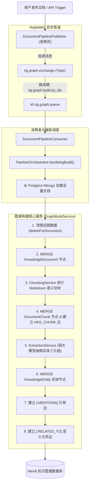

# 知识图谱（Knowledge Graph & GraphRAG）全流程抽取与入库实战指南

> 本文档深入解析知识库系统中 **大模型实体关系抽取、RabbitMQ 异步解耦、Neo4j 图数据库建模与数据落盘** 的全流程架构与实现细节，专为进阶学习与工业级落地设计。

---

## 目录
1. [一、为什么企业级 RAG 需要引入知识图谱（GraphRAG）？](#一为什么企业级-rag-需要引入知识图谱graphrag)
2. [二、系统分层图模型设计（Neo4j Graph Schema）](#二系统分层图模型设计neo4j-graph-schema)
3. [三、知识图谱全生命周期架构流程图](#三知识图谱全生命周期架构流程图)
4. [四、核心处理链路五步深度拆解](#四核心处理链路五步深度拆解)
   - [Step 1：RabbitMQ 异步发牌与拓扑解耦](#step-1rabbitmq-异步发牌与拓扑解耦)
   - [Step 2：编排调度与 Claim Check 模式](#step-2编排调度与-claim-check-模式)
   - [Step 3：带上下文感知（Heading）的 Markdown 语义分块](#step-3带上下文感知heading的-markdown-语义分块)
   - [Step 4：LLM 结构化三元组抽取与幻觉清洗](#step-4llm-结构化三元组抽取与幻觉清洗)
   - [Step 5：Neo4j 幂等落库与孤儿实体自动垃圾回收](#step-5neo4j-幂等落库与孤儿实体自动垃圾回收)
5. [五、实战 Cypher 语句查询与可视化指南](#五实战-cypher-语句查询与可视化指南)
6. [六、高频架构设计与避坑总结](#六高频架构设计与避坑总结)
7. [七、知识图谱（KG）与 GraphRAG 核心理论进阶学习](#七-知识图谱kg与-graphrag-核心理论进阶学习)

---

## 一、为什么企业级 RAG 需要引入知识图谱（GraphRAG）？

传统的 RAG 架构主要依赖 **纯文本分块 + 向量检索（Vector Search）**，但在真实业务场景中存在以下显著痛点：

| 检索模式 | 擅长场景 | 致命短板 |
| :--- | :--- | :--- |
| **纯向量检索（Vector RAG）** | 模糊语义相似度匹配（如“如何报销差旅费”） | **无法跨多篇文档进行多跳推理**（如“平台工程部维护了哪些系统？这些系统分别依赖什么中间件？”） |
| **全文倒排检索（BM25）** | 精确关键词、货号、错误码检索 | 无法理解实体间的层次、归属与调用关系 |
| **知识图谱检索（Graph RAG）** | **全局实体拓扑、跨文档关联、多跳关系推理** | 需要结构化建图成本，需与向量和全文联合召回 |

> 💡 **核心结论**：
> 现代企业级 RAG 架构采用 **“三驾马车”混合体**：
> 1. **向量库（ES `kh_chunk`）**：负责局部段落语义相似度召回；
> 2. **全文库（ES `kh_document`）**：负责全量正文精确词召回；
> 3. **知识图谱（Neo4j）**：负责跨文档的实体与关系拓扑推演。

---

## 二、系统分层图模型设计（Neo4j Graph Schema）

在 Neo4j 图数据库中，我们设计了 **“文档 ➔ 切片 ➔ 实体 ➔ 关系”** 的标准三层拓扑模型：

```
                    ┌─────────────────────────┐
                    │    KnowledgeDocument    │
                    │   (文档节点: id, title)   │
                    └────────────┬────────────┘
                                 │
                           [:HAS_CHUNK] (一对多)
                                 │
                                 ▼
                    ┌─────────────────────────┐
                    │      DocumentChunk      │
                    │  (切片节点: chunkId,     │
                    │   heading, content)     │
                    └────────────┬────────────┘
                                 │
                            [:MENTIONS] (提及/引用关系，多对多)
                                 │
                                 ▼
┌─────────────────────────┐             ┌─────────────────────────┐
│     KnowledgeEntity     │────────────▶│     KnowledgeEntity     │
│ (实体A: name, type)     │ [:RELATED_TO│ (实体B: name, type)     │
│                         │ {relation}] │                         │
└─────────────────────────┘             └─────────────────────────┘
```

### 1. 节点标签（Node Labels）
1. **`KnowledgeDocument`**：代表整篇文档（对应 Postgres/Mongo 记录）。
   * 属性：`id`, `title`, `summary`, `categoryId`, `authorId`, `status`, `createdAt`, `updatedAt`。
2. **`DocumentChunk`**：代表文档的一个语义切片。
   * 属性：`chunkId`, `documentId`, `content`, `heading`, `chunkIndex`, `totalChunks`。
3. **`KnowledgeEntity`**：代表从正文中抽取出的核心知识实体（跨文档同名合并）。
   * 属性：`name` (主键), `type` (PERSON / ORGANIZATION / CONCEPT / PRODUCT 等), `description`, `aliases`。

### 2. 关系类型（Relationship Types）
* **`[:HAS_CHUNK]`**：`KnowledgeDocument` ➔ `DocumentChunk`（文档包含哪些块，带 `chunkIndex` 序号）。
* **`[:MENTIONS]`**：`DocumentChunk` ➔ `KnowledgeEntity`（某段文本中提到了哪个实体，用于溯源出处）。
* **`[:RELATED_TO]`**：`KnowledgeEntity` ➔ `KnowledgeEntity`（实体间的有向语义关系边，属性 `relation` 存储具体语义如 `USES`, `RESPONSIBLE_FOR`, `BELONGS_TO`）。

---

## 三、知识图谱全生命周期架构流程图



---

## 四、核心处理链路五步深度拆解

### Step 1：RabbitMQ 异步发牌与拓扑解耦
* **文件路径**：[`src/mq/rabbitmq.service.ts`](https://github.com/wllcyg/ai-rag-learning/blob/main/src/mq/rabbitmq.service.ts)
* **设计意图**：
  * 大模型抽取实体需要调用 LLM API，耗时在数秒到十数秒，**绝对不能阻塞用户的文档发布 HTTP 请求**；
  * 将 RAG 向量化、ES 全文索引与 KG 图谱构建声明为 **3 个独立交换机与独立队列**，互不干扰，支持独立扩缩容与失败隔离。

```typescript
// 拓扑声明
await ch.assertExchange('kg.graph.exchange', 'topic', { durable: true });
await ch.assertQueue('kh.kg.graph.queue', { durable: true });
await ch.bindQueue('kh.kg.graph.queue', 'kg.graph.exchange', 'kg.graph.build.by_ids');
await ch.bindQueue('kh.kg.graph.queue', 'kg.graph.exchange', 'kg.graph.delete');
```

---

### Step 2：编排调度与 Claim Check 模式
* **文件路径**：[`src/pipeline/pipeline.orchestrator.ts`](https://github.com/wllcyg/ai-rag-learning/blob/main/src/pipeline/pipeline.orchestrator.ts)
* **设计意图**：
  * MQ 消息体仅传递轻量 ID（`< 150 bytes`）：`{ taskId, type: 'BUILD_BY_DOC_IDS', documentIds: ['...'] }`；
  * 编排器收到通知后，从 MongoDB 实时查取 100% 完整正文，既杜绝 RabbitMQ 内存压力，又保证抽取算法拿到最完整语料。

---

### Step 3：带上下文感知（Heading）的 Markdown 语义分块
* **文件路径**：[`src/pipeline/chunking.service.ts`](https://github.com/wllcyg/ai-rag-learning/blob/main/src/pipeline/chunking.service.ts)
* **核心难题**：长文档如果切成小块送给大模型，后面的段落往往缺少上下文（例如一段只有“负责日常巡检与发布”，LLM 不知道是谁负责什么）。
* **解决方案**：
  * 切块器自动推断上级 Markdown ATX 标题（如 `## 项目二 · Book Chat 书籍 RAG 系统`）；
  * 为没有标题行的子块自动前置补全 `heading` 作为 Context 送入大模型，**使大模型能精准识别主语与上下文关联**。

---

### Step 4：LLM 结构化三元组抽取与幻觉清洗
* **文件路径**：
  * [`src/pipeline/kg-extraction.schema.ts`](https://github.com/wllcyg/ai-rag-learning/blob/main/src/pipeline/kg-extraction.schema.ts)
  * [`src/pipeline/extraction.service.ts`](https://github.com/wllcyg/ai-rag-learning/blob/main/src/pipeline/extraction.service.ts)
* **实现技术**：采用 `@langchain/openai` 的 `ChatOpenAI.withStructuredOutput(kgExtractionResultSchema, { method: 'jsonMode' })`，强约束输出 Zod Schema。

#### 1. 10 大标准实体分类
`PERSON`（人物）、`ORGANIZATION`（组织部门）、`CONCEPT`（概念术语）、`DOCUMENT`（规范文档）、`PROCESS`（流程活动）、`PRODUCT`（产品系统）、`LOCATION`（地点）、`TIME`（周期）、`POLICY`（制度条款）、`RESOURCE`（工具/资源）。

#### 2. 12 大标准语义关系
`HAS_PART`（组成）、`BELONGS_TO`（归属）、`RELATED_TO`（泛关联）、`DEFINES`（定义）、`REQUIRES`（依赖）、`USES`（使用）、`RESPONSIBLE_FOR`（负责）、`PARTICIPATES_IN`（参与）、`LOCATED_IN`（位于）、`OCCURS_AT`（发生于）、`CAUSES`（导致）、`CONFLICTS_WITH`（冲突）。

#### 3. 工业级容错与防幻觉清洗规则
```typescript
// 截断数量、规范化类型、丢掉挂空实体的关系
for (const r of (parsed.relations ?? []).slice(0, this.maxRelations)) {
  const source = (r.source ?? '').trim();
  const target = (r.target ?? '').trim();
  // 🌟 严格校验：如果关系的起点或终点不在抽出的合法实体集内，坚决丢弃，杜绝悬空断链！
  if (!source || !target || !entityNames.has(source) || !entityNames.has(target)) {
    continue;
  }
  relations.push({
    source,
    target,
    relation: normalizeRelationType(r.relation ?? r.type),
    weight: typeof r.weight === 'number' ? r.weight : 0.5,
  });
}
```

---

### Step 5：Neo4j 幂等落库与孤儿实体自动垃圾回收
* **文件路径**：[`src/pipeline/graph-build.service.ts`](https://github.com/wllcyg/ai-rag-learning/blob/main/src/pipeline/graph-build.service.ts)

#### ① 幂等重建机制（Clear Before Build）
每次文档重新发布时，先清理该文档原有的节点和块关联，防止重复发布造成实体关系边数量指数级翻倍：
```cypher
MATCH (d:KnowledgeDocument {id: $id})
OPTIONAL MATCH (d)-[:HAS_CHUNK]->(c:DocumentChunk)
DETACH DELETE c, d
```

#### ② 跨文档实体自动融合（`MERGE`）
跨文档同名实体（如文档 A 提到了 `NestJS`，文档 B 也提到了 `NestJS`）通过 Cypher `MERGE (e:KnowledgeEntity {name: $name})` 自动合并为同一个物理节点，**天然织就一张企业全局知识网**！

#### ③ 孤儿实体自动垃圾回收（GC）
当文档被删除或重新编辑去掉了某个实体后，通过以下 Cypher 自动清除无任何块引用的孤立节点，防止图数据库无限膨胀：
```cypher
MATCH (e:KnowledgeEntity)
WHERE NOT (e)<-[:MENTIONS]-()
DETACH DELETE e
```

---

## 五、实战 Cypher 语句查询与可视化指南

打开浏览器访问 **[http://localhost:7474](http://localhost:7474)**（账号：`neo4j`，密码：`12345678`），即可运行以下常用分析查询：

### 1. 查看全库实体与语义关系图谱
```cypher
MATCH (a:KnowledgeEntity)-[r:RELATED_TO]->(b:KnowledgeEntity)
RETURN a, r, b LIMIT 100
```

### 2. 多跳关系查询（以某实体为中心向外探索 1~2 步）
```cypher
MATCH path = (e:KnowledgeEntity {name: '生产环境变更发布流程'})-[*1..2]-(target)
RETURN path
```

### 3. 查看知识溯源链路（文档 ➔ 段落 ➔ 实体）
```cypher
MATCH path = (d:KnowledgeDocument)-[:HAS_CHUNK]->(c:DocumentChunk)-[:MENTIONS]->(e:KnowledgeEntity)
RETURN path LIMIT 30
```

### 4. 统计度数最高（最核心）的 Top 10 实体
```cypher
MATCH (e:KnowledgeEntity)-[r]-()
RETURN e.name AS 实体, e.type AS 类型, count(r) AS 关联度数
ORDER BY 关联度数 DESC
LIMIT 10
```

---

## 六、高频架构设计与避坑总结

### Q1：为什么实体抽取要按 Chunk 进行，而不是把整篇 5 万字长文一次性喂给大模型？
* **解答**：
  1. **实体遗漏率（Lost in the Middle）**：长上下文一次性抽取会导致大模型严重漏掉中间段落的实体；
  2. **精准溯源**：按 Chunk 抽取可以精准建立 `(DocumentChunk)-[:MENTIONS]->(Entity)` 边，在问答时能够立刻定位到是哪一页哪一段话提到了该事实；
  3. **便于增量与并发**：单篇文档各块可并发调用 LLM，大幅缩短端到端建图时间。

### Q2：大模型抽取超时（Request Timed Out）如何解决？
* **解答**：
  1. **调优超时阈值**：将 `KG_LLM_TIMEOUT_MS` 设置为 `60000ms`（60 秒）；
  2. **客户端智能重试**：在 `ChatOpenAI` 中配置 `maxRetries: 2` 指数退避重试；
  3. **限制抽取数量**：配置 `maxEntities=12` 与 `maxRelations=15`，降低模型生成 JSON 的 Token 长度与推理时间。

### Q3：如何防止同义词导致节点割裂（如“Postgres”与“PostgreSQL”）？
* **解答**：在抽取 Schema 中设计了 `aliases: string[]`（别名列表），后续可在建图前引入基于 Embedding 的实体对齐（Entity Resolution）服务，将别名自动映射合并至标准主实体。

---

## 七、 知识图谱（KG）与 GraphRAG 核心理论进阶学习

为了帮助你在面试和实战中对知识图谱拥有降维打击级的理解，本节系统梳理知识图谱的核心概念、主流范式与图谱检索原理。

### 1. 核心理论：三元组与属性图模型（LPG）

#### ① 什么是知识三元组（Triples）？
知识图谱最底层的原子表达是 **SPO 三元组（Subject - Predicate - Object / 主 - 谓 - 宾）**：
* `(NestJS)` [主语 / 实体] ──`[:基于]` [谓语 / 关系]──▶ `(Node.js)` [宾语 / 实体]
* `(平台工程部)` [主语 / 实体] ──`[:RESPONSIBLE_FOR]` [谓语 / 关系]──▶ `(生产发布流程)` [宾语 / 实体]

#### ② 为什么工业界选择 Neo4j（标签属性图 LPG）而不是 RDF？
* **RDF / SPARQL 规范**：学术界常用，边上不能挂属性，复杂属性需要引入“重构化（Reification）”，查询繁琐性能低；
* **LPG（Labeled Property Graph，标签属性图）**：**Neo4j 的核心模型**。
  * 节点可以有多个 **标签（Labels）**（如 `:KnowledgeEntity:Resource`）；
  * 节点和边都可以直接挂载 **键值对属性（Properties）**（如 `weight: 0.8`、`updatedAt: '2026-08-16'`）；
  * 具备 **索引无关邻接（Index-Free Adjacency）** 特性：遍历关系时直接通过物理内存指针跳转，单步复杂度为 $O(1)$，即使全图有数亿节点，做 2-hop 关系查询依然是毫秒级！

---

### 2. GraphRAG 核心检索范式：如何结合大模型做问答？

在检索阶段，知识图谱如何赋能大模型？主流有以下三大工业级范式：

```
                              ┌──────────────────────────────────────┐
                              │     用户提问 (User Query)             │
                              └──────────────────┬───────────────────┘
                                                 │
                   ┌─────────────────────────────┼─────────────────────────────┐
                   ▼                             ▼                             ▼
        【范式一：子图检索】           【范式二：Text2Cypher】        【范式三：社区摘要聚类】
   (Entity Linking + k-hop)         (自然语言转 Cypher 语句)       (Global GraphRAG 宏观摘要)
                   │                             │                             │
                   │ 从 Query 抽实体关键词       │ 大模型写 Cypher 查询        │ 根据图谱层次化社群
                   │ 在 Neo4j 查 1~2 步关联子图  │ MATCH (e)... RETURN...      │ 召回全局领域综述
                   │ 组装实体关系文本            │ 获得精准结构化结果集        │
                   └─────────────────────────────┼─────────────────────────────┘
                                                 │
                                                 ▼
                              ┌──────────────────────────────────────┐
                              │  拼入 Context 注入大模型 (Prompt)    │
                              │  "基于以下知识图谱关系回答用户问题..."  │
                              └──────────────────────────────────────┘
```

#### ① 范式一：实体链接 + 子图扩展（Local Subgraph Retrieval，最常用）
1. 步骤：
   * 用小模型或正则从用户提问提取核心实体（如用户问：“CRM 系统发布出了问题找谁？” ➔ 提取实体 `CRM系统`）；
   * 在 Neo4j 中执行 Cypher 检索该实体周边 1~2 跳（1-hop / 2-hop）的关系子图；
   * 把子图序列化为自然语言事实（`“生产环境变更发布流程 RELATED_TO CRM系统，平台工程部SRE组 RESPONSIBLE_FOR 生产环境变更发布流程”`）；
   * 与向量切片一起注入 LLM Prompt 回答，**准确率高达 100%，彻底消除幻觉**！

#### ② 范式二：Text2Cypher（大模型生成图查询）
* 让 LLM 理解图数据库的 Schema，直接将自然语言翻译为 Cypher 并在 Neo4j 只读执行：
  ```cypher
  // 用户问：“列出所有由平台工程部负责的流程”
  MATCH (org:KnowledgeEntity {name: '平台工程部SRE组'})<-[:RESPONSIBLE_FOR]-(proc)
  RETURN proc.name
  ```

#### ③ 范式三：Global GraphRAG（微软社区聚类范式）
* 利用图图算法（如 Leiden 社区发现算法）将整个企业知识网络按主题划分成若干社区（Communities）；
* 预先为每个社区生成宏观摘要，适合回答 **“整个知识库中总结了哪些核心系统架构？”** 这种全局性宏观问题。

---

### 3. Cypher 查询语言极简自学速查（Cheat Sheet）

Cypher 是图数据库世界的 SQL，其核心语法采用了“所见即所得”的 ASCII 艺术箭头形式：

| 语法结构 | 含义说明 | 示例 |
| :--- | :--- | :--- |
| **`()`** | 表示 **节点（Node）** | `(e:KnowledgeEntity)` |
| **`[]`** | 表示 **关系（Relationship）** | `[r:RELATED_TO]` |
| **`-->`** / **`<--`** | 表示 **有向边（Directed Edge）** | `(a)-[r]->(b)` |
| **`--`** | 表示 **无向边（Undirected Edge）** | `(a)--(b)` |
| **`MATCH`** | 模式匹配（相当于 SQL 的 `SELECT ... FROM`） | `MATCH (a)-[r]->(b)` |
| **`WHERE`** | 条件过滤 | `WHERE a.type = 'PRODUCT'` |
| **`RETURN`** | 返回字段或子图 | `RETURN a.name, r.relation, b.name` |
| **`MERGE`** | 幂等写入（存在则匹配，不存在则创建） | `MERGE (e:KnowledgeEntity {name: 'NestJS'})` |
| **`ON CREATE SET`** | 首次创建节点时赋值 | `ON CREATE SET e.createdAt = timestamp()` |
| **`ON MATCH SET`** | 命中已有节点时更新字段 | `ON MATCH SET e.updatedAt = timestamp()` |
| **`DETACH DELETE`** | 级联删除节点及其相连的所有边 | `MATCH (n) DETACH DELETE n` |

---

### 4. 知识图谱进阶调优技术

1. **实体对齐与消歧（Entity Resolution）**：
   * 痛点：文中可能出现“阿里云”、“Aliyun”、“阿里云计算”等不同表述；
   * 方案：通过抽取 Schema 中的 `aliases` 数组，结合向量余弦相似度（Embedding Similarity $\ge 0.92$）在落库前进行同义实体自动归一化。
2. **关系权重与衰减机制**：
   * 可以在边属性上记录 `weight: 0.8` 与 `updatedAt` 时间戳；
   * 在多跳路径推理时，按权重相乘计算置信度衰减，优先选择置信度最高的推理路径。
3. **图数据库与向量数据库混合召回排序（RRF 融合）**：
   * 向量路得分排名 $R_{vec}$，图谱子图相关度排名 $R_{graph}$，全文检索排名 $R_{text}$；
   * 通过倒数排名融合公式计算最终综合打分：
     $$Score = \frac{1}{60 + R_{vec}} + \frac{1}{60 + R_{graph}} + \frac{1}{60 + R_{text}}$$

---

## 🎯 总结
通过 **RabbitMQ 异步管道 + LangChain 结构化大模型抽取 + Neo4j 分层图建模**，系统成功实现了企业知识的自动化实体抽取与关联建模，为构建 **GraphRAG 多跳问答系统** 提供了坚实可靠的图谱底座！

